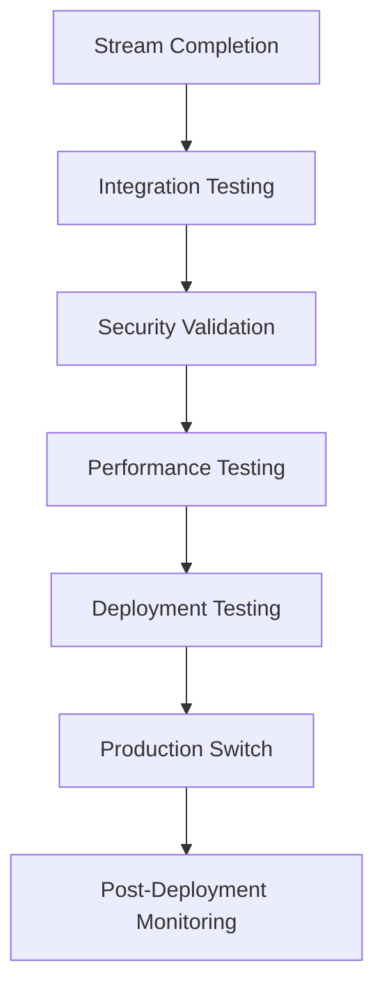

# Integration & Testing Stream Context Package
**Package ID**: integration-testing-stream-20250827  
**Token Limit**: 4000 tokens  
**Target Specialists**: test-automation-engineer, security-validator, deployment-orchestrator  
**Priority**: CRITICAL - CVE Remediation Coordination

## 🚨 CVE Remediation Integration Overview

### Critical Security Fixes (3 CVEs)
1. **CVE-LOCALAGENT-001**: WebSocket Authentication Bypass (CVSS 9.3)
2. **CVE-LOCALAGENT-002**: Shell Command Injection (CVSS 9.1) 
3. **CVE-LOCALAGENT-003**: Plain Text Credential Storage (CVSS 9.1)

### Current Security Score: 4.2/10 → Target: 8.0+/10

---

## 🔄 Cross-Stream Coordination

### WebSocket Security Stream Integration
**Primary Fix**: Header-based JWT authentication enforcement
```python
# BEFORE (Vulnerable)
token = websocket.query_params.get("token")  # CVE-2024-WS002

# AFTER (Secure)  
auth_header = websocket.headers.get("authorization")
token = auth_header[7:] if auth_header.startswith("Bearer ") else None
```

**Integration Points**:
- WebSocket connection stability testing
- Real-time authentication validation
- Session hijacking prevention
- Connection cleanup and heartbeat mechanisms

### Shell Plugin Security Stream
**Primary Fix**: Comprehensive command injection prevention
```python
# Enhanced validation patterns
FORBIDDEN_PATTERNS = [
    r'.*>\s*/dev/.*',           # Device redirections
    r'.*\|\s*sudo.*',           # Sudo piping
    r'\$\([^)]*\)',             # Command substitution
    r'`[^`]*`',                 # Backtick execution
    r'.*<\([^)]*\)',            # Process substitution
]
```

**Integration Requirements**:
- Plugin performance impact assessment
- Command execution monitoring
- Security policy enforcement validation
- Interactive shell mode testing

### Encryption & Credential Stream  
**Primary Fix**: OS keyring + AES-256-GCM encryption
```python
# Secure credential storage
keyring.set_password(
    service_name=f"localagent-cli-{provider}",
    username=credential_type,
    password=fernet.encrypt(value.encode()).decode()
)
```

**Integration Dependencies**:
- Cross-platform keyring compatibility
- Credential migration from plain text
- Provider authentication flow testing
- Encrypted fallback storage validation

---

## 🧪 Advanced Testing Framework (6 Test Files)

### 1. Advanced WebSocket Security Tests
**File**: `/tests/security/advanced_websocket_security_tests.py`
**Coverage**:
- Session hijacking protection mechanisms
- JWT token extraction resistance  
- Connection flooding prevention
- Real-time authentication validation
- WebSocket upgrade security
- Message integrity verification

### 2. Enhanced Command Injection Tests
**File**: `/tests/security/enhanced_command_injection_tests.py`  
**Coverage**:
- Shell escape sequence detection
- Environment variable injection
- Process substitution attacks
- Arithmetic expansion bypasses
- Unicode normalization attacks
- Command chaining prevention

### 3. Advanced Encryption Security Tests
**File**: `/tests/security/advanced_encryption_security_tests.py`
**Coverage**:
- AES-256-GCM implementation validation
- Key derivation function security
- Encrypted storage integrity
- Keyring integration testing
- Credential migration security
- Cross-platform encryption compatibility

### 4. Penetration Testing Automation
**File**: `/tests/security/penetration_testing_automation.py`
**Coverage**:
- Automated vulnerability scanning
- OWASP Top 10 compliance testing
- Fuzzing input validation systems
- Authentication bypass attempts
- Privilege escalation detection
- Network security validation

### 5. Security Regression Testing Suite
**File**: `/tests/security/security_regression_testing_suite.py`
**Coverage**:
- CVE fix validation (all 3 CVEs)
- Security control regression prevention
- Performance impact measurement
- Compatibility verification
- Error handling security
- Audit trail validation

### 6. Comprehensive Security Automation Framework
**File**: `/tests/security/comprehensive_security_automation_framework.py`
**Coverage**:
- Multi-stream security orchestration
- Real-time security monitoring
- Incident response automation
- Compliance reporting
- Security metrics collection
- Continuous security validation

---

## 🚀 Blue-Green Deployment Strategy

### Deployment Configuration
```yaml
# Blue-Green Service Configuration
services:
  localagent-blue:
    build: .
    environment:
      - DEPLOYMENT_SLOT=blue
      - SECURITY_VALIDATION=strict
    healthcheck:
      test: ["CMD", "python", "-m", "scripts.validate_cli", "--health"]
      interval: 30s
      timeout: 10s
      retries: 3
      
  localagent-green:  
    build: .
    environment:
      - DEPLOYMENT_SLOT=green
      - SECURITY_VALIDATION=strict
    healthcheck:
      test: ["CMD", "python", "-m", "scripts.validate_cli", "--health"]
      interval: 30s
      timeout: 10s
      retries: 3
```

### Zero-Downtime Requirements
- **Rollback Time**: <30 seconds maximum
- **Health Check Frequency**: 30-second intervals
- **Traffic Switch**: Instant with load balancer
- **Service Validation**: 100% health checks pass before traffic switch
- **Automated Rollback**: On any health check failure

### Deployment Sequencing
1. **Pre-deployment**: Run all 6 security test suites
2. **Green Deployment**: Deploy fixes to green slot
3. **Validation Phase**: 5-minute soak testing
4. **Traffic Switch**: Blue→Green if all validations pass
5. **Blue Retirement**: Keep blue as rollback for 24h
6. **Post-deployment**: Continuous monitoring activation

---

## 🔍 Performance Validation Framework

### WebSocket Performance Metrics
```python
# Connection stability requirements
MAX_CONNECTION_TIME = 100   # ms initial connection
MAX_MESSAGE_LATENCY = 50    # ms message round-trip
MAX_RECONNECTION_TIME = 2000  # ms after network drop
HEARTBEAT_INTERVAL = 30000    # ms keep-alive
```

### Shell Plugin Performance Impact
```python  
# Command execution overhead limits
MAX_VALIDATION_OVERHEAD = 10   # ms per command
MAX_POLICY_CHECK_TIME = 5      # ms security validation
MAX_AUDIT_LOG_DELAY = 2        # ms logging overhead
MEMORY_USAGE_LIMIT = 50        # MB total plugin memory
```

### Encryption Performance Benchmarks
```python
# Credential operations performance
MAX_ENCRYPT_TIME = 100        # ms credential encryption  
MAX_DECRYPT_TIME = 50         # ms credential retrieval
MAX_KEYRING_ACCESS = 200      # ms OS keyring operations
CACHE_HIT_RATE = 95          # % credential cache efficiency
```

### System Resource Impact Monitoring
- **CPU Overhead**: <5% increase from security enhancements
- **Memory Usage**: <100MB additional for security frameworks  
- **Disk I/O**: <10% increase from audit logging
- **Network Latency**: <20ms additional from HTTPS enforcement

---

## ✅ Success Criteria & Validation Checkpoints

### CVE Remediation Validation
- [ ] **CVE-LOCALAGENT-001**: WebSocket auth header-only, no query params
- [ ] **CVE-LOCALAGENT-002**: All shell injection vectors blocked  
- [ ] **CVE-LOCALAGENT-003**: All credentials in OS keyring/encrypted

### Security Score Improvement
- **Current**: 4.2/10 (High Risk)
- **Target**: 8.0+/10 (Low Risk)  
- **Critical**: 3 → 0 vulnerabilities
- **High**: 8 → 2 vulnerabilities maximum
- **OWASP Compliance**: 90%+ coverage

### Test Suite Requirements  
- **Unit Tests**: 100% pass rate (300+ security tests)
- **Integration Tests**: 100% pass rate (50+ multi-stream tests)
- **Penetration Tests**: 0 successful attacks
- **Regression Tests**: 100% CVE fix validation
- **Performance Tests**: All metrics within limits
- **Compliance Tests**: OWASP Top 10 verification

### Production Readiness Gates
1. **Security Validation**: All 6 test suites pass
2. **Performance Validation**: No degradation >5%
3. **Integration Testing**: Cross-stream compatibility verified
4. **Deployment Testing**: Blue-green switch successful
5. **Monitoring Setup**: All alerts and dashboards active
6. **Rollback Testing**: <30 second rollback verified

---

## 🛡️ Risk Mitigation & Emergency Procedures

### Service Disruption Prevention
```bash
# Pre-deployment risk assessment
./scripts/validate_cli_integration_nolibs.py --full-security-scan
./scripts/test_all_security_controls.py --production-mode
./scripts/validate_backward_compatibility.py --strict
```

### Backward Compatibility Assurance
- All existing CLI commands remain functional
- Configuration file format backward compatible
- API endpoints maintain existing contracts  
- Plugin interface unchanged for existing plugins
- WebSocket message formats preserved

### Emergency Rollback Procedures
```yaml
# Automated rollback triggers
rollback_conditions:
  - health_check_failure_rate: >1%
  - security_test_failure: any
  - performance_degradation: >10%
  - error_rate_increase: >5%
  - user_authentication_failure: >0.1%
```

### Monitoring & Alerting Setup
- **Security Events**: Real-time CVE attempt detection
- **Performance Metrics**: Latency/throughput monitoring  
- **System Health**: Service availability tracking
- **Error Rates**: Authentication/authorization failures
- **Audit Compliance**: Security policy violations

---

## 🎯 Coordination Protocols

### Multi-Stream Communication
```python
# Redis coordination keys
COORD_WEBSOCKET_STATUS = "coord:websocket-stream:status"
COORD_SHELL_STATUS = "coord:shell-stream:status" 
COORD_ENCRYPTION_STATUS = "coord:encryption-stream:status"
COORD_INTEGRATION_CHECKPOINT = "coord:integration:checkpoint"
```

### Integration Checkpoints
1. **Stream Readiness**: All 3 streams report completion
2. **Cross-Stream Testing**: Integration tests pass
3. **Security Validation**: Combined security score achieved
4. **Performance Validation**: Resource impact acceptable
5. **Deployment Readiness**: All gates passed
6. **Production Switch**: Blue-green deployment successful

### Validation Sequencing


This comprehensive context package provides the Integration & Testing Stream with all necessary information for coordinating the 3 CVE remediations, managing the testing framework, executing blue-green deployment, and ensuring production readiness with <30 second rollback capability.