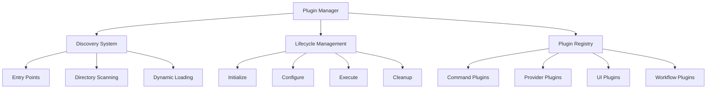

# LocalAgent CLI Plugin Development Guide

## Table of Contents
- [Plugin System Overview](#plugin-system-overview)
- [Plugin Types and Architecture](#plugin-types-and-architecture)
- [Development Environment Setup](#development-environment-setup)
- [Creating Your First Plugin](#creating-your-first-plugin)
- [Plugin Development Framework](#plugin-development-framework)
- [Advanced Plugin Features](#advanced-plugin-features)
- [Testing and Validation](#testing-and-validation)
- [Packaging and Distribution](#packaging-and-distribution)
- [Best Practices](#best-practices)
- [Debugging and Troubleshooting](#debugging-and-troubleshooting)
- [API Reference](#api-reference)
- [Plugin Examples](#plugin-examples)

---

## Plugin System Overview

The LocalAgent CLI features a comprehensive plugin architecture that allows developers to extend functionality through multiple plugin types. The system is built on Python entry points with dynamic loading capabilities and provides extensive integration points.

### Key Features

- **Multiple Plugin Types**: Command, Provider, UI, and Workflow plugins
- **Dynamic Loading**: Hot-reload support during development
- **Entry Point Discovery**: Standard Python packaging integration
- **Dependency Management**: Automatic dependency resolution and loading order
- **Configuration Schema**: Plugin-specific configuration validation
- **Lifecycle Management**: Complete plugin lifecycle with initialization and cleanup
- **Development Tools**: Built-in testing framework and debugging support

### Plugin Architecture



### Plugin Discovery Mechanisms

#### 1. Entry Points (Recommended)
```python
# setup.py or pyproject.toml
entry_points={
    "localagent.plugins.commands": [
        "my-plugin = my_plugin.plugin:MyPlugin"
    ]
}
```

#### 2. Directory Scanning (Development)
```bash
~/.localagent/plugins/
├── my-custom-plugin/
│   ├── __init__.py
│   ├── plugin.py
│   └── setup.py
```

#### 3. Dynamic Installation
```bash
localagent plugins --install ./my-plugin-directory
localagent plugins --install git+https://github.com/user/plugin.git
```

---

## Plugin Types and Architecture

### 1. Command Plugins

Command plugins add new CLI commands to LocalAgent with full integration into the command system.

#### Base Class Structure
```python
from app.cli.plugins.framework import CommandPlugin
import typer
from rich.console import Console

class MyCommandPlugin(CommandPlugin):
    @property
    def name(self) -> str:
        return "my-command-plugin"
    
    @property
    def version(self) -> str:
        return "1.0.0"
    
    @property
    def description(self) -> str:
        return "Example command plugin"
    
    async def initialize(self, context) -> bool:
        self.context = context
        self.console = Console()
        return True
    
    def register_commands(self, app: typer.Typer) -> None:
        @app.command("my-command")
        def my_command(
            target: str = typer.Argument(help="Target for operation"),
            option: bool = typer.Option(False, "--option", "-o")
        ):
            """Custom command implementation"""
            self.console.print(f"Processing {target}")
            if option:
                self.console.print("Option enabled")
```

#### Command Plugin Features
- **Typer Integration**: Full Typer CLI framework support
- **Rich UI**: Access to Rich terminal UI components
- **Context Access**: Full CLI context including configuration and providers
- **Async Support**: Asynchronous command execution
- **Error Handling**: Integrated error handling and reporting

### 2. Provider Plugins

Provider plugins add new LLM providers with standardized interfaces.

#### Base Class Structure
```python
from app.cli.plugins.framework import ProviderPlugin
from app.llm_providers.base_provider import BaseProvider
from typing import Dict, Any, AsyncIterator

class CustomLLMProvider(BaseProvider):
    def __init__(self, config: Dict[str, Any]):
        super().__init__(config)
        self.api_endpoint = config.get('api_endpoint')
        self.api_key = config.get('api_key')
    
    async def initialize(self, config: dict) -> bool:
        # Provider initialization logic
        self.session = aiohttp.ClientSession()
        return await self.test_connection()
    
    async def health_check(self) -> Dict[str, Any]:
        try:
            # Test provider connectivity
            response = await self.session.get(f"{self.api_endpoint}/health")
            return {
                'healthy': response.status == 200,
                'response_time': response.headers.get('X-Response-Time'),
                'models_available': await self.count_available_models()
            }
        except Exception as e:
            return {'healthy': False, 'error': str(e)}
    
    async def complete(self, request) -> CompletionResponse:
        # Implement completion logic
        response = await self.session.post(
            f"{self.api_endpoint}/complete",
            json=request.to_dict(),
            headers={'Authorization': f'Bearer {self.api_key}'}
        )
        return CompletionResponse.from_dict(await response.json())
    
    async def stream_complete(self, request) -> AsyncIterator[str]:
        # Implement streaming completion
        async with self.session.post(
            f"{self.api_endpoint}/stream",
            json=request.to_dict(),
            headers={'Authorization': f'Bearer {self.api_key}'}
        ) as response:
            async for chunk in response.content:
                yield chunk.decode()

class CustomProviderPlugin(ProviderPlugin):
    @property
    def name(self) -> str:
        return "custom-llm-provider"
    
    def get_provider_class(self):
        return CustomLLMProvider
    
    def get_provider_config_schema(self) -> Dict[str, Any]:
        return {
            "type": "object",
            "properties": {
                "api_endpoint": {
                    "type": "string",
                    "description": "API endpoint URL"
                },
                "api_key": {
                    "type": "string",
                    "description": "API authentication key"
                },
                "timeout": {
                    "type": "integer",
                    "default": 30,
                    "description": "Request timeout in seconds"
                }
            },
            "required": ["api_endpoint", "api_key"]
        }
```

### 3. UI Plugins

UI plugins extend the terminal user interface with custom components and displays.

#### Base Class Structure
```python
from app.cli.plugins.framework import UIPlugin
from rich.panel import Panel
from rich.table import Table
from rich.progress import Progress
from rich.live import Live

class CustomUIPlugin(UIPlugin):
    @property
    def name(self) -> str:
        return "custom-ui-components"
    
    def get_ui_components(self) -> Dict[str, Any]:
        return {
            "data_table": self.create_data_table,
            "progress_dashboard": self.create_progress_dashboard,
            "status_panel": self.create_status_panel
        }
    
    def create_data_table(self, data: List[Dict], title: str = "Data Table"):
        """Create a Rich table from data"""
        table = Table(title=title)
        
        if data:
            # Add columns from first row keys
            for key in data[0].keys():
                table.add_column(key.title())
            
            # Add rows
            for row in data:
                table.add_row(*[str(v) for v in row.values()])
        
        return table
    
    def create_progress_dashboard(self, workflows: List[WorkflowStatus]):
        """Create workflow progress dashboard"""
        dashboard = Panel("")
        
        with Live(dashboard, refresh_per_second=2) as live:
            for workflow in workflows:
                progress = Progress()
                task = progress.add_task(
                    f"[cyan]{workflow.name}[/cyan]",
                    total=100
                )
                progress.update(task, advance=workflow.progress)
                
                live.update(Panel(progress, title="Active Workflows"))
                
        return dashboard
    
    def create_status_panel(self, status_data: Dict[str, Any]):
        """Create system status panel"""
        content = []
        for key, value in status_data.items():
            content.append(f"{key}: {value}")
        
        return Panel(
            "\n".join(content),
            title="System Status",
            border_style="green"
        )
```

### 4. Workflow Plugins

Workflow plugins add new phases, agents, or orchestration components to the workflow system.

#### Base Class Structure
```python
from app.cli.plugins.framework import WorkflowPlugin
from typing import Dict, Any, List

class CustomWorkflowAgent:
    def __init__(self, config: Dict[str, Any]):
        self.config = config
        self.name = config.get('name', 'custom-agent')
    
    async def execute(self, task: str, context: Dict[str, Any]) -> Dict[str, Any]:
        """Execute agent task"""
        # Custom agent logic
        result = await self.process_task(task, context)
        return {
            'agent': self.name,
            'task': task,
            'result': result,
            'evidence': await self.collect_evidence()
        }
    
    async def process_task(self, task: str, context: Dict[str, Any]):
        # Implement custom processing logic
        pass
    
    async def collect_evidence(self) -> List[Dict[str, Any]]:
        # Collect evidence of work performed
        return []

class CustomWorkflowPhase:
    def __init__(self, phase_id: str, config: Dict[str, Any]):
        self.phase_id = phase_id
        self.config = config
    
    async def execute(self, context: Dict[str, Any]) -> Dict[str, Any]:
        """Execute workflow phase"""
        agents = self.get_required_agents(context)
        
        # Execute agents in parallel
        results = await asyncio.gather(*[
            agent.execute(context['task'], context)
            for agent in agents
        ])
        
        return {
            'phase': self.phase_id,
            'results': results,
            'success': all(r.get('success', False) for r in results)
        }
    
    def get_required_agents(self, context: Dict[str, Any]) -> List[CustomWorkflowAgent]:
        # Return agents needed for this phase
        return []

class CustomWorkflowPlugin(WorkflowPlugin):
    @property
    def name(self) -> str:
        return "custom-workflow-components"
    
    def get_workflow_components(self) -> Dict[str, Any]:
        return {
            "phases": {
                "custom-validation": CustomWorkflowPhase,
                "custom-analysis": CustomAnalysisPhase
            },
            "agents": {
                "custom-security-agent": CustomSecurityAgent,
                "custom-performance-agent": CustomPerformanceAgent
            },
            "orchestrators": {
                "specialized-orchestrator": SpecializedOrchestrator
            }
        }
```

---

## Development Environment Setup

### Prerequisites

```bash
# System requirements
Python 3.9+
Git
Text editor/IDE (VS Code recommended)

# Optional but recommended
Docker (for containerized testing)
Virtual environment tool (venv, conda, poetry)
```

### Development Setup

#### 1. Create Development Environment
```bash
# Clone LocalAgent repository
git clone <localagent-repo-url>
cd LocalProgramming

# Create virtual environment
python -m venv .venv
source .venv/bin/activate  # Linux/Mac
# or .venv\Scripts\activate  # Windows

# Install LocalAgent in development mode
pip install -e .

# Install development dependencies
pip install -r requirements-dev.txt
```

#### 2. Enable Development Mode
```bash
# Create development configuration
mkdir -p ~/.localagent
cat > ~/.localagent/development.yaml << 'EOF'
development:
  debug_mode: true
  hot_reload: true
  verbose_logging: true
  
  plugins:
    allow_dev_plugins: true
    auto_reload: true
    development_directories:
      - "./dev-plugins"
      - "~/.localagent/dev-plugins"
  
  workflow:
    enable_step_debugging: true
    save_intermediate_results: true
    detailed_error_traces: true
EOF

# Set development environment
export LOCALAGENT_DEV_MODE=true
export LOCALAGENT_PLUGINS_ALLOW_DEV=true
export LOCALAGENT_LOG_LEVEL=DEBUG
```

#### 3. Setup Plugin Development Directory
```bash
# Create plugin development structure
mkdir -p ~/.localagent/dev-plugins
mkdir -p ./dev-plugins

# Create plugin template directory
mkdir -p ./plugin-templates
```

### IDE Configuration

#### VS Code Setup
```json
// .vscode/settings.json
{
  "python.defaultInterpreterPath": "./.venv/bin/python",
  "python.testing.pytestEnabled": true,
  "python.testing.unittestEnabled": false,
  "python.linting.enabled": true,
  "python.linting.pylintEnabled": true,
  "python.formatting.provider": "black",
  "python.sortImports.path": "isort",
  "files.associations": {
    "*.yaml": "yaml"
  },
  "yaml.schemas": {
    "./schemas/plugin-schema.json": "dev-plugins/*/plugin.yaml"
  }
}

// .vscode/launch.json
{
  "version": "0.2.0",
  "configurations": [
    {
      "name": "Debug LocalAgent CLI",
      "type": "python",
      "request": "launch",
      "program": "${workspaceFolder}/scripts/localagent",
      "args": ["--debug", "plugins", "--list"],
      "console": "integratedTerminal",
      "env": {
        "LOCALAGENT_DEV_MODE": "true"
      }
    },
    {
      "name": "Debug Plugin",
      "type": "python",
      "request": "launch",
      "program": "${workspaceFolder}/scripts/localagent",
      "args": ["plugins", "--test", "my-plugin"],
      "console": "integratedTerminal"
    }
  ]
}
```

---

## Creating Your First Plugin

Let's create a simple command plugin that adds a project analysis command.

### Step 1: Plugin Scaffold Generation

```bash
# Use LocalAgent's plugin scaffold generator
localagent dev create-plugin project-analyzer command

# This creates:
./dev-plugins/project-analyzer/
├── __init__.py
├── plugin.py
├── setup.py
├── README.md
├── config_schema.json
└── tests/
    └── test_plugin.py
```

### Step 2: Implement Plugin Logic

```python
# dev-plugins/project-analyzer/plugin.py
"""
Project Analyzer Plugin
Analyzes project structure and provides insights
"""

import asyncio
import os
from pathlib import Path
from typing import Dict, List, Any
import typer
from rich.console import Console
from rich.table import Table
from rich.panel import Panel

from app.cli.plugins.framework import CommandPlugin

class ProjectAnalyzer:
    """Core project analysis logic"""
    
    def __init__(self, project_path: Path):
        self.project_path = Path(project_path)
        
    def analyze_structure(self) -> Dict[str, Any]:
        """Analyze project directory structure"""
        structure = {
            'total_files': 0,
            'total_directories': 0,
            'file_types': {},
            'largest_files': [],
            'empty_directories': []
        }
        
        for item in self.project_path.rglob('*'):
            if item.is_file():
                structure['total_files'] += 1
                suffix = item.suffix or 'no_extension'
                structure['file_types'][suffix] = structure['file_types'].get(suffix, 0) + 1
                
                # Track largest files
                size = item.stat().st_size
                structure['largest_files'].append((str(item), size))
                
            elif item.is_dir():
                structure['total_directories'] += 1
                
                # Check for empty directories
                if not any(item.iterdir()):
                    structure['empty_directories'].append(str(item))
        
        # Sort largest files
        structure['largest_files'].sort(key=lambda x: x[1], reverse=True)
        structure['largest_files'] = structure['largest_files'][:10]
        
        return structure
    
    def detect_project_type(self) -> str:
        """Detect project type based on files"""
        indicators = {
            'python': ['requirements.txt', 'setup.py', 'pyproject.toml', '*.py'],
            'nodejs': ['package.json', 'node_modules', '*.js', '*.ts'],
            'golang': ['go.mod', 'go.sum', '*.go'],
            'rust': ['Cargo.toml', 'Cargo.lock', '*.rs'],
            'java': ['pom.xml', 'build.gradle', '*.java'],
            'docker': ['Dockerfile', 'docker-compose.yml']
        }
        
        detected = []
        for project_type, files in indicators.items():
            for file_pattern in files:
                if list(self.project_path.glob(file_pattern)):
                    detected.append(project_type)
                    break
        
        return detected
    
    def analyze_dependencies(self) -> Dict[str, List[str]]:
        """Analyze project dependencies"""
        dependencies = {}
        
        # Python dependencies
        requirements_files = ['requirements.txt', 'requirements-*.txt']
        for pattern in requirements_files:
            for req_file in self.project_path.glob(pattern):
                try:
                    with open(req_file) as f:
                        deps = [line.strip() for line in f if line.strip() and not line.startswith('#')]
                    dependencies[str(req_file)] = deps
                except Exception:
                    pass
        
        # Node.js dependencies
        package_json = self.project_path / 'package.json'
        if package_json.exists():
            try:
                import json
                with open(package_json) as f:
                    data = json.load(f)
                dependencies['npm_dependencies'] = list(data.get('dependencies', {}).keys())
                dependencies['npm_dev_dependencies'] = list(data.get('devDependencies', {}).keys())
            except Exception:
                pass
        
        return dependencies

class ProjectAnalyzerPlugin(CommandPlugin):
    """LocalAgent plugin for project analysis"""
    
    @property
    def name(self) -> str:
        return "project-analyzer"
    
    @property
    def version(self) -> str:
        return "1.0.0"
    
    @property
    def description(self) -> str:
        return "Analyze project structure, dependencies, and characteristics"
    
    @property
    def dependencies(self) -> List[str]:
        return []  # No dependencies for this plugin
    
    @property
    def requires_config(self) -> bool:
        return False  # No configuration required
    
    async def initialize(self, context) -> bool:
        """Initialize plugin with CLI context"""
        self.context = context
        self.console = Console()
        return True
    
    async def cleanup(self) -> None:
        """Cleanup plugin resources"""
        pass
    
    def register_commands(self, app: typer.Typer) -> None:
        """Register plugin commands"""
        
        @app.command("analyze-project")
        def analyze_project(
            path: str = typer.Argument(".", help="Project path to analyze"),
            detailed: bool = typer.Option(False, "--detailed", "-d", help="Show detailed analysis"),
            format: str = typer.Option("rich", "--format", "-f", help="Output format (rich, json)")
        ):
            """Analyze project structure and characteristics"""
            asyncio.run(self._analyze_project_async(path, detailed, format))
        
        @app.command("project-summary")
        def project_summary(
            path: str = typer.Argument(".", help="Project path"),
            save: str = typer.Option(None, "--save", "-s", help="Save summary to file")
        ):
            """Generate project summary report"""
            asyncio.run(self._project_summary_async(path, save))
    
    async def _analyze_project_async(self, path: str, detailed: bool, format: str):
        """Async wrapper for project analysis"""
        analyzer = ProjectAnalyzer(Path(path))
        
        with self.console.status("[bold green]Analyzing project..."):
            structure = analyzer.analyze_structure()
            project_types = analyzer.detect_project_type()
            dependencies = analyzer.analyze_dependencies()
        
        if format == "json":
            import json
            result = {
                'structure': structure,
                'project_types': project_types,
                'dependencies': dependencies
            }
            self.console.print(json.dumps(result, indent=2))
        else:
            self._display_rich_analysis(structure, project_types, dependencies, detailed)
    
    def _display_rich_analysis(self, structure: Dict, project_types: List[str], 
                             dependencies: Dict, detailed: bool):
        """Display analysis results with Rich formatting"""
        
        # Project overview
        overview_table = Table(title=f"Project Analysis: {os.getcwd()}")
        overview_table.add_column("Metric", style="cyan")
        overview_table.add_column("Value", style="green")
        
        overview_table.add_row("Total Files", str(structure['total_files']))
        overview_table.add_row("Total Directories", str(structure['total_directories']))
        overview_table.add_row("Project Types", ", ".join(project_types) if project_types else "Unknown")
        
        self.console.print(overview_table)
        self.console.print()
        
        # File types distribution
        if structure['file_types']:
            ft_table = Table(title="File Types Distribution")
            ft_table.add_column("Extension", style="blue")
            ft_table.add_column("Count", style="green")
            ft_table.add_column("Percentage", style="yellow")
            
            total_files = structure['total_files']
            for ext, count in sorted(structure['file_types'].items(), 
                                   key=lambda x: x[1], reverse=True)[:10]:
                percentage = (count / total_files) * 100 if total_files > 0 else 0
                ft_table.add_row(ext, str(count), f"{percentage:.1f}%")
            
            self.console.print(ft_table)
            self.console.print()
        
        # Dependencies
        if dependencies:
            for dep_file, deps in dependencies.items():
                if deps:
                    dep_panel = Panel(
                        f"Dependencies: {len(deps)}\n" + 
                        (", ".join(deps[:5]) + ("..." if len(deps) > 5 else "")),
                        title=f"Dependencies ({dep_file})",
                        border_style="blue"
                    )
                    self.console.print(dep_panel)
        
        # Detailed information
        if detailed:
            # Largest files
            if structure['largest_files']:
                large_files_table = Table(title="Largest Files")
                large_files_table.add_column("File", style="cyan")
                large_files_table.add_column("Size", style="green")
                
                for file_path, size in structure['largest_files'][:5]:
                    size_mb = size / (1024 * 1024)
                    large_files_table.add_row(file_path, f"{size_mb:.2f} MB")
                
                self.console.print(large_files_table)
            
            # Empty directories
            if structure['empty_directories']:
                empty_dirs_panel = Panel(
                    "\n".join(structure['empty_directories'][:10]),
                    title="Empty Directories",
                    border_style="yellow"
                )
                self.console.print(empty_dirs_panel)
    
    async def _project_summary_async(self, path: str, save_path: str):
        """Generate comprehensive project summary"""
        analyzer = ProjectAnalyzer(Path(path))
        
        with self.console.status("[bold green]Generating project summary..."):
            structure = analyzer.analyze_structure()
            project_types = analyzer.detect_project_type()
            dependencies = analyzer.analyze_dependencies()
        
        # Generate summary
        summary = self._generate_summary_report(structure, project_types, dependencies)
        
        if save_path:
            with open(save_path, 'w') as f:
                f.write(summary)
            self.console.print(f"[green]Summary saved to {save_path}[/green]")
        else:
            self.console.print(Panel(summary, title="Project Summary"))
    
    def _generate_summary_report(self, structure: Dict, project_types: List[str], 
                                dependencies: Dict) -> str:
        """Generate text summary report"""
        lines = [
            f"# Project Analysis Summary",
            f"",
            f"## Overview",
            f"- Total Files: {structure['total_files']}",
            f"- Total Directories: {structure['total_directories']}",
            f"- Project Types: {', '.join(project_types) if project_types else 'Unknown'}",
            f"",
            f"## File Distribution",
        ]
        
        for ext, count in sorted(structure['file_types'].items(), 
                               key=lambda x: x[1], reverse=True)[:5]:
            lines.append(f"- {ext}: {count} files")
        
        if dependencies:
            lines.append(f"\n## Dependencies")
            for dep_type, deps in dependencies.items():
                lines.append(f"- {dep_type}: {len(deps)} dependencies")
        
        return "\n".join(lines)
```

### Step 3: Create Setup Configuration

```python
# dev-plugins/project-analyzer/setup.py
from setuptools import setup, find_packages

setup(
    name="localagent-project-analyzer",
    version="1.0.0",
    description="LocalAgent plugin for project analysis",
    author="Your Name",
    author_email="your.email@example.com",
    packages=find_packages(),
    python_requires=">=3.9",
    install_requires=[
        "typer",
        "rich",
    ],
    entry_points={
        "localagent.plugins.commands": [
            "project-analyzer = plugin:ProjectAnalyzerPlugin"
        ]
    },
    classifiers=[
        "Development Status :: 4 - Beta",
        "Intended Audience :: Developers",
        "Programming Language :: Python :: 3",
        "Programming Language :: Python :: 3.9",
        "Programming Language :: Python :: 3.10",
        "Programming Language :: Python :: 3.11",
    ]
)
```

### Step 4: Plugin Configuration Schema

```json
# dev-plugins/project-analyzer/config_schema.json
{
  "$schema": "http://json-schema.org/draft-07/schema#",
  "title": "Project Analyzer Plugin Configuration",
  "type": "object",
  "properties": {
    "default_analysis_depth": {
      "type": "string",
      "enum": ["shallow", "normal", "deep"],
      "default": "normal",
      "description": "Default analysis depth"
    },
    "exclude_patterns": {
      "type": "array",
      "items": {"type": "string"},
      "default": ["node_modules/*", ".git/*", "__pycache__/*"],
      "description": "Patterns to exclude from analysis"
    },
    "max_file_size_mb": {
      "type": "number",
      "default": 100,
      "description": "Maximum file size to analyze in MB"
    }
  }
}
```

### Step 5: Testing Your Plugin

```python
# dev-plugins/project-analyzer/tests/test_plugin.py
import pytest
import tempfile
from pathlib import Path
from plugin import ProjectAnalyzer, ProjectAnalyzerPlugin

class TestProjectAnalyzer:
    
    def setup_method(self):
        """Setup test environment"""
        self.temp_dir = tempfile.mkdtemp()
        self.test_path = Path(self.temp_dir)
        
        # Create test project structure
        (self.test_path / "src").mkdir()
        (self.test_path / "tests").mkdir()
        (self.test_path / "src" / "main.py").write_text("print('hello')")
        (self.test_path / "tests" / "test_main.py").write_text("def test_main(): pass")
        (self.test_path / "requirements.txt").write_text("requests==2.25.1\npytest==6.2.2")
        (self.test_path / "README.md").write_text("# Test Project")
    
    def test_analyze_structure(self):
        """Test structure analysis"""
        analyzer = ProjectAnalyzer(self.test_path)
        result = analyzer.analyze_structure()
        
        assert result['total_files'] == 4
        assert result['total_directories'] == 2
        assert '.py' in result['file_types']
        assert '.txt' in result['file_types']
        assert '.md' in result['file_types']
    
    def test_detect_project_type(self):
        """Test project type detection"""
        analyzer = ProjectAnalyzer(self.test_path)
        project_types = analyzer.detect_project_type()
        
        assert 'python' in project_types
    
    def test_analyze_dependencies(self):
        """Test dependency analysis"""
        analyzer = ProjectAnalyzer(self.test_path)
        dependencies = analyzer.analyze_dependencies()
        
        assert 'requirements.txt' in str(dependencies)
    
    @pytest.mark.asyncio
    async def test_plugin_initialization(self):
        """Test plugin initialization"""
        plugin = ProjectAnalyzerPlugin()
        
        # Mock context
        class MockContext:
            def __init__(self):
                self.config = {}
        
        context = MockContext()
        result = await plugin.initialize(context)
        
        assert result is True
        assert plugin.context is not None
```

### Step 6: Install and Test Plugin

```bash
# Install plugin in development mode
cd dev-plugins/project-analyzer
pip install -e .

# Enable plugin
localagent plugins --enable project-analyzer

# Test plugin
localagent plugins --test project-analyzer

# Use new commands
localagent analyze-project ./some-project --detailed
localagent project-summary . --save project-report.md
```

---

## Plugin Development Framework

### Advanced Plugin Base Classes

#### Enhanced Command Plugin
```python
from app.cli.plugins.framework import CommandPlugin
from typing import Optional, Dict, Any, List
import asyncio
from rich.progress import Progress
from rich.console import Console

class EnhancedCommandPlugin(CommandPlugin):
    """Enhanced command plugin with additional features"""
    
    def __init__(self):
        self.console = Console()
        self.progress: Optional[Progress] = None
        self.config: Dict[str, Any] = {}
    
    async def initialize(self, context) -> bool:
        """Initialize with configuration loading"""
        self.context = context
        
        # Load plugin-specific configuration
        self.config = self.load_plugin_config()
        
        # Validate configuration
        if not await self.validate_config():
            return False
        
        # Setup logging
        self.setup_logging()
        
        return True
    
    def load_plugin_config(self) -> Dict[str, Any]:
        """Load plugin-specific configuration"""
        plugin_config = self.context.config.plugins.get(self.name, {})
        return plugin_config.get('config', {})
    
    async def validate_config(self) -> bool:
        """Validate plugin configuration against schema"""
        schema = self.get_config_schema()
        if not schema:
            return True
        
        try:
            import jsonschema
            jsonschema.validate(self.config, schema)
            return True
        except jsonschema.ValidationError as e:
            self.console.print(f"[red]Config validation failed: {e.message}[/red]")
            return False
    
    def setup_logging(self):
        """Setup plugin-specific logging"""
        import logging
        self.logger = logging.getLogger(f"localagent.plugin.{self.name}")
    
    def create_progress(self, description: str) -> Progress:
        """Create progress tracker"""
        self.progress = Progress()
        return self.progress
    
    async def execute_with_progress(self, coro, description: str):
        """Execute coroutine with progress tracking"""
        with self.create_progress(description) as progress:
            task = progress.add_task(description, total=None)
            result = await coro
            progress.update(task, completed=True)
            return result
    
    def get_config_schema(self) -> Optional[Dict[str, Any]]:
        """Override to provide configuration schema"""
        return None
    
    async def cleanup(self) -> None:
        """Enhanced cleanup"""
        if self.progress:
            self.progress.stop()
        await super().cleanup()
```

#### Provider Plugin with Connection Pooling
```python
from app.cli.plugins.framework import ProviderPlugin
from app.llm_providers.base_provider import BaseProvider
import aiohttp
import asyncio
from typing import Dict, Any, Optional

class PooledProvider(BaseProvider):
    """Provider with connection pooling"""
    
    def __init__(self, config: Dict[str, Any]):
        super().__init__(config)
        self.session: Optional[aiohttp.ClientSession] = None
        self.connection_pool_size = config.get('connection_pool_size', 10)
        self.timeout = config.get('timeout', 30)
    
    async def initialize(self, config: dict) -> bool:
        """Initialize with connection pooling"""
        connector = aiohttp.TCPConnector(
            limit=self.connection_pool_size,
            ttl_dns_cache=300,
            use_dns_cache=True
        )
        
        timeout = aiohttp.ClientTimeout(total=self.timeout)
        
        self.session = aiohttp.ClientSession(
            connector=connector,
            timeout=timeout,
            headers={'User-Agent': 'LocalAgent/1.0'}
        )
        
        return await self.test_connection()
    
    async def cleanup(self) -> None:
        """Cleanup connection pool"""
        if self.session:
            await self.session.close()
            # Wait for connections to close
            await asyncio.sleep(0.1)
    
    async def health_check(self) -> Dict[str, Any]:
        """Enhanced health check with connection pool status"""
        basic_health = await super().health_check()
        
        if self.session:
            connector_info = {
                'open_connections': len(self.session.connector._conns),
                'pool_size': self.connection_pool_size,
                'closed': self.session.closed
            }
            basic_health.update(connector_info)
        
        return basic_health
```

### Plugin Lifecycle Hooks

#### Lifecycle Management
```python
from enum import Enum
from typing import Callable, Dict, Any, List
import asyncio

class PluginLifecycleStage(Enum):
    DISCOVERED = "discovered"
    LOADING = "loading"
    INITIALIZING = "initializing"
    READY = "ready"
    EXECUTING = "executing"
    CLEANING_UP = "cleaning_up"
    UNLOADED = "unloaded"
    ERROR = "error"

class LifecycleManager:
    """Manages plugin lifecycle with hooks"""
    
    def __init__(self):
        self.hooks: Dict[PluginLifecycleStage, List[Callable]] = {
            stage: [] for stage in PluginLifecycleStage
        }
        self.plugin_states: Dict[str, PluginLifecycleStage] = {}
    
    def add_hook(self, stage: PluginLifecycleStage, callback: Callable):
        """Add lifecycle hook"""
        self.hooks[stage].append(callback)
    
    async def transition_plugin(self, plugin_name: str, 
                              from_stage: PluginLifecycleStage,
                              to_stage: PluginLifecycleStage,
                              context: Dict[str, Any] = None):
        """Transition plugin between lifecycle stages"""
        context = context or {}
        
        # Execute hooks for the target stage
        for hook in self.hooks[to_stage]:
            try:
                if asyncio.iscoroutinefunction(hook):
                    await hook(plugin_name, from_stage, to_stage, context)
                else:
                    hook(plugin_name, from_stage, to_stage, context)
            except Exception as e:
                self.logger.error(f"Hook failed for {plugin_name}: {e}")
        
        # Update plugin state
        self.plugin_states[plugin_name] = to_stage

# Usage in plugin
class LifecycleAwarePlugin(EnhancedCommandPlugin):
    """Plugin with lifecycle awareness"""
    
    async def initialize(self, context) -> bool:
        # Register lifecycle hooks
        context.lifecycle_manager.add_hook(
            PluginLifecycleStage.READY,
            self.on_ready
        )
        
        context.lifecycle_manager.add_hook(
            PluginLifecycleStage.CLEANING_UP,
            self.on_cleanup
        )
        
        return await super().initialize(context)
    
    async def on_ready(self, plugin_name: str, from_stage, to_stage, context):
        """Called when plugin becomes ready"""
        self.logger.info(f"Plugin {plugin_name} is ready")
    
    async def on_cleanup(self, plugin_name: str, from_stage, to_stage, context):
        """Called during cleanup"""
        self.logger.info(f"Plugin {plugin_name} cleaning up")
```

---

## Advanced Plugin Features

### Configuration Management

#### Dynamic Configuration Updates
```python
class ConfigurablePlugin(EnhancedCommandPlugin):
    """Plugin with dynamic configuration updates"""
    
    def __init__(self):
        super().__init__()
        self.config_watchers: List[Callable] = []
    
    async def initialize(self, context) -> bool:
        await super().initialize(context)
        
        # Setup configuration watching
        await self.setup_config_watcher()
        return True
    
    async def setup_config_watcher(self):
        """Setup configuration file watching"""
        config_file = self.context.config_dir / f"{self.name}.yaml"
        
        if config_file.exists():
            # Watch for configuration changes
            asyncio.create_task(self.watch_config_file(config_file))
    
    async def watch_config_file(self, config_file: Path):
        """Watch configuration file for changes"""
        try:
            from watchdog.observers import Observer
            from watchdog.events import FileSystemEventHandler
            
            class ConfigHandler(FileSystemEventHandler):
                def __init__(self, plugin):
                    self.plugin = plugin
                
                def on_modified(self, event):
                    if event.src_path == str(config_file):
                        asyncio.create_task(self.plugin.reload_config())
            
            observer = Observer()
            observer.schedule(ConfigHandler(self), str(config_file.parent))
            observer.start()
            
        except ImportError:
            # Fallback: periodic config checking
            await self.periodic_config_check(config_file)
    
    async def reload_config(self):
        """Reload configuration dynamically"""
        old_config = self.config.copy()
        self.config = self.load_plugin_config()
        
        if await self.validate_config():
            # Notify config watchers
            for watcher in self.config_watchers:
                await watcher(old_config, self.config)
            
            self.logger.info("Configuration reloaded successfully")
        else:
            # Revert to old configuration
            self.config = old_config
            self.logger.error("Config reload failed, reverted to previous config")
    
    def add_config_watcher(self, callback: Callable):
        """Add configuration change callback"""
        self.config_watchers.append(callback)
```

### Caching and Persistence

#### Plugin Data Persistence
```python
import pickle
import json
from pathlib import Path
from typing import Any, Dict, Optional

class PersistentPlugin(EnhancedCommandPlugin):
    """Plugin with data persistence capabilities"""
    
    def __init__(self):
        super().__init__()
        self.data_dir: Optional[Path] = None
        self.cache: Dict[str, Any] = {}
    
    async def initialize(self, context) -> bool:
        await super().initialize(context)
        
        # Setup data directory
        self.data_dir = context.config_dir / "plugins" / self.name
        self.data_dir.mkdir(parents=True, exist_ok=True)
        
        # Load persisted data
        await self.load_persistent_data()
        
        return True
    
    async def load_persistent_data(self):
        """Load persistent data from disk"""
        cache_file = self.data_dir / "cache.json"
        
        if cache_file.exists():
            try:
                with open(cache_file, 'r') as f:
                    self.cache = json.load(f)
                self.logger.info("Loaded persistent cache")
            except Exception as e:
                self.logger.warning(f"Failed to load cache: {e}")
    
    async def save_persistent_data(self):
        """Save persistent data to disk"""
        cache_file = self.data_dir / "cache.json"
        
        try:
            with open(cache_file, 'w') as f:
                json.dump(self.cache, f, indent=2)
        except Exception as e:
            self.logger.error(f"Failed to save cache: {e}")
    
    def set_cache(self, key: str, value: Any, ttl: int = None):
        """Set cache value with optional TTL"""
        import time
        
        cache_entry = {
            'value': value,
            'timestamp': time.time()
        }
        
        if ttl:
            cache_entry['expires'] = time.time() + ttl
        
        self.cache[key] = cache_entry
    
    def get_cache(self, key: str, default: Any = None) -> Any:
        """Get cache value with expiration check"""
        import time
        
        if key not in self.cache:
            return default
        
        entry = self.cache[key]
        
        # Check expiration
        if 'expires' in entry and time.time() > entry['expires']:
            del self.cache[key]
            return default
        
        return entry['value']
    
    async def cleanup(self) -> None:
        """Save data before cleanup"""
        await self.save_persistent_data()
        await super().cleanup()
```

### Inter-Plugin Communication

#### Plugin Message Bus
```python
import asyncio
from typing import Dict, List, Callable, Any
from enum import Enum

class MessageType(Enum):
    BROADCAST = "broadcast"
    DIRECT = "direct"
    REQUEST = "request"
    RESPONSE = "response"

class PluginMessage:
    def __init__(self, sender: str, message_type: MessageType, 
                 data: Any, recipient: str = None, correlation_id: str = None):
        self.sender = sender
        self.type = message_type
        self.data = data
        self.recipient = recipient
        self.correlation_id = correlation_id or str(uuid4())

class PluginMessageBus:
    """Message bus for inter-plugin communication"""
    
    def __init__(self):
        self.subscribers: Dict[str, List[Callable]] = {}
        self.direct_handlers: Dict[str, Callable] = {}
        self.pending_requests: Dict[str, asyncio.Future] = {}
    
    def subscribe(self, message_type: str, handler: Callable):
        """Subscribe to broadcast messages"""
        if message_type not in self.subscribers:
            self.subscribers[message_type] = []
        self.subscribers[message_type].append(handler)
    
    def register_direct_handler(self, plugin_name: str, handler: Callable):
        """Register handler for direct messages"""
        self.direct_handlers[plugin_name] = handler
    
    async def broadcast(self, sender: str, message_type: str, data: Any):
        """Broadcast message to all subscribers"""
        message = PluginMessage(sender, MessageType.BROADCAST, data)
        
        handlers = self.subscribers.get(message_type, [])
        tasks = []
        
        for handler in handlers:
            if asyncio.iscoroutinefunction(handler):
                tasks.append(asyncio.create_task(handler(message)))
            else:
                # Run sync handler in executor
                tasks.append(asyncio.get_event_loop().run_in_executor(
                    None, handler, message
                ))
        
        if tasks:
            await asyncio.gather(*tasks, return_exceptions=True)
    
    async def send_direct(self, sender: str, recipient: str, data: Any):
        """Send direct message to specific plugin"""
        if recipient not in self.direct_handlers:
            raise ValueError(f"No handler registered for {recipient}")
        
        message = PluginMessage(sender, MessageType.DIRECT, data, recipient)
        handler = self.direct_handlers[recipient]
        
        if asyncio.iscoroutinefunction(handler):
            await handler(message)
        else:
            await asyncio.get_event_loop().run_in_executor(None, handler, message)
    
    async def request(self, sender: str, recipient: str, data: Any, timeout: int = 30) -> Any:
        """Send request and wait for response"""
        correlation_id = str(uuid4())
        message = PluginMessage(
            sender, MessageType.REQUEST, data, recipient, correlation_id
        )
        
        # Create future for response
        response_future = asyncio.Future()
        self.pending_requests[correlation_id] = response_future
        
        try:
            # Send request
            await self.send_direct(sender, recipient, message)
            
            # Wait for response
            response = await asyncio.wait_for(response_future, timeout=timeout)
            return response
        finally:
            # Cleanup
            self.pending_requests.pop(correlation_id, None)
    
    def respond(self, original_message: PluginMessage, sender: str, data: Any):
        """Respond to a request message"""
        if original_message.correlation_id in self.pending_requests:
            future = self.pending_requests[original_message.correlation_id]
            if not future.done():
                future.set_result(data)

# Usage in communicating plugins
class CommunicatingPlugin(EnhancedCommandPlugin):
    """Plugin with inter-plugin communication"""
    
    async def initialize(self, context) -> bool:
        await super().initialize(context)
        
        # Get message bus
        self.message_bus = context.message_bus
        
        # Subscribe to broadcasts
        self.message_bus.subscribe("workflow_started", self.on_workflow_started)
        self.message_bus.subscribe("workflow_completed", self.on_workflow_completed)
        
        # Register direct message handler
        self.message_bus.register_direct_handler(self.name, self.handle_direct_message)
        
        return True
    
    async def on_workflow_started(self, message: PluginMessage):
        """Handle workflow started broadcast"""
        workflow_data = message.data
        self.logger.info(f"Workflow started: {workflow_data.get('workflow_id')}")
        
        # React to workflow start
        await self.prepare_for_workflow(workflow_data)
    
    async def on_workflow_completed(self, message: PluginMessage):
        """Handle workflow completed broadcast"""
        workflow_result = message.data
        self.logger.info(f"Workflow completed: {workflow_result.get('workflow_id')}")
    
    async def handle_direct_message(self, message: PluginMessage):
        """Handle direct messages"""
        if message.type == MessageType.REQUEST:
            # Handle request and send response
            response_data = await self.process_request(message.data)
            self.message_bus.respond(message, self.name, response_data)
        else:
            # Handle direct message
            await self.process_direct_message(message.data)
    
    async def request_from_plugin(self, plugin_name: str, request_data: Any) -> Any:
        """Request data from another plugin"""
        return await self.message_bus.request(self.name, plugin_name, request_data)
```

---

## Testing and Validation

### Plugin Testing Framework

#### Comprehensive Test Suite
```python
import pytest
import asyncio
import tempfile
from unittest.mock import Mock, AsyncMock
from pathlib import Path

class PluginTestFramework:
    """Comprehensive testing framework for plugins"""
    
    def __init__(self, plugin_class):
        self.plugin_class = plugin_class
        self.mock_context = None
        self.plugin_instance = None
    
    def setup_mock_context(self, **config_overrides):
        """Setup mock CLI context"""
        self.mock_context = Mock()
        
        # Mock configuration
        self.mock_context.config = Mock()
        self.mock_context.config.plugins = config_overrides
        self.mock_context.config_dir = Path(tempfile.mkdtemp())
        
        # Mock provider manager
        self.mock_context.provider_manager = Mock()
        self.mock_context.provider_manager.providers = {}
        
        # Mock message bus
        self.mock_context.message_bus = Mock()
        
        return self.mock_context
    
    async def create_plugin_instance(self, **config_overrides):
        """Create plugin instance with mock context"""
        context = self.setup_mock_context(**config_overrides)
        
        self.plugin_instance = self.plugin_class()
        await self.plugin_instance.initialize(context)
        
        return self.plugin_instance
    
    async def test_plugin_lifecycle(self):
        """Test complete plugin lifecycle"""
        # Test initialization
        plugin = await self.create_plugin_instance()
        assert plugin is not None
        
        # Test commands registration
        if hasattr(plugin, 'register_commands'):
            import typer
            app = typer.Typer()
            plugin.register_commands(app)
            # Verify commands were added
            assert len(app.registered_commands) > 0
        
        # Test cleanup
        await plugin.cleanup()
        
        return True
    
    async def test_configuration_validation(self, valid_config: dict, invalid_config: dict):
        """Test configuration validation"""
        # Test valid configuration
        plugin = await self.create_plugin_instance(**valid_config)
        assert await plugin.validate_config() is True
        
        # Test invalid configuration
        plugin.config = invalid_config
        assert await plugin.validate_config() is False
    
    def test_command_execution(self, command_name: str, args: list, expected_exit_code: int = 0):
        """Test command execution"""
        from typer.testing import CliRunner
        import typer
        
        app = typer.Typer()
        self.plugin_instance.register_commands(app)
        
        runner = CliRunner()
        result = runner.invoke(app, [command_name] + args)
        
        assert result.exit_code == expected_exit_code
        return result

# Example test suite using the framework
@pytest.mark.asyncio
class TestProjectAnalyzerPlugin:
    
    def setup_method(self):
        self.test_framework = PluginTestFramework(ProjectAnalyzerPlugin)
    
    async def test_plugin_lifecycle(self):
        """Test plugin initialization and cleanup"""
        result = await self.test_framework.test_plugin_lifecycle()
        assert result is True
    
    async def test_configuration_validation(self):
        """Test configuration validation"""
        valid_config = {
            "project-analyzer": {
                "config": {
                    "default_analysis_depth": "normal",
                    "max_file_size_mb": 50
                }
            }
        }
        
        invalid_config = {
            "default_analysis_depth": "invalid_depth"
        }
        
        await self.test_framework.test_configuration_validation(valid_config, invalid_config)
    
    def test_analyze_project_command(self):
        """Test analyze-project command"""
        plugin = self.test_framework.plugin_instance
        
        # Mock project directory
        test_dir = tempfile.mkdtemp()
        Path(test_dir, "test.py").write_text("print('test')")
        
        result = self.test_framework.test_command_execution(
            "analyze-project", [test_dir, "--format", "json"]
        )
        
        assert "total_files" in result.stdout
    
    async def test_error_handling(self):
        """Test plugin error handling"""
        plugin = await self.test_framework.create_plugin_instance()
        
        # Test with non-existent directory
        with pytest.raises(FileNotFoundError):
            analyzer = ProjectAnalyzer(Path("/non/existent/path"))
            analyzer.analyze_structure()
```

### Integration Testing

#### Plugin Integration Tests
```python
class PluginIntegrationTestSuite:
    """Integration tests for plugin interaction with LocalAgent"""
    
    def __init__(self):
        self.localagent_instance = None
        self.test_plugins = []
    
    async def setup_test_environment(self):
        """Setup complete test environment"""
        # Initialize LocalAgent instance
        from app.cli.core.app import LocalAgentCLI
        
        self.localagent_instance = LocalAgentCLI()
        await self.localagent_instance.initialize()
        
        # Load test plugins
        await self.load_test_plugins()
    
    async def load_test_plugins(self):
        """Load plugins for testing"""
        plugin_manager = self.localagent_instance.plugin_manager
        
        # Discover plugins
        await plugin_manager.discover_plugins()
        
        # Load test plugins
        test_plugin_names = ["project-analyzer", "test-plugin"]
        for plugin_name in test_plugin_names:
            if plugin_name in plugin_manager.discovered_plugins:
                success = await plugin_manager.load_plugin(plugin_name)
                if success:
                    self.test_plugins.append(plugin_name)
    
    async def test_plugin_command_integration(self):
        """Test plugin commands work within LocalAgent"""
        from typer.testing import CliRunner
        
        runner = CliRunner()
        
        # Test plugin command through main CLI
        result = runner.invoke(
            self.localagent_instance.app,
            ["analyze-project", ".", "--format", "json"]
        )
        
        assert result.exit_code == 0
        assert "total_files" in result.stdout
    
    async def test_plugin_provider_integration(self):
        """Test provider plugins work with workflow system"""
        if "test-provider" in self.test_plugins:
            # Execute workflow using test provider
            result = await self.localagent_instance.workflow_manager.execute_workflow(
                "Test workflow",
                provider="test-provider"
            )
            
            assert result['success'] is True
    
    async def test_inter_plugin_communication(self):
        """Test plugins can communicate with each other"""
        if len(self.test_plugins) >= 2:
            plugin1 = self.localagent_instance.plugin_manager.loaded_plugins[self.test_plugins[0]]
            plugin2 = self.localagent_instance.plugin_manager.loaded_plugins[self.test_plugins[1]]
            
            # Test message passing
            message_data = {"test": "data"}
            await plugin1.message_bus.send_direct(plugin1.name, plugin2.name, message_data)
            
            # Verify message was received
            # (This would require mock or test implementation)
    
    async def cleanup_test_environment(self):
        """Cleanup test environment"""
        if self.localagent_instance:
            await self.localagent_instance.cleanup()
```

### Performance Testing

#### Plugin Performance Benchmarks
```python
import time
import asyncio
import psutil
from typing import Dict, Any

class PluginPerformanceTester:
    """Performance testing for plugins"""
    
    def __init__(self, plugin_instance):
        self.plugin = plugin_instance
        self.metrics = {}
    
    async def benchmark_initialization(self, iterations: int = 10) -> Dict[str, float]:
        """Benchmark plugin initialization time"""
        times = []
        
        for _ in range(iterations):
            plugin = self.plugin.__class__()
            
            start_time = time.time()
            await plugin.initialize(self.plugin.context)
            end_time = time.time()
            
            times.append(end_time - start_time)
            await plugin.cleanup()
        
        return {
            'avg_init_time': sum(times) / len(times),
            'min_init_time': min(times),
            'max_init_time': max(times)
        }
    
    async def benchmark_command_execution(self, command_args: list, iterations: int = 100):
        """Benchmark command execution performance"""
        from typer.testing import CliRunner
        import typer
        
        app = typer.Typer()
        self.plugin.register_commands(app)
        runner = CliRunner()
        
        times = []
        memory_usage = []
        
        for _ in range(iterations):
            # Measure memory before
            process = psutil.Process()
            memory_before = process.memory_info().rss
            
            # Execute command
            start_time = time.time()
            result = runner.invoke(app, command_args)
            end_time = time.time()
            
            # Measure memory after
            memory_after = process.memory_info().rss
            
            times.append(end_time - start_time)
            memory_usage.append(memory_after - memory_before)
        
        return {
            'avg_execution_time': sum(times) / len(times),
            'avg_memory_delta': sum(memory_usage) / len(memory_usage),
            'success_rate': sum(1 for _ in times if _ > 0) / len(times)
        }
    
    async def stress_test(self, duration_seconds: int = 60):
        """Stress test plugin under load"""
        start_time = time.time()
        end_time = start_time + duration_seconds
        
        execution_count = 0
        error_count = 0
        
        while time.time() < end_time:
            try:
                # Execute plugin operation
                await self.execute_plugin_operation()
                execution_count += 1
            except Exception:
                error_count += 1
            
            # Small delay to prevent overwhelming
            await asyncio.sleep(0.01)
        
        return {
            'total_executions': execution_count,
            'error_count': error_count,
            'error_rate': error_count / (execution_count + error_count),
            'operations_per_second': execution_count / duration_seconds
        }
    
    async def execute_plugin_operation(self):
        """Execute a typical plugin operation"""
        # This should be overridden for specific plugin testing
        pass
```

---

## Packaging and Distribution

### Plugin Packaging

#### Standard Package Structure
```
my-localagent-plugin/
├── README.md
├── LICENSE
├── setup.py
├── pyproject.toml
├── requirements.txt
├── my_plugin/
│   ├── __init__.py
│   ├── plugin.py
│   ├── commands/
│   │   ├── __init__.py
│   │   └── main_commands.py
│   ├── providers/
│   │   ├── __init__.py
│   │   └── custom_provider.py
│   ├── config/
│   │   ├── schema.json
│   │   └── defaults.yaml
│   └── tests/
│       ├── __init__.py
│       ├── test_plugin.py
│       └── test_integration.py
├── docs/
│   ├── README.md
│   ├── usage.md
│   └── api.md
└── examples/
    ├── basic_usage.py
    └── advanced_usage.py
```

#### Modern Setup Configuration (pyproject.toml)
```toml
[build-system]
requires = ["setuptools>=61.0", "wheel"]
build-backend = "setuptools.build_meta"

[project]
name = "localagent-my-plugin"
version = "1.0.0"
description = "Custom LocalAgent plugin"
authors = [
    {name = "Your Name", email = "your.email@example.com"}
]
readme = "README.md"
license = {text = "MIT"}
requires-python = ">=3.9"
classifiers = [
    "Development Status :: 4 - Beta",
    "Intended Audience :: Developers",
    "License :: OSI Approved :: MIT License",
    "Programming Language :: Python :: 3",
    "Programming Language :: Python :: 3.9",
    "Programming Language :: Python :: 3.10",
    "Programming Language :: Python :: 3.11",
]
keywords = ["localagent", "plugin", "cli", "ai"]

dependencies = [
    "typer>=0.9.0",
    "rich>=13.0.0",
    "pydantic>=2.0.0",
    "aiohttp>=3.8.0",
]

[project.optional-dependencies]
dev = [
    "pytest>=7.0.0",
    "pytest-asyncio>=0.21.0",
    "black>=23.0.0",
    "isort>=5.0.0",
    "mypy>=1.0.0",
    "coverage>=7.0.0",
]
test = [
    "pytest>=7.0.0",
    "pytest-asyncio>=0.21.0",
    "pytest-cov>=4.0.0",
]

[project.urls]
Homepage = "https://github.com/yourusername/localagent-my-plugin"
Documentation = "https://localagent-my-plugin.readthedocs.io"
Repository = "https://github.com/yourusername/localagent-my-plugin.git"
Issues = "https://github.com/yourusername/localagent-my-plugin/issues"

[project.entry-points."localagent.plugins.commands"]
my-plugin = "my_plugin.plugin:MyPlugin"

[project.entry-points."localagent.plugins.providers"]
my-provider = "my_plugin.providers.custom_provider:MyProviderPlugin"

[tool.setuptools.packages.find]
where = ["."]
include = ["my_plugin*"]

[tool.setuptools.package-data]
my_plugin = [
    "config/*.json",
    "config/*.yaml",
    "templates/*.j2"
]

[tool.black]
line-length = 88
target-version = ['py39']
include = '\.pyi?$'
extend-exclude = '''
/(
  | \.git
  | \.mypy_cache
  | \.pytest_cache
  | build
  | dist
)/
'''

[tool.isort]
profile = "black"
multi_line_output = 3
line_length = 88

[tool.mypy]
python_version = "3.9"
warn_return_any = true
warn_unused_configs = true
disallow_untyped_defs = true

[tool.pytest.ini_options]
testpaths = ["tests"]
python_files = ["test_*.py"]
python_classes = ["Test*"]
python_functions = ["test_*"]
asyncio_mode = "auto"
addopts = "-v --tb=short --strict-markers"
markers = [
    "slow: marks tests as slow",
    "integration: marks tests as integration tests",
]

[tool.coverage.run]
source = ["my_plugin"]
omit = ["*/tests/*", "*/test_*"]

[tool.coverage.report]
exclude_lines = [
    "pragma: no cover",
    "def __repr__",
    "raise AssertionError",
    "raise NotImplementedError",
]
```

### Distribution Methods

#### 1. PyPI Distribution
```bash
# Build package
python -m build

# Upload to Test PyPI first
python -m twine upload --repository testpypi dist/*

# Test installation
pip install --index-url https://test.pypi.org/simple/ localagent-my-plugin

# Upload to PyPI
python -m twine upload dist/*
```

#### 2. GitHub Releases
```bash
# Create GitHub release with automation
gh release create v1.0.0 \
  --title "Release v1.0.0" \
  --notes "Initial release of my LocalAgent plugin" \
  dist/*

# Users can install directly from GitHub
pip install git+https://github.com/yourusername/localagent-my-plugin.git
```

#### 3. Docker Distribution
```dockerfile
# Plugin Docker container
FROM python:3.11-slim

WORKDIR /app

# Install plugin
COPY . .
RUN pip install .

# Setup LocalAgent with plugin
RUN pip install localagent-cli
ENV LOCALAGENT_PLUGINS_ENABLED="my-plugin"

CMD ["localagent", "--help"]
```

### Plugin Registry and Discovery

#### Plugin Manifest
```yaml
# plugin-manifest.yaml
name: "my-localagent-plugin"
version: "1.0.0"
description: "Custom LocalAgent plugin for project analysis"
author: "Your Name"
license: "MIT"
homepage: "https://github.com/yourusername/localagent-my-plugin"

compatibility:
  localagent_min_version: "1.0.0"
  python_min_version: "3.9"

plugin_types:
  - "command"
  - "ui"

entry_points:
  commands:
    - name: "my-plugin"
      class: "my_plugin.plugin:MyPlugin"
  ui:
    - name: "my-ui-components"
      class: "my_plugin.ui:MyUIPlugin"

dependencies:
  required:
    - "typer>=0.9.0"
    - "rich>=13.0.0"
  optional:
    - "aiohttp>=3.8.0"

configuration:
  schema_file: "config/schema.json"
  required_settings: []
  optional_settings:
    - "analysis_depth"
    - "output_format"

features:
  - "Project structure analysis"
  - "Dependency detection"
  - "Custom reports"

tags:
  - "analysis"
  - "project"
  - "development"

testing:
  test_command: "pytest"
  coverage_threshold: 80
  integration_tests: true

documentation:
  readme: "README.md"
  docs_url: "https://localagent-my-plugin.readthedocs.io"
  api_docs: "docs/api.md"
```

---

## Best Practices

### Plugin Development Best Practices

#### 1. Code Organization
```python
# Good: Clear separation of concerns
my_plugin/
├── __init__.py           # Plugin exports
├── plugin.py             # Main plugin class
├── commands/             # Command implementations
├── providers/            # Provider implementations
├── ui/                   # UI components
├── utils/                # Utility functions
├── config/               # Configuration schemas
└── tests/                # Test suite

# Plugin class should be focused
class MyPlugin(CommandPlugin):
    """Single responsibility: coordinate plugin functionality"""
    
    def __init__(self):
        self.command_handler = CommandHandler()
        self.config_manager = ConfigManager()
        self.data_processor = DataProcessor()
    
    async def initialize(self, context) -> bool:
        # Initialize components
        await self.command_handler.initialize(context)
        await self.config_manager.load_config()
        return True
```

#### 2. Error Handling
```python
# Good: Comprehensive error handling with recovery
class RobustPlugin(CommandPlugin):
    
    async def execute_operation(self, operation_data: dict):
        """Execute operation with comprehensive error handling"""
        try:
            # Validate input
            validated_data = self.validate_input(operation_data)
            
            # Execute with retries
            return await self.execute_with_retry(validated_data)
            
        except ValidationError as e:
            self.logger.error(f"Input validation failed: {e}")
            raise PluginError(f"Invalid input: {e}") from e
            
        except ConnectionError as e:
            self.logger.error(f"Connection failed: {e}")
            # Attempt recovery
            if await self.attempt_reconnection():
                return await self.execute_operation(operation_data)
            raise PluginError("Connection failed and recovery unsuccessful") from e
            
        except Exception as e:
            self.logger.exception("Unexpected error during operation")
            # Graceful degradation
            return self.get_fallback_result(operation_data)
    
    async def execute_with_retry(self, data: dict, max_retries: int = 3):
        """Execute with exponential backoff retry"""
        for attempt in range(max_retries):
            try:
                return await self.perform_operation(data)
            except RetryableError as e:
                if attempt == max_retries - 1:
                    raise
                
                wait_time = 2 ** attempt  # Exponential backoff
                self.logger.warning(f"Attempt {attempt + 1} failed, retrying in {wait_time}s")
                await asyncio.sleep(wait_time)
```

#### 3. Configuration Management
```python
# Good: Structured configuration with validation
class ConfigurablePlugin(CommandPlugin):
    
    def get_config_schema(self) -> Dict[str, Any]:
        """Provide JSON schema for configuration validation"""
        return {
            "type": "object",
            "properties": {
                "timeout": {
                    "type": "integer",
                    "minimum": 1,
                    "maximum": 3600,
                    "default": 30,
                    "description": "Operation timeout in seconds"
                },
                "retry_count": {
                    "type": "integer",
                    "minimum": 0,
                    "maximum": 10,
                    "default": 3,
                    "description": "Number of retry attempts"
                },
                "output_format": {
                    "type": "string",
                    "enum": ["json", "yaml", "table"],
                    "default": "table",
                    "description": "Default output format"
                }
            }
        }
    
    def load_plugin_config(self) -> Dict[str, Any]:
        """Load configuration with defaults and environment overrides"""
        # Start with schema defaults
        config = self.get_default_config()
        
        # Override with plugin configuration
        plugin_config = self.context.config.plugins.get(self.name, {})
        config.update(plugin_config.get('config', {}))
        
        # Override with environment variables
        env_config = self.load_env_config()
        config.update(env_config)
        
        return config
    
    def load_env_config(self) -> Dict[str, Any]:
        """Load configuration from environment variables"""
        import os
        
        env_config = {}
        prefix = f"LOCALAGENT_{self.name.upper().replace('-', '_')}_"
        
        for key, value in os.environ.items():
            if key.startswith(prefix):
                config_key = key[len(prefix):].lower()
                # Type conversion based on schema
                env_config[config_key] = self.convert_env_value(config_key, value)
        
        return env_config
```

#### 4. Logging and Monitoring
```python
# Good: Structured logging with correlation IDs
import structlog
from contextvars import ContextVar

# Context variable for request correlation
correlation_id: ContextVar[str] = ContextVar('correlation_id', default='')

class ObservablePlugin(CommandPlugin):
    
    async def initialize(self, context) -> bool:
        # Setup structured logging
        structlog.configure(
            processors=[
                structlog.processors.add_log_level,
                structlog.processors.TimeStamper(fmt="iso"),
                self.add_correlation_id,
                structlog.processors.JSONRenderer()
            ],
            logger_factory=structlog.WriteLoggerFactory(),
            wrapper_class=structlog.BoundLogger,
        )
        
        self.logger = structlog.get_logger(plugin=self.name)
        await super().initialize(context)
        return True
    
    def add_correlation_id(self, logger, method_name, event_dict):
        """Add correlation ID to log entries"""
        cid = correlation_id.get('')
        if cid:
            event_dict['correlation_id'] = cid
        return event_dict
    
    async def execute_operation(self, operation: str, **kwargs):
        """Execute operation with comprehensive logging"""
        # Set correlation ID for this operation
        import uuid
        cid = str(uuid.uuid4())
        correlation_id.set(cid)
        
        # Log operation start
        self.logger.info(
            "Operation started",
            operation=operation,
            parameters=kwargs
        )
        
        try:
            # Record metrics
            start_time = time.time()
            
            result = await self.perform_operation(operation, **kwargs)
            
            # Log successful completion
            execution_time = time.time() - start_time
            self.logger.info(
                "Operation completed successfully",
                operation=operation,
                execution_time=execution_time,
                result_size=len(str(result)) if result else 0
            )
            
            return result
            
        except Exception as e:
            # Log error with context
            self.logger.error(
                "Operation failed",
                operation=operation,
                error=str(e),
                error_type=type(e).__name__
            )
            raise
        finally:
            # Clear correlation ID
            correlation_id.set('')
```

### Performance Best Practices

#### 1. Async/Await Usage
```python
# Good: Proper async usage
class AsyncPlugin(CommandPlugin):
    
    async def process_multiple_items(self, items: List[Any]):
        """Process multiple items concurrently"""
        semaphore = asyncio.Semaphore(10)  # Limit concurrency
        
        async def process_item(item):
            async with semaphore:
                return await self.process_single_item(item)
        
        # Process items concurrently
        tasks = [process_item(item) for item in items]
        results = await asyncio.gather(*tasks, return_exceptions=True)
        
        # Handle exceptions in results
        successful_results = []
        for i, result in enumerate(results):
            if isinstance(result, Exception):
                self.logger.error(f"Item {i} processing failed: {result}")
            else:
                successful_results.append(result)
        
        return successful_results
    
    async def process_with_backpressure(self, item_generator):
        """Process items with backpressure control"""
        async def worker(queue):
            while True:
                try:
                    item = await asyncio.wait_for(queue.get(), timeout=1.0)
                    if item is None:  # Sentinel value
                        break
                    
                    await self.process_single_item(item)
                    queue.task_done()
                    
                except asyncio.TimeoutError:
                    continue
                except Exception as e:
                    self.logger.error(f"Worker error: {e}")
                    queue.task_done()
        
        # Create queue with limited size for backpressure
        queue = asyncio.Queue(maxsize=100)
        
        # Start workers
        workers = [asyncio.create_task(worker(queue)) for _ in range(5)]
        
        try:
            # Feed items to queue
            async for item in item_generator:
                await queue.put(item)
            
            # Wait for all items to be processed
            await queue.join()
            
        finally:
            # Stop workers
            for _ in workers:
                await queue.put(None)
            await asyncio.gather(*workers)
```

#### 2. Memory Management
```python
# Good: Memory-conscious plugin
class MemoryEfficientPlugin(CommandPlugin):
    
    def __init__(self):
        super().__init__()
        self.cache = {}
        self.cache_max_size = 1000
        self.cache_ttl = 3600
    
    async def process_large_dataset(self, data_source):
        """Process large dataset without loading everything into memory"""
        results = []
        batch_size = 1000
        
        async for batch in self.batch_generator(data_source, batch_size):
            # Process batch
            batch_results = await self.process_batch(batch)
            
            # Yield results immediately to avoid memory buildup
            for result in batch_results:
                yield result
            
            # Periodic memory cleanup
            if len(results) % 10000 == 0:
                await self.cleanup_memory()
    
    async def cleanup_memory(self):
        """Perform memory cleanup operations"""
        import gc
        
        # Clean expired cache entries
        current_time = time.time()
        expired_keys = [
            key for key, (value, timestamp) in self.cache.items()
            if current_time - timestamp > self.cache_ttl
        ]
        
        for key in expired_keys:
            del self.cache[key]
        
        # Limit cache size
        if len(self.cache) > self.cache_max_size:
            # Remove oldest entries
            sorted_items = sorted(
                self.cache.items(),
                key=lambda x: x[1][1]  # Sort by timestamp
            )
            
            items_to_remove = len(self.cache) - self.cache_max_size
            for key, _ in sorted_items[:items_to_remove]:
                del self.cache[key]
        
        # Force garbage collection
        gc.collect()
    
    async def batch_generator(self, data_source, batch_size):
        """Generate batches from data source"""
        batch = []
        
        async for item in data_source:
            batch.append(item)
            
            if len(batch) >= batch_size:
                yield batch
                batch = []
        
        # Yield remaining items
        if batch:
            yield batch
```

### Security Best Practices

#### 1. Input Validation and Sanitization
```python
# Good: Comprehensive input validation
from pydantic import BaseModel, validator, Field
from typing import List, Optional
import re

class CommandInput(BaseModel):
    """Validated command input model"""
    
    file_path: str = Field(..., description="File path to process")
    options: List[str] = Field(default=[], description="Command options")
    timeout: Optional[int] = Field(default=30, ge=1, le=3600)
    
    @validator('file_path')
    def validate_file_path(cls, v):
        """Validate and sanitize file path"""
        # Prevent path traversal
        if '..' in v or v.startswith('/'):
            raise ValueError("Invalid file path")
        
        # Sanitize path
        import os
        normalized = os.path.normpath(v)
        
        # Additional security checks
        if not re.match(r'^[a-zA-Z0-9._/-]+$', normalized):
            raise ValueError("File path contains invalid characters")
        
        return normalized
    
    @validator('options')
    def validate_options(cls, v):
        """Validate command options"""
        allowed_options = ['--verbose', '--quiet', '--format=json', '--format=yaml']
        
        for option in v:
            if option not in allowed_options:
                raise ValueError(f"Invalid option: {option}")
        
        return v

class SecurePlugin(CommandPlugin):
    
    async def execute_secure_command(self, raw_input: dict):
        """Execute command with input validation"""
        try:
            # Validate input
            validated_input = CommandInput(**raw_input)
            
            # Check permissions
            if not await self.check_file_access(validated_input.file_path):
                raise PermissionError("Access denied to file")
            
            # Execute with validated input
            return await self.execute_validated_command(validated_input)
            
        except ValueError as e:
            self.logger.error(f"Input validation failed: {e}")
            raise PluginError(f"Invalid input: {e}")
        except PermissionError as e:
            self.logger.error(f"Permission denied: {e}")
            raise PluginError("Access denied")
    
    async def check_file_access(self, file_path: str) -> bool:
        """Check if plugin has permission to access file"""
        import os
        from pathlib import Path
        
        path = Path(file_path)
        
        # Check if file exists and is readable
        if not path.exists() or not os.access(path, os.R_OK):
            return False
        
        # Check against allowed directories
        allowed_dirs = [
            Path.cwd(),
            Path.home() / 'projects',
            Path('/tmp')
        ]
        
        return any(
            path.is_relative_to(allowed_dir)
            for allowed_dir in allowed_dirs
        )
```

This comprehensive plugin development guide provides everything needed to create, test, package, and distribute high-quality LocalAgent CLI plugins. The examples demonstrate best practices for security, performance, testing, and maintainability.