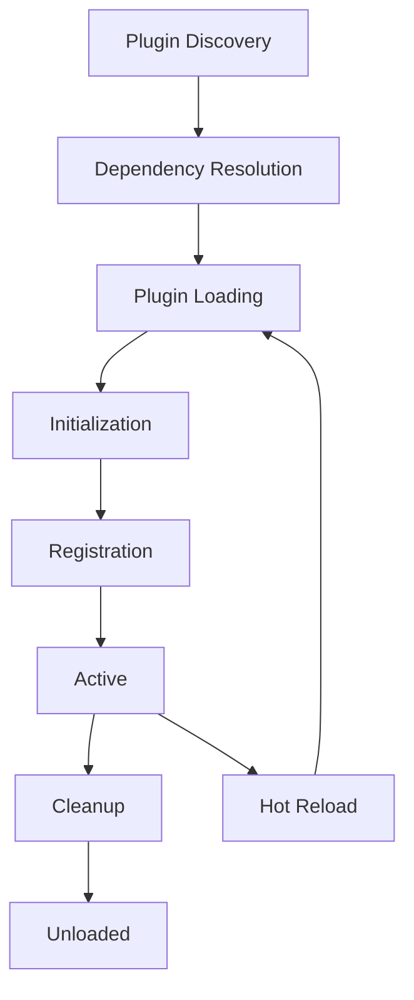
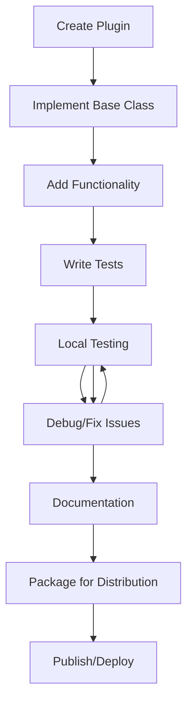

# LocalAgent CLI Plugin Development Guide

## Table of Contents
- [Overview](#overview)
- [Plugin Architecture](#plugin-architecture)
- [Getting Started](#getting-started)
- [Plugin Types](#plugin-types)
- [Development Workflow](#development-workflow)
- [Plugin Framework API](#plugin-framework-api)
- [Advanced Features](#advanced-features)
- [Testing and Debugging](#testing-and-debugging)
- [Distribution and Deployment](#distribution-and-deployment)
- [Best Practices](#best-practices)
- [Examples](#examples)
- [Reference](#reference)

---

## Overview

The LocalAgent CLI features a comprehensive plugin system that allows developers to extend functionality through modular, reusable components. The plugin architecture is built on Python's entry points system and supports dynamic loading, hot-reloading, and dependency management.

### Plugin System Benefits
- **Extensibility**: Add new commands, providers, and UI components
- **Modularity**: Clean separation of concerns and responsibilities
- **Reusability**: Share plugins across different installations
- **Hot-Reload**: Development-time plugin reloading
- **Type Safety**: Full type hints and validation
- **Integration**: Seamless integration with core CLI features

### Supported Plugin Types
- **Command Plugins**: Add new CLI commands
- **Provider Plugins**: Add new LLM providers
- **UI Plugins**: Extend user interface components
- **Workflow Plugins**: Add workflow phases or agents
- **Tool Plugins**: Add utility functions and tools

---

## Plugin Architecture

### Core Components

```
Plugin System Architecture
├── Plugin Framework (app/cli/plugins/framework.py)
│   ├── Plugin Discovery
│   ├── Dependency Resolution
│   ├── Lifecycle Management
│   └── Error Handling
├── Base Classes (app/cli/plugins/base.py)
│   ├── CLIPlugin (Abstract Base)
│   ├── CommandPlugin
│   ├── ProviderPlugin
│   ├── UIPlugin
│   └── WorkflowPlugin
├── Plugin Manager (app/cli/plugins/framework.py)
│   ├── Entry Point Discovery
│   ├── Directory Scanning
│   ├── Plugin Loading
│   └── Configuration Management
└── Built-in Plugins (app/cli/plugins/builtin/)
    ├── Developer Tools
    ├── Export Tools
    ├── Security Scanner
    └── Workflow Automation
```

### Plugin Lifecycle



### Discovery Mechanisms

1. **Entry Points**: Standard Python package entry points
2. **Directory Scanning**: Local plugin directories
3. **Dynamic Loading**: Runtime plugin registration

---

## Getting Started

### Prerequisites

- Python 3.9+
- LocalAgent CLI installed
- Basic understanding of Python packaging
- Familiarity with Typer CLI framework

### Development Environment Setup

```bash
# Create plugin development directory
mkdir -p ~/.localagent/plugins/my-plugin
cd ~/.localagent/plugins/my-plugin

# Initialize plugin structure
cat > setup.py << 'EOF'
from setuptools import setup, find_packages

setup(
    name="my-localagent-plugin",
    version="1.0.0",
    packages=find_packages(),
    install_requires=[
        "localagent-cli",
        "typer>=0.16.0",
        "rich>=13.6.0"
    ],
    entry_points={
        "localagent.plugins.commands": [
            "my-plugin = my_plugin.plugin:MyPlugin"
        ]
    }
)
EOF

# Create plugin package
mkdir my_plugin
touch my_plugin/__init__.py
```

### Basic Plugin Structure

```python
# my_plugin/plugin.py
from app.cli.plugins.framework import CommandPlugin
import typer
from rich.console import Console
from typing import Optional

console = Console()

class MyPlugin(CommandPlugin):
    """Example plugin demonstrating basic functionality"""
    
    @property
    def name(self) -> str:
        return "my-plugin"
    
    @property
    def version(self) -> str:
        return "1.0.0"
    
    @property
    def description(self) -> str:
        return "My first LocalAgent plugin"
    
    async def initialize(self, context) -> bool:
        """Initialize plugin with CLI context"""
        self.context = context
        console.print(f"[green]Initialized {self.name} v{self.version}[/green]")
        return True
    
    def register_commands(self, app: typer.Typer) -> None:
        """Register plugin commands"""
        
        @app.command("hello")
        def hello_command(
            name: str = typer.Argument("World", help="Name to greet"),
            count: int = typer.Option(1, "--count", "-c", help="Number of greetings")
        ):
            """Say hello with customizable greeting"""
            for i in range(count):
                console.print(f"Hello, {name}! ({i+1}/{count})")
        
        @app.command("status")
        def status_command():
            """Show plugin status"""
            console.print(f"Plugin: {self.name}")
            console.print(f"Version: {self.version}")
            console.print(f"Status: Active")
            console.print(f"Provider: {self.context.config.default_provider}")
```

### Plugin Installation and Testing

```bash
# Install plugin in development mode
pip install -e .

# Enable plugin in LocalAgent
localagent plugins --enable my-plugin

# Test plugin commands
localagent hello "Developer"
localagent status
```

---

## Plugin Types

### Command Plugins

Command plugins add new CLI commands to LocalAgent.

```python
from app.cli.plugins.framework import CommandPlugin
import typer
from rich.console import Console
from rich.table import Table
from typing import Optional, List

class WorkflowToolsPlugin(CommandPlugin):
    @property
    def name(self) -> str:
        return "workflow-tools"
    
    def register_commands(self, app: typer.Typer) -> None:
        @app.command("workflow-template")
        def create_workflow_template(
            name: str = typer.Argument(help="Template name"),
            phases: Optional[str] = typer.Option(None, "--phases", help="Comma-separated phase numbers"),
            output: Optional[str] = typer.Option("template.yaml", "--output", "-o", help="Output file")
        ):
            """Create a workflow template"""
            template_data = self._create_template(name, phases)
            self._save_template(template_data, output)
            console.print(f"[green]Template saved to {output}[/green]")
        
        @app.command("workflow-history")
        def list_workflow_history(
            limit: int = typer.Option(10, "--limit", "-l", help="Number of workflows to show"),
            format: str = typer.Option("table", "--format", help="Output format (table/json)")
        ):
            """List recent workflow executions"""
            history = self._get_workflow_history(limit)
            
            if format == "table":
                table = Table(title="Recent Workflows")
                table.add_column("ID")
                table.add_column("Prompt")
                table.add_column("Status")
                table.add_column("Duration")
                table.add_column("Date")
                
                for workflow in history:
                    table.add_row(
                        workflow['id'][:8],
                        workflow['prompt'][:50] + "..." if len(workflow['prompt']) > 50 else workflow['prompt'],
                        workflow['status'],
                        f"{workflow['duration']:.1f}s",
                        workflow['date']
                    )
                
                console.print(table)
            else:
                console.print_json(history)
    
    def _create_template(self, name: str, phases: Optional[str]) -> dict:
        """Create workflow template data"""
        template = {
            "name": name,
            "description": f"Workflow template: {name}",
            "phases": []
        }
        
        if phases:
            phase_numbers = [int(p.strip()) for p in phases.split(',')]
            for phase_num in phase_numbers:
                template["phases"].append({
                    "phase": phase_num,
                    "enabled": True,
                    "parallel": True
                })
        
        return template
```

### Provider Plugins

Provider plugins add new LLM providers to the system.

```python
from app.cli.plugins.framework import ProviderPlugin
from app.llm_providers.base_provider import BaseProvider, CompletionRequest, CompletionResponse
from typing import Dict, Any, List, AsyncGenerator
import aiohttp
import json

class CustomLLMProvider(BaseProvider):
    """Custom LLM provider implementation"""
    
    def __init__(self, config: Dict[str, Any]):
        super().__init__(config)
        self.api_endpoint = config.get("api_endpoint")
        self.api_key = config.get("api_key")
        self.default_model = config.get("default_model", "custom-model")
    
    @property
    def provider_name(self) -> str:
        return "custom-llm"
    
    @property
    def requires_api_key(self) -> bool:
        return True
    
    async def initialize(self) -> bool:
        """Initialize the provider"""
        try:
            # Test connection
            async with aiohttp.ClientSession() as session:
                async with session.get(
                    f"{self.api_endpoint}/health",
                    headers={"Authorization": f"Bearer {self.api_key}"}
                ) as response:
                    return response.status == 200
        except Exception:
            return False
    
    async def health_check(self) -> Dict[str, Any]:
        """Check provider health"""
        try:
            models = await self.list_models()
            return {
                "healthy": True,
                "models_available": len(models),
                "endpoint": self.api_endpoint
            }
        except Exception as e:
            return {
                "healthy": False,
                "error": str(e)
            }
    
    async def list_models(self) -> List[Any]:
        """List available models"""
        async with aiohttp.ClientSession() as session:
            async with session.get(
                f"{self.api_endpoint}/models",
                headers={"Authorization": f"Bearer {self.api_key}"}
            ) as response:
                data = await response.json()
                return data.get("models", [])
    
    async def complete(self, request: CompletionRequest) -> CompletionResponse:
        """Generate completion"""
        payload = {
            "model": request.model or self.default_model,
            "messages": request.messages,
            "max_tokens": request.max_tokens,
            "temperature": request.temperature
        }
        
        async with aiohttp.ClientSession() as session:
            async with session.post(
                f"{self.api_endpoint}/completions",
                headers={
                    "Authorization": f"Bearer {self.api_key}",
                    "Content-Type": "application/json"
                },
                json=payload
            ) as response:
                data = await response.json()
                
                return CompletionResponse(
                    content=data["choices"][0]["message"]["content"],
                    model=data["model"],
                    usage=data.get("usage", {}),
                    provider=self.provider_name
                )
    
    async def stream_complete(self, request: CompletionRequest) -> AsyncGenerator[str, None]:
        """Generate streaming completion"""
        payload = {
            "model": request.model or self.default_model,
            "messages": request.messages,
            "stream": True,
            "max_tokens": request.max_tokens,
            "temperature": request.temperature
        }
        
        async with aiohttp.ClientSession() as session:
            async with session.post(
                f"{self.api_endpoint}/completions",
                headers={
                    "Authorization": f"Bearer {self.api_key}",
                    "Content-Type": "application/json"
                },
                json=payload
            ) as response:
                async for line in response.content:
                    if line.startswith(b"data: "):
                        data_str = line[6:].decode().strip()
                        if data_str == "[DONE]":
                            break
                        
                        try:
                            data = json.loads(data_str)
                            if "choices" in data and data["choices"]:
                                delta = data["choices"][0].get("delta", {})
                                if "content" in delta:
                                    yield delta["content"]
                        except json.JSONDecodeError:
                            continue

class CustomProviderPlugin(ProviderPlugin):
    """Plugin for custom LLM provider"""
    
    @property
    def name(self) -> str:
        return "custom-llm-provider"
    
    @property
    def version(self) -> str:
        return "1.0.0"
    
    @property
    def description(self) -> str:
        return "Custom LLM provider integration"
    
    async def initialize(self, context) -> bool:
        self.context = context
        return True
    
    def get_provider_class(self):
        return CustomLLMProvider
    
    def get_provider_config_schema(self) -> Dict[str, Any]:
        return {
            "type": "object",
            "properties": {
                "api_endpoint": {
                    "type": "string",
                    "description": "API endpoint URL"
                },
                "api_key": {
                    "type": "string",
                    "description": "API authentication key"
                },
                "default_model": {
                    "type": "string",
                    "description": "Default model name",
                    "default": "custom-model"
                }
            },
            "required": ["api_endpoint", "api_key"]
        }
```

### UI Plugins

UI plugins extend the user interface with custom components.

```python
from app.cli.plugins.framework import UIPlugin
from rich.console import Console
from rich.table import Table
from rich.panel import Panel
from rich.progress import Progress, SpinnerColumn, TextColumn
from rich.layout import Layout
from typing import Dict, Any, List

class CustomUIPlugin(UIPlugin):
    """Plugin providing custom UI components"""
    
    @property
    def name(self) -> str:
        return "custom-ui-components"
    
    def get_ui_components(self) -> Dict[str, Any]:
        return {
            "workflow_dashboard": self.create_workflow_dashboard,
            "provider_status_panel": self.create_provider_status_panel,
            "performance_monitor": self.create_performance_monitor,
            "interactive_selector": self.create_interactive_selector
        }
    
    def create_workflow_dashboard(self, workflow_data: Dict[str, Any]) -> Layout:
        """Create comprehensive workflow dashboard"""
        layout = Layout()
        
        # Create sections
        layout.split_column(
            Layout(name="header", size=3),
            Layout(name="body"),
            Layout(name="footer", size=3)
        )
        
        # Header with workflow info
        header_panel = Panel(
            f"Workflow: {workflow_data.get('name', 'Unknown')} | "
            f"Status: {workflow_data.get('status', 'Unknown')} | "
            f"Progress: {workflow_data.get('progress', 0)}%",
            title="Workflow Dashboard"
        )
        layout["header"].update(header_panel)
        
        # Body with phase details
        layout["body"].split_row(
            Layout(name="phases"),
            Layout(name="agents")
        )
        
        # Phases table
        phases_table = Table(title="Phases")
        phases_table.add_column("Phase")
        phases_table.add_column("Status")
        phases_table.add_column("Duration")
        phases_table.add_column("Agents")
        
        for phase in workflow_data.get('phases', []):
            status_emoji = "✅" if phase['status'] == 'completed' else "🔄" if phase['status'] == 'running' else "⏸️"
            phases_table.add_row(
                f"Phase {phase['number']}",
                f"{status_emoji} {phase['status']}",
                f"{phase['duration']:.1f}s",
                str(phase['agent_count'])
            )
        
        layout["phases"].update(phases_table)
        
        # Agents status
        agents_table = Table(title="Active Agents")
        agents_table.add_column("Agent")
        agents_table.add_column("Status")
        agents_table.add_column("Provider")
        
        for agent in workflow_data.get('active_agents', []):
            agents_table.add_row(
                agent['name'],
                agent['status'],
                agent['provider']
            )
        
        layout["agents"].update(agents_table)
        
        # Footer with summary
        footer_text = f"Total Execution Time: {workflow_data.get('total_time', 0):.1f}s | " \
                     f"Successful Phases: {workflow_data.get('successful_phases', 0)} | " \
                     f"Failed Phases: {workflow_data.get('failed_phases', 0)}"
        
        layout["footer"].update(Panel(footer_text))
        
        return layout
    
    def create_provider_status_panel(self, providers_data: List[Dict[str, Any]]) -> Panel:
        """Create provider status panel"""
        status_table = Table()
        status_table.add_column("Provider")
        status_table.add_column("Status")
        status_table.add_column("Models")
        status_table.add_column("Response Time")
        
        for provider in providers_data:
            status_emoji = "🟢" if provider['healthy'] else "🔴"
            status_table.add_row(
                provider['name'],
                f"{status_emoji} {'Online' if provider['healthy'] else 'Offline'}",
                str(provider.get('model_count', 0)),
                f"{provider.get('response_time', 0):.0f}ms"
            )
        
        return Panel(status_table, title="Provider Status")
    
    def create_performance_monitor(self, metrics: Dict[str, Any]) -> Panel:
        """Create performance monitoring display"""
        perf_layout = Layout()
        perf_layout.split_row(
            Layout(name="cpu_memory"),
            Layout(name="network_io")
        )
        
        # CPU and Memory metrics
        cpu_memory_text = f"""CPU Usage: {metrics.get('cpu_percent', 0):.1f}%
Memory Usage: {metrics.get('memory_percent', 0):.1f}%
Active Agents: {metrics.get('active_agents', 0)}
Queue Size: {metrics.get('queue_size', 0)}"""
        
        perf_layout["cpu_memory"].update(Panel(cpu_memory_text, title="System Resources"))
        
        # Network and I/O metrics
        network_io_text = f"""Network Requests: {metrics.get('network_requests', 0)}
API Calls/min: {metrics.get('api_calls_per_minute', 0)}
Cache Hit Rate: {metrics.get('cache_hit_rate', 0):.1f}%
Avg Response Time: {metrics.get('avg_response_time', 0):.0f}ms"""
        
        perf_layout["network_io"].update(Panel(network_io_text, title="Performance"))
        
        return Panel(perf_layout, title="Performance Monitor")
    
    def create_interactive_selector(self, options: List[str], title: str = "Select Option") -> str:
        """Create interactive option selector"""
        from InquirerPy import inquirer
        
        return inquirer.select(
            message=title,
            choices=options,
            default=options[0] if options else None
        ).execute()
```

### Workflow Plugins

Workflow plugins add new phases or agents to the workflow system.

```python
from app.cli.plugins.framework import WorkflowPlugin
from typing import Dict, Any, List

class CustomWorkflowPlugin(WorkflowPlugin):
    """Plugin adding custom workflow components"""
    
    @property
    def name(self) -> str:
        return "custom-workflow-components"
    
    def get_workflow_components(self) -> Dict[str, Any]:
        return {
            "agents": {
                "custom-analyzer": CustomAnalyzerAgent,
                "performance-optimizer": PerformanceOptimizerAgent
            },
            "phases": {
                "custom-analysis": {
                    "phase_id": "custom-analysis",
                    "name": "Custom Analysis Phase",
                    "description": "Perform custom analysis tasks",
                    "agents": ["custom-analyzer"],
                    "parallel": True
                }
            },
            "workflows": {
                "performance-optimization": {
                    "name": "Performance Optimization Workflow",
                    "description": "Comprehensive performance optimization",
                    "phases": [1, 2, "custom-analysis", 6, 8, 9]
                }
            }
        }

class CustomAnalyzerAgent:
    """Custom workflow agent implementation"""
    
    def __init__(self, config: Dict[str, Any]):
        self.config = config
        self.name = "custom-analyzer"
        self.description = "Custom analysis agent"
    
    async def execute(self, context: Dict[str, Any]) -> Dict[str, Any]:
        """Execute agent task"""
        # Implement custom analysis logic
        analysis_results = await self._perform_analysis(context)
        
        return {
            "success": True,
            "results": analysis_results,
            "evidence": ["Analysis completed successfully"],
            "execution_time": 0.0
        }
    
    async def _perform_analysis(self, context: Dict[str, Any]) -> Dict[str, Any]:
        """Perform the actual analysis"""
        # Custom analysis implementation
        return {
            "analysis_type": "custom",
            "findings": [],
            "recommendations": []
        }

class PerformanceOptimizerAgent:
    """Performance optimization agent"""
    
    def __init__(self, config: Dict[str, Any]):
        self.config = config
        self.name = "performance-optimizer"
        self.description = "Performance optimization agent"
    
    async def execute(self, context: Dict[str, Any]) -> Dict[str, Any]:
        """Execute optimization tasks"""
        optimizations = await self._optimize_performance(context)
        
        return {
            "success": True,
            "results": optimizations,
            "evidence": [f"Applied {len(optimizations)} optimizations"],
            "execution_time": 0.0
        }
    
    async def _optimize_performance(self, context: Dict[str, Any]) -> List[str]:
        """Implement performance optimizations"""
        return [
            "Optimized database queries",
            "Implemented caching strategy",
            "Reduced memory usage"
        ]
```

---

## Development Workflow

### Plugin Development Lifecycle



### Development Setup

```bash
# Create development environment
python -m venv plugin_dev_env
source plugin_dev_env/bin/activate

# Install LocalAgent CLI in development mode
pip install -e /path/to/localagent

# Enable hot-reload for development
export LOCALAGENT_PLUGINS_HOT_RELOAD=true
export LOCALAGENT_PLUGINS_ALLOW_DEV=true

# Create plugin project structure
mkdir my-awesome-plugin
cd my-awesome-plugin

# Initialize with cookiecutter (if available)
# cookiecutter gh:localagent/plugin-template
```

### Plugin Project Template

```
my-awesome-plugin/
├── setup.py                 # Package configuration
├── setup.cfg                # Package metadata
├── pyproject.toml           # Modern Python packaging
├── README.md                # Plugin documentation
├── LICENSE                  # License file
├── requirements.txt         # Dependencies
├── requirements-dev.txt     # Development dependencies
├── my_awesome_plugin/       # Plugin package
│   ├── __init__.py         # Package init
│   ├── plugin.py           # Main plugin class
│   ├── commands.py         # Command implementations
│   ├── providers.py        # Provider implementations (if applicable)
│   ├── ui.py              # UI components (if applicable)
│   └── utils.py           # Utility functions
├── tests/                   # Test suite
│   ├── __init__.py
│   ├── test_plugin.py      # Plugin tests
│   ├── test_commands.py    # Command tests
│   └── conftest.py         # Test configuration
├── docs/                    # Documentation
│   ├── usage.md           # Usage guide
│   ├── api.md             # API documentation
│   └── examples.md        # Examples
└── .github/                # GitHub workflows (optional)
    └── workflows/
        └── test.yml        # CI/CD pipeline
```

### Development Commands

```bash
# Install plugin in development mode
pip install -e .

# Run tests
pytest tests/

# Test plugin discovery
localagent plugins --list --verbose

# Enable plugin
localagent plugins --enable my-awesome-plugin

# Test plugin commands
localagent my-command --help

# Debug plugin issues
localagent --debug plugins --info my-awesome-plugin

# Hot-reload plugin during development
# (Changes are picked up automatically with LOCALAGENT_PLUGINS_HOT_RELOAD=true)

# Package for distribution
python setup.py sdist bdist_wheel

# Check package
twine check dist/*
```

---

## Plugin Framework API

### Base Plugin Class

```python
from abc import ABC, abstractmethod
from typing import Dict, Any, List, Optional
import typer

class CLIPlugin(ABC):
    """Abstract base class for all LocalAgent plugins"""
    
    @property
    @abstractmethod
    def name(self) -> str:
        """Plugin identifier/name"""
        pass
    
    @property
    @abstractmethod
    def version(self) -> str:
        """Plugin version (semantic versioning)"""
        pass
    
    @property
    @abstractmethod
    def description(self) -> str:
        """Plugin description for help and documentation"""
        pass
    
    @property
    def author(self) -> Optional[str]:
        """Plugin author information"""
        return None
    
    @property
    def homepage(self) -> Optional[str]:
        """Plugin homepage URL"""
        return None
    
    @property
    def dependencies(self) -> List[str]:
        """List of plugin dependencies (other plugin names)"""
        return []
    
    @property
    def requires_config(self) -> bool:
        """Whether plugin requires configuration"""
        return False
    
    @property
    def min_cli_version(self) -> Optional[str]:
        """Minimum required CLI version"""
        return None
    
    @abstractmethod
    async def initialize(self, context: 'CLIContext') -> bool:
        """
        Initialize plugin with CLI context
        
        Args:
            context: CLI context containing configuration and services
            
        Returns:
            bool: True if initialization successful, False otherwise
        """
        pass
    
    async def cleanup(self) -> None:
        """
        Cleanup plugin resources
        Called when plugin is unloaded or CLI shuts down
        """
        pass
    
    def get_config_schema(self) -> Optional[Dict[str, Any]]:
        """
        Get plugin configuration schema (JSON Schema format)
        
        Returns:
            Optional[Dict]: JSON schema for plugin configuration
        """
        return None
    
    def validate_config(self, config: Dict[str, Any]) -> List[str]:
        """
        Validate plugin configuration
        
        Args:
            config: Plugin configuration dictionary
            
        Returns:
            List[str]: List of validation errors (empty if valid)
        """
        return []
    
    async def health_check(self) -> Dict[str, Any]:
        """
        Perform plugin health check
        
        Returns:
            Dict containing health status and details
        """
        return {
            "healthy": True,
            "name": self.name,
            "version": self.version
        }
```

### CLI Context

```python
from dataclasses import dataclass
from typing import Dict, Any, Optional
from pathlib import Path

@dataclass
class CLIContext:
    """Context object passed to plugins during initialization"""
    
    # Core configuration
    config: 'LocalAgentConfig'
    debug_mode: bool = False
    log_level: str = "INFO"
    
    # System information
    cli_version: str = ""
    python_version: str = ""
    platform: str = ""
    
    # Runtime state
    active_session: Optional[str] = None
    current_workflow: Optional[str] = None
    working_directory: Path = Path.cwd()
    
    # Services (injected by plugin manager)
    provider_manager: Optional['ProviderManager'] = None
    orchestrator: Optional['LocalAgentOrchestrator'] = None
    cache_manager: Optional['CacheManager'] = None
    
    def get_plugin_config(self, plugin_name: str) -> Dict[str, Any]:
        """Get configuration for specific plugin"""
        return self.config.plugins.get(plugin_name, {})
    
    def get_service(self, service_name: str) -> Optional[Any]:
        """Get injected service by name"""
        return getattr(self, service_name, None)
```

### Plugin Registration Helpers

```python
from typing import Callable, Any
import functools

def plugin_command(
    name: Optional[str] = None,
    help: Optional[str] = None,
    requires_config: bool = False
):
    """Decorator for plugin commands"""
    def decorator(func: Callable) -> Callable:
        @functools.wraps(func)
        def wrapper(*args, **kwargs):
            # Add plugin-specific logic
            return func(*args, **kwargs)
        
        wrapper._is_plugin_command = True
        wrapper._command_name = name or func.__name__
        wrapper._command_help = help or func.__doc__
        wrapper._requires_config = requires_config
        
        return wrapper
    
    return decorator

def requires_provider(provider_type: str):
    """Decorator to ensure specific provider is available"""
    def decorator(func: Callable) -> Callable:
        @functools.wraps(func)
        async def wrapper(self, *args, **kwargs):
            if not self.context.provider_manager.has_provider(provider_type):
                raise RuntimeError(f"Provider {provider_type} not available")
            return await func(self, *args, **kwargs)
        return wrapper
    return decorator

def cache_result(ttl: int = 3600):
    """Decorator to cache command results"""
    def decorator(func: Callable) -> Callable:
        @functools.wraps(func)
        async def wrapper(self, *args, **kwargs):
            cache_key = f"{self.name}:{func.__name__}:{hash(str(args) + str(kwargs))}"
            
            if hasattr(self.context, 'cache_manager'):
                cached = await self.context.cache_manager.get(cache_key)
                if cached:
                    return cached
            
            result = await func(self, *args, **kwargs)
            
            if hasattr(self.context, 'cache_manager'):
                await self.context.cache_manager.set(cache_key, result, ttl=ttl)
            
            return result
        return wrapper
    return decorator
```

---

## Advanced Features

### Configuration Management

```python
class ConfigurablePlugin(CommandPlugin):
    """Plugin with advanced configuration management"""
    
    def get_config_schema(self) -> Dict[str, Any]:
        return {
            "type": "object",
            "properties": {
                "api_endpoint": {
                    "type": "string",
                    "format": "uri",
                    "description": "API endpoint URL"
                },
                "timeout": {
                    "type": "integer",
                    "minimum": 1,
                    "maximum": 300,
                    "default": 30,
                    "description": "Request timeout in seconds"
                },
                "features": {
                    "type": "object",
                    "properties": {
                        "caching": {"type": "boolean", "default": True},
                        "retry": {"type": "boolean", "default": True},
                        "async_mode": {"type": "boolean", "default": False}
                    }
                }
            },
            "required": ["api_endpoint"]
        }
    
    def validate_config(self, config: Dict[str, Any]) -> List[str]:
        errors = []
        
        # Custom validation logic
        if config.get("timeout", 0) > 300:
            errors.append("Timeout cannot exceed 300 seconds")
        
        if config.get("api_endpoint", "").startswith("http://"):
            errors.append("HTTPS endpoint recommended for security")
        
        return errors
    
    async def initialize(self, context) -> bool:
        self.context = context
        self.config = context.get_plugin_config(self.name)
        
        # Validate configuration
        errors = self.validate_config(self.config)
        if errors:
            for error in errors:
                console.print(f"[red]Config Error: {error}[/red]")
            return False
        
        # Initialize with configuration
        self.api_endpoint = self.config["api_endpoint"]
        self.timeout = self.config.get("timeout", 30)
        self.features = self.config.get("features", {})
        
        return True
```

### Dependency Management

```python
class DependentPlugin(CommandPlugin):
    """Plugin with dependencies on other plugins"""
    
    @property
    def dependencies(self) -> List[str]:
        return ["base-utilities", "api-client"]
    
    async def initialize(self, context) -> bool:
        self.context = context
        
        # Check if dependencies are loaded
        plugin_manager = context.get_service('plugin_manager')
        
        for dep in self.dependencies:
            if not plugin_manager.is_plugin_loaded(dep):
                console.print(f"[red]Dependency not loaded: {dep}[/red]")
                return False
        
        # Get dependency instances
        self.base_utils = plugin_manager.get_loaded_plugin('base-utilities')
        self.api_client = plugin_manager.get_loaded_plugin('api-client')
        
        return True
    
    def register_commands(self, app: typer.Typer) -> None:
        @app.command("dependent-action")
        def dependent_action():
            """Action that uses dependencies"""
            # Use dependency functionality
            result = self.base_utils.format_output("Hello from dependent plugin")
            api_data = self.api_client.fetch_data()
            console.print(result)
```

### Event System

```python
from typing import Callable, Dict, List
from dataclasses import dataclass
from enum import Enum

class PluginEvent(Enum):
    PLUGIN_LOADED = "plugin_loaded"
    PLUGIN_UNLOADED = "plugin_unloaded"
    COMMAND_EXECUTED = "command_executed"
    WORKFLOW_STARTED = "workflow_started"
    WORKFLOW_COMPLETED = "workflow_completed"

@dataclass
class EventData:
    event_type: PluginEvent
    plugin_name: str
    data: Dict[str, Any]

class EventAwarePlugin(CommandPlugin):
    """Plugin that can emit and listen to events"""
    
    async def initialize(self, context) -> bool:
        self.context = context
        self.event_manager = context.get_service('event_manager')
        
        # Subscribe to events
        if self.event_manager:
            self.event_manager.subscribe(PluginEvent.WORKFLOW_STARTED, self._on_workflow_started)
            self.event_manager.subscribe(PluginEvent.WORKFLOW_COMPLETED, self._on_workflow_completed)
        
        return True
    
    async def _on_workflow_started(self, event_data: EventData):
        """Handle workflow started event"""
        console.print(f"[blue]Workflow started: {event_data.data.get('workflow_id')}[/blue]")
    
    async def _on_workflow_completed(self, event_data: EventData):
        """Handle workflow completed event"""
        success = event_data.data.get('success', False)
        status_color = "green" if success else "red"
        console.print(f"[{status_color}]Workflow completed: {success}[/{status_color}]")
    
    def register_commands(self, app: typer.Typer) -> None:
        @app.command("trigger-event")
        def trigger_event():
            """Trigger a custom event"""
            if self.event_manager:
                event_data = EventData(
                    event_type=PluginEvent.COMMAND_EXECUTED,
                    plugin_name=self.name,
                    data={"command": "trigger-event", "timestamp": "2024-01-01T12:00:00Z"}
                )
                self.event_manager.emit(event_data)
```

### Async Operations and Background Tasks

```python
import asyncio
from typing import Optional

class AsyncPlugin(CommandPlugin):
    """Plugin with async operations and background tasks"""
    
    def __init__(self):
        self.background_tasks: List[asyncio.Task] = []
        self.shutdown_event = asyncio.Event()
    
    async def initialize(self, context) -> bool:
        self.context = context
        
        # Start background task
        task = asyncio.create_task(self._background_monitor())
        self.background_tasks.append(task)
        
        return True
    
    async def cleanup(self) -> None:
        """Cleanup background tasks"""
        self.shutdown_event.set()
        
        # Wait for background tasks to complete
        if self.background_tasks:
            await asyncio.gather(*self.background_tasks, return_exceptions=True)
    
    async def _background_monitor(self):
        """Background monitoring task"""
        while not self.shutdown_event.is_set():
            try:
                # Perform periodic monitoring
                await self._check_system_status()
                await asyncio.sleep(60)  # Check every minute
            except asyncio.CancelledError:
                break
            except Exception as e:
                console.print(f"[red]Background monitor error: {e}[/red]")
                await asyncio.sleep(60)
    
    async def _check_system_status(self):
        """Check system status in background"""
        # Implementation for system status checking
        pass
    
    def register_commands(self, app: typer.Typer) -> None:
        @app.command("async-operation")
        async def async_operation(
            duration: int = typer.Option(10, "--duration", "-d", help="Operation duration")
        ):
            """Perform async operation"""
            console.print(f"Starting async operation for {duration} seconds...")
            
            # Simulate long-running operation with progress
            from rich.progress import Progress
            
            with Progress() as progress:
                task = progress.add_task("Processing...", total=duration)
                
                for i in range(duration):
                    await asyncio.sleep(1)
                    progress.update(task, advance=1)
            
            console.print("[green]Async operation completed![/green]")
```

---

## Testing and Debugging

### Testing Framework

```python
# tests/test_plugin.py
import pytest
import asyncio
from unittest.mock import Mock, AsyncMock
from my_awesome_plugin.plugin import MyAwesomePlugin
from app.cli.core.context import CLIContext

class TestMyAwesomePlugin:
    """Test suite for plugin functionality"""
    
    @pytest.fixture
    def mock_context(self):
        """Create mock CLI context for testing"""
        context = Mock(spec=CLIContext)
        context.config = Mock()
        context.config.default_provider = "test-provider"
        context.get_plugin_config.return_value = {
            "api_endpoint": "https://api.test.com",
            "timeout": 30
        }
        return context
    
    @pytest.fixture
    async def plugin(self, mock_context):
        """Create plugin instance for testing"""
        plugin = MyAwesomePlugin()
        await plugin.initialize(mock_context)
        return plugin
    
    @pytest.mark.asyncio
    async def test_plugin_initialization(self, mock_context):
        """Test plugin initialization"""
        plugin = MyAwesomePlugin()
        
        # Test successful initialization
        result = await plugin.initialize(mock_context)
        assert result is True
        assert plugin.context == mock_context
    
    @pytest.mark.asyncio
    async def test_plugin_health_check(self, plugin):
        """Test plugin health check"""
        health = await plugin.health_check()
        
        assert health["healthy"] is True
        assert health["name"] == plugin.name
        assert health["version"] == plugin.version
    
    def test_plugin_properties(self):
        """Test plugin properties"""
        plugin = MyAwesomePlugin()
        
        assert plugin.name == "my-awesome-plugin"
        assert plugin.version is not None
        assert plugin.description is not None
    
    def test_plugin_config_schema(self):
        """Test plugin configuration schema"""
        plugin = MyAwesomePlugin()
        schema = plugin.get_config_schema()
        
        if schema:
            assert "type" in schema
            assert schema["type"] == "object"
    
    @pytest.mark.asyncio
    async def test_command_registration(self, plugin):
        """Test command registration"""
        import typer
        
        app = typer.Typer()
        plugin.register_commands(app)
        
        # Check if commands were registered
        assert len(app.registered_commands) > 0
    
    def test_plugin_dependencies(self):
        """Test plugin dependencies"""
        plugin = MyAwesomePlugin()
        dependencies = plugin.dependencies
        
        assert isinstance(dependencies, list)
        # Add specific dependency tests if applicable

# Integration tests
class TestPluginIntegration:
    """Integration tests for plugin with CLI"""
    
    @pytest.mark.asyncio
    async def test_plugin_loading(self):
        """Test plugin loading in CLI"""
        from app.cli.plugins.framework import PluginManager
        
        # Mock CLI context
        context = Mock(spec=CLIContext)
        context.config = Mock()
        context.config.plugins = Mock()
        context.config.plugins.enabled_plugins = ["my-awesome-plugin"]
        context.config.plugins.auto_load_plugins = True
        context.config.plugins.plugin_directories = []
        context.config.plugins.allow_dev_plugins = True
        
        # Create plugin manager and test loading
        plugin_manager = PluginManager(context)
        
        # Mock plugin discovery (in real scenario, this would find our plugin)
        plugin_manager.discovered_plugins["my-awesome-plugin"] = Mock()
        
        # Test plugin loading
        success = await plugin_manager.load_plugin("my-awesome-plugin")
        assert success is True  # Adjust based on actual implementation

# Performance tests
class TestPluginPerformance:
    """Performance tests for plugin"""
    
    @pytest.mark.asyncio
    async def test_initialization_time(self, mock_context):
        """Test plugin initialization performance"""
        import time
        
        plugin = MyAwesomePlugin()
        
        start_time = time.time()
        await plugin.initialize(mock_context)
        end_time = time.time()
        
        initialization_time = end_time - start_time
        assert initialization_time < 1.0  # Should initialize in less than 1 second
    
    @pytest.mark.asyncio
    async def test_command_execution_time(self, plugin):
        """Test command execution performance"""
        import time
        
        # Mock command execution
        start_time = time.time()
        # Execute plugin command here
        end_time = time.time()
        
        execution_time = end_time - start_time
        assert execution_time < 5.0  # Commands should complete in reasonable time

# Fixtures for common test data
@pytest.fixture
def sample_workflow_data():
    """Sample workflow data for testing"""
    return {
        "workflow_id": "test-workflow-123",
        "status": "completed",
        "phases": [
            {"number": 1, "status": "completed", "duration": 2.5, "agent_count": 3},
            {"number": 2, "status": "completed", "duration": 1.8, "agent_count": 2}
        ],
        "active_agents": [
            {"name": "test-agent-1", "status": "idle", "provider": "test-provider"}
        ],
        "total_time": 4.3,
        "successful_phases": 2,
        "failed_phases": 0
    }

@pytest.fixture
def sample_provider_data():
    """Sample provider data for testing"""
    return [
        {
            "name": "test-provider-1",
            "healthy": True,
            "model_count": 5,
            "response_time": 150
        },
        {
            "name": "test-provider-2", 
            "healthy": False,
            "model_count": 0,
            "response_time": 0
        }
    ]
```

### Debugging Tools

```python
# my_awesome_plugin/debug.py
import logging
import traceback
from typing import Any, Dict
from rich.console import Console
from rich.traceback import install

# Install rich traceback for better error display
install()

console = Console()

class PluginDebugger:
    """Debugging utilities for plugin development"""
    
    def __init__(self, plugin_name: str):
        self.plugin_name = plugin_name
        self.logger = logging.getLogger(f"localagent.plugins.{plugin_name}")
    
    def debug_log(self, message: str, data: Any = None):
        """Debug logging with structured data"""
        if data:
            self.logger.debug(f"{message}: {data}")
        else:
            self.logger.debug(message)
        
        # Also output to console in debug mode
        if console:
            if data:
                console.print(f"[yellow]DEBUG[/yellow] [{self.plugin_name}] {message}")
                console.print_json(data)
            else:
                console.print(f"[yellow]DEBUG[/yellow] [{self.plugin_name}] {message}")
    
    def trace_exception(self, exc: Exception, context: str = ""):
        """Trace exception with context"""
        context_msg = f" in {context}" if context else ""
        self.logger.error(f"Exception{context_msg}: {exc}")
        
        if console:
            console.print(f"[red]ERROR[/red] [{self.plugin_name}]{context_msg}:")
            console.print_exception()
    
    def performance_timer(self, operation_name: str):
        """Context manager for performance timing"""
        return PerformanceTimer(self, operation_name)
    
    def validate_state(self, expected_state: Dict[str, Any], actual_state: Dict[str, Any]):
        """Validate plugin state for debugging"""
        mismatches = []
        
        for key, expected_value in expected_state.items():
            actual_value = actual_state.get(key)
            if actual_value != expected_value:
                mismatches.append(f"{key}: expected {expected_value}, got {actual_value}")
        
        if mismatches:
            self.debug_log("State validation failed", {"mismatches": mismatches})
            return False
        
        self.debug_log("State validation passed")
        return True

class PerformanceTimer:
    """Performance timing context manager"""
    
    def __init__(self, debugger: PluginDebugger, operation_name: str):
        self.debugger = debugger
        self.operation_name = operation_name
        self.start_time = None
    
    def __enter__(self):
        import time
        self.start_time = time.time()
        return self
    
    def __exit__(self, exc_type, exc_val, exc_tb):
        import time
        end_time = time.time()
        duration = end_time - self.start_time
        
        self.debugger.debug_log(
            f"Performance: {self.operation_name}",
            {"duration_seconds": round(duration, 3)}
        )

# Usage in plugin
class MyAwesomePlugin(CommandPlugin):
    def __init__(self):
        self.debugger = PluginDebugger(self.name)
    
    async def initialize(self, context) -> bool:
        with self.debugger.performance_timer("initialization"):
            try:
                self.context = context
                self.debugger.debug_log("Plugin initialized", {"context": str(context)})
                return True
            except Exception as e:
                self.debugger.trace_exception(e, "initialization")
                return False
```

### Testing Utilities

```bash
# test_runner.sh
#!/bin/bash

echo "=== LocalAgent Plugin Test Runner ==="

# Set up test environment
export LOCALAGENT_LOG_LEVEL=DEBUG
export LOCALAGENT_PLUGINS_ALLOW_DEV=true
export LOCALAGENT_PLUGINS_HOT_RELOAD=true

# Run plugin tests
echo "Running unit tests..."
pytest tests/ -v --tb=short

# Test plugin installation
echo "Testing plugin installation..."
pip install -e . --quiet

# Test plugin discovery
echo "Testing plugin discovery..."
localagent plugins --list | grep "my-awesome-plugin" || {
    echo "ERROR: Plugin not discovered"
    exit 1
}

# Test plugin enabling
echo "Testing plugin enabling..."
localagent plugins --enable my-awesome-plugin || {
    echo "ERROR: Plugin enable failed"
    exit 1
}

# Test plugin commands
echo "Testing plugin commands..."
localagent --help | grep "hello" || {
    echo "ERROR: Plugin commands not registered"
    exit 1
}

# Test command execution
echo "Testing command execution..."
localagent hello "Test User" --count 2 || {
    echo "ERROR: Command execution failed"
    exit 1
}

echo "All tests passed!"
```

---

## Distribution and Deployment

### Packaging for Distribution

```python
# setup.py
from setuptools import setup, find_packages
import os

# Read version from package
def read_version():
    version_file = os.path.join(os.path.dirname(__file__), 'my_awesome_plugin', '__version__.py')
    with open(version_file) as f:
        exec(f.read())
    return locals()['__version__']

# Read long description from README
def read_long_description():
    with open("README.md", "r", encoding="utf-8") as fh:
        return fh.read()

setup(
    name="localagent-plugin-awesome",
    version=read_version(),
    author="Your Name",
    author_email="your.email@example.com",
    description="Awesome plugin for LocalAgent CLI",
    long_description=read_long_description(),
    long_description_content_type="text/markdown",
    url="https://github.com/yourusername/localagent-plugin-awesome",
    packages=find_packages(),
    classifiers=[
        "Development Status :: 4 - Beta",
        "Intended Audience :: Developers",
        "Topic :: Software Development :: Tools",
        "License :: OSI Approved :: MIT License",
        "Programming Language :: Python :: 3",
        "Programming Language :: Python :: 3.9",
        "Programming Language :: Python :: 3.10",
        "Programming Language :: Python :: 3.11",
        "Programming Language :: Python :: 3.12",
    ],
    python_requires=">=3.9",
    install_requires=[
        "localagent-cli>=2.0.0",
        "typer>=0.16.0",
        "rich>=13.6.0",
        "pydantic>=2.0.0",
    ],
    extras_require={
        "dev": [
            "pytest>=7.0.0",
            "pytest-asyncio>=0.21.0",
            "black>=23.0.0",
            "isort>=5.0.0",
            "mypy>=1.0.0",
            "pre-commit>=3.0.0",
        ],
        "docs": [
            "mkdocs>=1.5.0",
            "mkdocs-material>=9.0.0",
        ],
    },
    entry_points={
        "localagent.plugins.commands": [
            "awesome-plugin = my_awesome_plugin.plugin:MyAwesomePlugin"
        ],
        "localagent.plugins.providers": [
            "awesome-provider = my_awesome_plugin.providers:AwesomeProviderPlugin"
        ],
    },
    include_package_data=True,
    zip_safe=False,
)
```

```toml
# pyproject.toml (Modern Python packaging)
[build-system]
requires = ["setuptools>=61.0", "wheel"]
build-backend = "setuptools.build_meta"

[project]
name = "localagent-plugin-awesome"
version = "1.0.0"
authors = [
    {name = "Your Name", email = "your.email@example.com"},
]
description = "Awesome plugin for LocalAgent CLI"
readme = "README.md"
license = {file = "LICENSE"}
requires-python = ">=3.9"
classifiers = [
    "Development Status :: 4 - Beta",
    "Intended Audience :: Developers",
    "Topic :: Software Development :: Tools",
    "License :: OSI Approved :: MIT License",
    "Programming Language :: Python :: 3",
    "Programming Language :: Python :: 3.9",
    "Programming Language :: Python :: 3.10",
    "Programming Language :: Python :: 3.11",
    "Programming Language :: Python :: 3.12",
]
dependencies = [
    "localagent-cli>=2.0.0",
    "typer>=0.16.0", 
    "rich>=13.6.0",
    "pydantic>=2.0.0",
]
keywords = ["localagent", "plugin", "cli", "ai", "llm"]

[project.optional-dependencies]
dev = [
    "pytest>=7.0.0",
    "pytest-asyncio>=0.21.0",
    "black>=23.0.0",
    "isort>=5.0.0",
    "mypy>=1.0.0",
    "pre-commit>=3.0.0",
]
docs = [
    "mkdocs>=1.5.0",
    "mkdocs-material>=9.0.0",
]

[project.urls]
Homepage = "https://github.com/yourusername/localagent-plugin-awesome"
Repository = "https://github.com/yourusername/localagent-plugin-awesome.git"
Documentation = "https://yourusername.github.io/localagent-plugin-awesome/"
"Bug Reports" = "https://github.com/yourusername/localagent-plugin-awesome/issues"

[project.entry-points."localagent.plugins.commands"]
awesome-plugin = "my_awesome_plugin.plugin:MyAwesomePlugin"

[project.entry-points."localagent.plugins.providers"]
awesome-provider = "my_awesome_plugin.providers:AwesomeProviderPlugin"

[tool.setuptools]
packages = ["my_awesome_plugin"]

[tool.black]
line-length = 88
target-version = ['py39']

[tool.isort]
profile = "black"
line_length = 88

[tool.mypy]
python_version = "3.9"
warn_return_any = true
warn_unused_configs = true
disallow_untyped_defs = true
```

### Plugin Registry and Distribution

```bash
# Build and distribute plugin
python -m build

# Check package
twine check dist/*

# Upload to TestPyPI first
twine upload --repository testpypi dist/*

# Test installation from TestPyPI
pip install -i https://test.pypi.org/simple/ localagent-plugin-awesome

# Upload to PyPI
twine upload dist/*
```

### Deployment Strategies

#### 1. PyPI Distribution
```bash
# Users install via pip
pip install localagent-plugin-awesome

# LocalAgent automatically discovers the plugin
localagent plugins --list | grep awesome-plugin

# Enable the plugin
localagent plugins --enable awesome-plugin
```

#### 2. Git-based Distribution
```bash
# Install directly from Git
pip install git+https://github.com/yourusername/localagent-plugin-awesome.git

# Or for development
pip install -e git+https://github.com/yourusername/localagent-plugin-awesome.git#egg=localagent-plugin-awesome
```

#### 3. Local Development Distribution
```bash
# Create plugin bundle
localagent plugins --bundle awesome-plugin --output awesome-plugin.tar.gz

# Distribute bundle file
# Users install with:
localagent plugins --install awesome-plugin.tar.gz
```

### CI/CD Pipeline

```yaml
# .github/workflows/test-and-publish.yml
name: Test and Publish Plugin

on:
  push:
    branches: [ main, develop ]
  pull_request:
    branches: [ main ]
  release:
    types: [ published ]

jobs:
  test:
    runs-on: ubuntu-latest
    strategy:
      matrix:
        python-version: [3.9, 3.10, 3.11, 3.12]

    steps:
    - uses: actions/checkout@v3
    
    - name: Set up Python ${{ matrix.python-version }}
      uses: actions/setup-python@v3
      with:
        python-version: ${{ matrix.python-version }}
    
    - name: Install dependencies
      run: |
        python -m pip install --upgrade pip
        pip install -e ".[dev]"
    
    - name: Lint with black and isort
      run: |
        black --check my_awesome_plugin tests
        isort --check-only my_awesome_plugin tests
    
    - name: Type check with mypy
      run: |
        mypy my_awesome_plugin
    
    - name: Test with pytest
      run: |
        pytest tests/ -v --tb=short
    
    - name: Test plugin installation
      run: |
        pip install -e .
        python -c "import my_awesome_plugin; print('Plugin imports successfully')"

  publish:
    needs: test
    runs-on: ubuntu-latest
    if: github.event_name == 'release'
    
    steps:
    - uses: actions/checkout@v3
    
    - name: Set up Python
      uses: actions/setup-python@v3
      with:
        python-version: '3.9'
    
    - name: Install build dependencies
      run: |
        python -m pip install --upgrade pip
        pip install build twine
    
    - name: Build package
      run: python -m build
    
    - name: Publish to PyPI
      env:
        TWINE_USERNAME: __token__
        TWINE_PASSWORD: ${{ secrets.PYPI_TOKEN }}
      run: |
        twine check dist/*
        twine upload dist/*
```

---

## Best Practices

### Code Quality

1. **Type Hints**: Use comprehensive type hints for better IDE support and runtime checking
2. **Documentation**: Include docstrings for all public methods and classes
3. **Error Handling**: Implement robust error handling with meaningful error messages
4. **Testing**: Achieve high test coverage with unit, integration, and performance tests
5. **Code Style**: Follow PEP 8 and use automated formatting tools (black, isort)

### Plugin Design

1. **Single Responsibility**: Each plugin should have a clear, focused purpose
2. **Loose Coupling**: Minimize dependencies between plugins
3. **Configuration**: Make plugins configurable rather than hardcoded
4. **Graceful Degradation**: Handle missing dependencies gracefully
5. **Resource Management**: Clean up resources properly in cleanup methods

### Performance

1. **Async Operations**: Use async/await for I/O operations
2. **Lazy Loading**: Load heavy resources only when needed
3. **Caching**: Implement appropriate caching strategies
4. **Resource Limits**: Respect system resource limits
5. **Background Tasks**: Use background tasks for long-running operations

### Security

1. **Input Validation**: Validate all input parameters
2. **Secure Defaults**: Use secure default configurations
3. **Credential Handling**: Never hardcode credentials
4. **Permission Checks**: Implement appropriate permission checks
5. **Audit Logging**: Log security-relevant operations

### User Experience

1. **Clear Commands**: Use intuitive command names and help text
2. **Progress Feedback**: Show progress for long operations
3. **Error Messages**: Provide actionable error messages
4. **Configuration**: Make configuration straightforward
5. **Documentation**: Provide comprehensive usage documentation

---

## Examples

### Complete Plugin Examples

#### 1. File Processing Plugin

```python
# file_processor/plugin.py
from app.cli.plugins.framework import CommandPlugin
import typer
from rich.console import Console
from rich.progress import Progress
from pathlib import Path
from typing import List, Optional
import asyncio
import aiofiles

console = Console()

class FileProcessorPlugin(CommandPlugin):
    """Plugin for advanced file processing operations"""
    
    @property
    def name(self) -> str:
        return "file-processor"
    
    @property
    def version(self) -> str:
        return "1.0.0"
    
    @property
    def description(self) -> str:
        return "Advanced file processing and analysis tools"
    
    async def initialize(self, context) -> bool:
        self.context = context
        return True
    
    def register_commands(self, app: typer.Typer) -> None:
        @app.command("file-analyze")
        def analyze_files(
            directory: str = typer.Argument(help="Directory to analyze"),
            pattern: str = typer.Option("*", "--pattern", "-p", help="File pattern to match"),
            recursive: bool = typer.Option(True, "--recursive/--no-recursive", help="Recursive search"),
            output: Optional[str] = typer.Option(None, "--output", "-o", help="Output file")
        ):
            """Analyze files in directory"""
            asyncio.run(self._analyze_files_async(directory, pattern, recursive, output))
        
        @app.command("file-process")
        def process_files(
            files: List[str] = typer.Argument(help="Files to process"),
            operation: str = typer.Option("analyze", "--operation", help="Processing operation"),
            parallel: bool = typer.Option(True, "--parallel", help="Process files in parallel")
        ):
            """Process multiple files"""
            asyncio.run(self._process_files_async(files, operation, parallel))
    
    async def _analyze_files_async(self, directory: str, pattern: str, recursive: bool, output: Optional[str]):
        """Analyze files asynchronously"""
        dir_path = Path(directory)
        
        if not dir_path.exists():
            console.print(f"[red]Directory not found: {directory}[/red]")
            return
        
        # Find files
        if recursive:
            files = list(dir_path.rglob(pattern))
        else:
            files = list(dir_path.glob(pattern))
        
        console.print(f"Found {len(files)} files matching pattern '{pattern}'")
        
        # Analyze files
        results = []
        with Progress() as progress:
            task = progress.add_task("Analyzing files...", total=len(files))
            
            for file_path in files:
                if file_path.is_file():
                    analysis = await self._analyze_single_file(file_path)
                    results.append(analysis)
                progress.advance(task)
        
        # Display results
        self._display_analysis_results(results)
        
        # Save to output file if specified
        if output:
            await self._save_results(results, output)
    
    async def _analyze_single_file(self, file_path: Path) -> dict:
        """Analyze a single file"""
        try:
            stat = file_path.stat()
            
            # Basic file info
            analysis = {
                "path": str(file_path),
                "size": stat.st_size,
                "modified": stat.st_mtime,
                "extension": file_path.suffix.lower(),
                "lines": 0,
                "words": 0,
                "characters": 0
            }
            
            # Content analysis for text files
            if file_path.suffix.lower() in ['.txt', '.md', '.py', '.js', '.yaml', '.json']:
                try:
                    async with aiofiles.open(file_path, 'r', encoding='utf-8') as f:
                        content = await f.read()
                        analysis.update({
                            "lines": len(content.splitlines()),
                            "words": len(content.split()),
                            "characters": len(content)
                        })
                except UnicodeDecodeError:
                    analysis["error"] = "Could not decode file as text"
            
            return analysis
            
        except Exception as e:
            return {
                "path": str(file_path),
                "error": str(e)
            }
    
    def _display_analysis_results(self, results: List[dict]):
        """Display analysis results"""
        from rich.table import Table
        
        table = Table(title="File Analysis Results")
        table.add_column("File")
        table.add_column("Size")
        table.add_column("Lines")
        table.add_column("Words")
        table.add_column("Extension")
        
        for result in results:
            if "error" in result:
                table.add_row(
                    result["path"],
                    "[red]Error[/red]",
                    "",
                    "",
                    ""
                )
            else:
                table.add_row(
                    str(Path(result["path"]).name),
                    self._format_size(result["size"]),
                    str(result["lines"]),
                    str(result["words"]),
                    result["extension"]
                )
        
        console.print(table)
    
    def _format_size(self, size_bytes: int) -> str:
        """Format file size in human readable format"""
        for unit in ['B', 'KB', 'MB', 'GB']:
            if size_bytes < 1024.0:
                return f"{size_bytes:.1f} {unit}"
            size_bytes /= 1024.0
        return f"{size_bytes:.1f} TB"
    
    async def _save_results(self, results: List[dict], output_path: str):
        """Save results to file"""
        import json
        
        try:
            async with aiofiles.open(output_path, 'w') as f:
                await f.write(json.dumps(results, indent=2))
            console.print(f"[green]Results saved to {output_path}[/green]")
        except Exception as e:
            console.print(f"[red]Failed to save results: {e}[/red]")
    
    async def _process_files_async(self, files: List[str], operation: str, parallel: bool):
        """Process files with specified operation"""
        if parallel:
            tasks = [self._process_single_file(file_path, operation) for file_path in files]
            results = await asyncio.gather(*tasks, return_exceptions=True)
        else:
            results = []
            for file_path in files:
                result = await self._process_single_file(file_path, operation)
                results.append(result)
        
        # Display results
        for i, result in enumerate(results):
            if isinstance(result, Exception):
                console.print(f"[red]Error processing {files[i]}: {result}[/red]")
            else:
                console.print(f"[green]Processed {files[i]}: {result}[/green]")
    
    async def _process_single_file(self, file_path: str, operation: str) -> str:
        """Process a single file"""
        if operation == "analyze":
            analysis = await self._analyze_single_file(Path(file_path))
            return f"Analysis completed - {analysis.get('lines', 0)} lines"
        elif operation == "validate":
            # Implement file validation
            return "Validation completed"
        else:
            return f"Unknown operation: {operation}"
```

#### 2. API Integration Plugin

```python
# api_integration/plugin.py
from app.cli.plugins.framework import CommandPlugin, ProviderPlugin
from app.llm_providers.base_provider import BaseProvider
import typer
import aiohttp
import asyncio
from typing import Dict, Any, Optional, List
from rich.console import Console
from rich.table import Table

console = Console()

class APIIntegrationPlugin(CommandPlugin):
    """Plugin for integrating with external APIs"""
    
    @property
    def name(self) -> str:
        return "api-integration"
    
    @property
    def version(self) -> str:
        return "1.0.0"
    
    @property
    def description(self) -> str:
        return "Integration with external APIs and services"
    
    def get_config_schema(self) -> Dict[str, Any]:
        return {
            "type": "object",
            "properties": {
                "apis": {
                    "type": "object",
                    "patternProperties": {
                        ".*": {
                            "type": "object",
                            "properties": {
                                "base_url": {"type": "string"},
                                "api_key": {"type": "string"},
                                "timeout": {"type": "integer", "default": 30},
                                "rate_limit": {"type": "integer", "default": 60}
                            },
                            "required": ["base_url"]
                        }
                    }
                }
            }
        }
    
    async def initialize(self, context) -> bool:
        self.context = context
        self.config = context.get_plugin_config(self.name)
        self.apis = self.config.get("apis", {})
        
        # Initialize HTTP session
        self.session = aiohttp.ClientSession()
        
        return True
    
    async def cleanup(self) -> None:
        if hasattr(self, 'session'):
            await self.session.close()
    
    def register_commands(self, app: typer.Typer) -> None:
        @app.command("api-call")
        def api_call(
            api_name: str = typer.Argument(help="API name from configuration"),
            endpoint: str = typer.Argument(help="API endpoint path"),
            method: str = typer.Option("GET", "--method", "-m", help="HTTP method"),
            data: Optional[str] = typer.Option(None, "--data", "-d", help="Request data (JSON)")
        ):
            """Make API call to configured service"""
            asyncio.run(self._make_api_call(api_name, endpoint, method, data))
        
        @app.command("api-test")
        def api_test(
            api_name: Optional[str] = typer.Option(None, "--api", help="Specific API to test")
        ):
            """Test API connections"""
            asyncio.run(self._test_apis(api_name))
        
        @app.command("api-monitor")
        def api_monitor(
            duration: int = typer.Option(60, "--duration", "-d", help="Monitoring duration in seconds"),
            interval: int = typer.Option(10, "--interval", "-i", help="Check interval in seconds")
        ):
            """Monitor API health"""
            asyncio.run(self._monitor_apis(duration, interval))
    
    async def _make_api_call(self, api_name: str, endpoint: str, method: str, data: Optional[str]):
        """Make API call"""
        if api_name not in self.apis:
            console.print(f"[red]Unknown API: {api_name}[/red]")
            return
        
        api_config = self.apis[api_name]
        base_url = api_config["base_url"]
        api_key = api_config.get("api_key")
        timeout = api_config.get("timeout", 30)
        
        url = f"{base_url.rstrip('/')}/{endpoint.lstrip('/')}"
        headers = {}
        
        if api_key:
            headers["Authorization"] = f"Bearer {api_key}"
        
        request_data = None
        if data:
            import json
            try:
                request_data = json.loads(data)
                headers["Content-Type"] = "application/json"
            except json.JSONDecodeError:
                console.print(f"[red]Invalid JSON data: {data}[/red]")
                return
        
        try:
            async with self.session.request(
                method=method.upper(),
                url=url,
                headers=headers,
                json=request_data,
                timeout=aiohttp.ClientTimeout(total=timeout)
            ) as response:
                response_data = await response.text()
                
                console.print(f"[green]Response Status: {response.status}[/green]")
                console.print(f"[blue]Response Headers:[/blue]")
                
                for header, value in response.headers.items():
                    console.print(f"  {header}: {value}")
                
                console.print(f"[blue]Response Body:[/blue]")
                try:
                    import json
                    formatted_response = json.dumps(json.loads(response_data), indent=2)
                    console.print_json(formatted_response)
                except json.JSONDecodeError:
                    console.print(response_data)
                    
        except aiohttp.ClientError as e:
            console.print(f"[red]Request failed: {e}[/red]")
        except asyncio.TimeoutError:
            console.print(f"[red]Request timeout after {timeout} seconds[/red]")
    
    async def _test_apis(self, api_name: Optional[str]):
        """Test API connections"""
        apis_to_test = [api_name] if api_name else list(self.apis.keys())
        
        table = Table(title="API Connection Test Results")
        table.add_column("API Name")
        table.add_column("Status")
        table.add_column("Response Time")
        table.add_column("Details")
        
        for api in apis_to_test:
            if api not in self.apis:
                table.add_row(api, "[red]Not Found[/red]", "", "API not configured")
                continue
            
            api_config = self.apis[api]
            base_url = api_config["base_url"]
            
            try:
                start_time = asyncio.get_event_loop().time()
                
                async with self.session.get(
                    base_url,
                    timeout=aiohttp.ClientTimeout(total=10)
                ) as response:
                    end_time = asyncio.get_event_loop().time()
                    response_time = round((end_time - start_time) * 1000, 2)
                    
                    if response.status < 400:
                        status = "[green]Online[/green]"
                        details = f"HTTP {response.status}"
                    else:
                        status = "[yellow]Issues[/yellow]" 
                        details = f"HTTP {response.status}"
                    
                    table.add_row(api, status, f"{response_time}ms", details)
                    
            except Exception as e:
                table.add_row(api, "[red]Offline[/red]", "", str(e)[:50])
        
        console.print(table)
    
    async def _monitor_apis(self, duration: int, interval: int):
        """Monitor API health over time"""
        console.print(f"Monitoring APIs for {duration} seconds (checking every {interval}s)")
        
        end_time = asyncio.get_event_loop().time() + duration
        
        while asyncio.get_event_loop().time() < end_time:
            console.print(f"\n[blue]--- Check at {asyncio.get_event_loop().time():.0f} ---[/blue]")
            await self._test_apis(None)
            
            remaining = end_time - asyncio.get_event_loop().time()
            if remaining > interval:
                await asyncio.sleep(interval)
            else:
                break
        
        console.print("[green]Monitoring completed[/green]")
```

---

## Reference

### Plugin Framework Classes

| Class | Purpose | Key Methods |
|-------|---------|-------------|
| `CLIPlugin` | Abstract base for all plugins | `initialize()`, `cleanup()`, `health_check()` |
| `CommandPlugin` | Base for command plugins | `register_commands()` |
| `ProviderPlugin` | Base for provider plugins | `get_provider_class()`, `get_provider_config_schema()` |
| `UIPlugin` | Base for UI plugins | `get_ui_components()` |
| `WorkflowPlugin` | Base for workflow plugins | `get_workflow_components()` |

### Entry Point Groups

| Group | Purpose | Example |
|-------|---------|---------|
| `localagent.plugins.commands` | Command plugins | `my-plugin = package.module:PluginClass` |
| `localagent.plugins.providers` | Provider plugins | `my-provider = package.module:ProviderClass` |
| `localagent.plugins.ui` | UI component plugins | `my-ui = package.module:UIClass` |
| `localagent.plugins.workflow` | Workflow plugins | `my-workflow = package.module:WorkflowClass` |

### Plugin Lifecycle Events

1. **Discovery**: Plugin found via entry points or directory scan
2. **Loading**: Plugin class instantiated
3. **Initialization**: `initialize()` method called with CLI context
4. **Registration**: Commands/components registered with CLI
5. **Active**: Plugin ready for use
6. **Cleanup**: `cleanup()` method called on unload/shutdown

### Configuration Schema Types

Common JSON Schema types for plugin configuration:

```python
{
    "type": "object",
    "properties": {
        "string_field": {"type": "string", "description": "String value"},
        "integer_field": {"type": "integer", "minimum": 0, "maximum": 100},
        "boolean_field": {"type": "boolean", "default": True},
        "array_field": {"type": "array", "items": {"type": "string"}},
        "enum_field": {"type": "string", "enum": ["option1", "option2"]},
        "nested_object": {
            "type": "object",
            "properties": {
                "nested_field": {"type": "string"}
            }
        }
    },
    "required": ["string_field"],
    "additionalProperties": False
}
```

### Utility Functions

```python
# Common utility functions for plugin development

def validate_url(url: str) -> bool:
    """Validate URL format"""
    import re
    pattern = re.compile(
        r'^https?://'  # http:// or https://
        r'(?:(?:[A-Z0-9](?:[A-Z0-9-]{0,61}[A-Z0-9])?\.)+[A-Z]{2,6}\.?|'  # domain...
        r'localhost|'  # localhost...
        r'\d{1,3}\.\d{1,3}\.\d{1,3}\.\d{1,3})'  # ...or ip
        r'(?::\d+)?'  # optional port
        r'(?:/?|[/?]\S+)$', re.IGNORECASE)
    return pattern.match(url) is not None

def format_duration(seconds: float) -> str:
    """Format duration in human readable format"""
    if seconds < 1:
        return f"{seconds*1000:.0f}ms"
    elif seconds < 60:
        return f"{seconds:.1f}s"
    elif seconds < 3600:
        return f"{seconds/60:.1f}m"
    else:
        return f"{seconds/3600:.1f}h"

def truncate_text(text: str, max_length: int = 50) -> str:
    """Truncate text with ellipsis"""
    return text if len(text) <= max_length else text[:max_length-3] + "..."

async def rate_limit(calls_per_minute: int):
    """Simple rate limiting decorator"""
    import time
    last_call = getattr(rate_limit, '_last_call', 0)
    min_interval = 60.0 / calls_per_minute
    
    elapsed = time.time() - last_call
    if elapsed < min_interval:
        await asyncio.sleep(min_interval - elapsed)
    
    rate_limit._last_call = time.time()
```

This comprehensive plugin development guide provides everything needed to create powerful, maintainable plugins for the LocalAgent CLI system. Follow the patterns and best practices outlined here to build plugins that integrate seamlessly with the CLI and provide value to users.