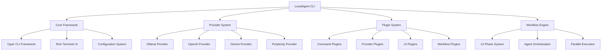
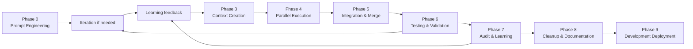

# LocalAgent CLI Toolkit - Complete Overview

## Table of Contents
- [Architecture Overview](#architecture-overview)
- [Core Capabilities](#core-capabilities)
- [Multi-Provider LLM Support](#multi-provider-llm-support)
- [12-Phase UnifiedWorkflow System](#12-phase-unifiedworkflow-system)
- [Plugin Architecture](#plugin-architecture)
- [Command Structure](#command-structure)
- [Configuration System](#configuration-system)
- [Integration Capabilities](#integration-capabilities)
- [Performance Features](#performance-features)
- [Security Framework](#security-framework)
- [Development Tools](#development-tools)

---

## Architecture Overview

The LocalAgent CLI Toolkit is a sophisticated command-line interface designed to provide Claude Code-compatible functionality with extensive multi-provider LLM support. Built with modern Python frameworks including Typer, Rich, and asyncio, it delivers professional-grade orchestration capabilities for development workflows.

### High-Level Architecture



### Component Architecture

| Component | Purpose | Technology Stack |
|-----------|---------|------------------|
| **CLI Core** | Command parsing, routing, lifecycle management | Typer, Click, asyncio |
| **Provider System** | Multi-LLM integration and abstraction | Custom provider interfaces |
| **Workflow Engine** | 12-phase orchestration and parallel execution | Custom orchestration framework |
| **Plugin Framework** | Extensible command and functionality system | Entry points, dynamic loading |
| **UI System** | Rich terminal interfaces and displays | Rich, Live rendering |
| **Configuration** | Environment-based configuration management | YAML, environment variables |
| **Security** | Authentication, encryption, audit logging | Keyring integration, secure storage |
| **I/O Operations** | Atomic file operations and safe handling | Custom atomic operations |

---

## Core Capabilities

### 1. Multi-Provider LLM Orchestration

LocalAgent provides unified access to multiple Large Language Model providers through a consistent interface:

#### Supported Providers
- **Ollama**: Local LLM serving with model management
- **OpenAI**: GPT-4, GPT-3.5-turbo, and other OpenAI models
- **Google Gemini**: Gemini 1.5 Pro and Flash variants
- **Perplexity**: Sonar models with web search integration

#### Provider Features
```yaml
Provider Capabilities:
  Ollama:
    - Local execution (no API costs)
    - Custom model support
    - Embeddings generation
    - Model management (pull, delete, list)
  
  OpenAI:
    - Latest GPT models
    - Function calling
    - Vision capabilities (GPT-4V)
    - Structured outputs (JSON mode)
  
  Gemini:
    - Large context windows (1M+ tokens)
    - Multimodal support (text, image, audio)
    - Code execution environment
    - Advanced safety controls
  
  Perplexity:
    - Real-time web search
    - Citation support
    - Online knowledge access
    - Multiple model sizes
```

### 2. Interactive Command Line Interface

#### Rich Terminal Experience
- **Syntax Highlighting**: Code and configuration syntax highlighting
- **Progress Bars**: Real-time progress tracking for long-running operations
- **Interactive Tables**: Dynamic data display with sorting and filtering
- **Live Updates**: Real-time status updates during workflow execution
- **Error Formatting**: Beautiful error messages with context and suggestions

#### Command Categories
```bash
Core Commands:
  init              # Initialize configuration
  config            # Manage configuration
  providers         # Manage LLM providers
  workflow          # Execute 12-phase workflows
  chat              # Interactive chat sessions
  plugins           # Manage plugins
  health            # System health checks

Extended Commands (via plugins):
  security-scan     # Security vulnerability scanning
  export-tools      # Export workflows and data
  dev-tools         # Developer debugging tools
  workflow-batch    # Batch workflow processing
```

### 3. Atomic File Operations

LocalAgent implements atomic file operations to ensure data integrity:

#### Safety Features
- **Atomic Writes**: Write to temporary files, then atomic rename
- **Automatic Backups**: Create backups before modifications
- **Rollback Capability**: Restore from backups on failures
- **Checksum Validation**: Verify file integrity after operations
- **Permission Preservation**: Maintain original file permissions

#### Example Implementation
```python
# Internal atomic write process
async def atomic_write(file_path: str, content: str):
    temp_file = f"{file_path}.tmp.{uuid4()}"
    backup_file = f"{file_path}.backup.{timestamp()}"
    
    try:
        # Create backup
        if os.path.exists(file_path):
            shutil.copy2(file_path, backup_file)
        
        # Write to temporary file
        async with aiofiles.open(temp_file, 'w') as f:
            await f.write(content)
        
        # Atomic rename
        os.rename(temp_file, file_path)
        
        # Cleanup backup (optional)
        if cleanup_backups:
            os.remove(backup_file)
            
    except Exception:
        # Cleanup on failure
        if os.path.exists(temp_file):
            os.remove(temp_file)
        raise
```

---

## Multi-Provider LLM Support

### Provider Abstraction Layer

LocalAgent implements a sophisticated abstraction layer that normalizes interactions across different LLM providers:

#### Base Provider Interface
```python
class BaseProvider:
    async def initialize(config: dict) -> bool
    async def health_check() -> dict
    async def list_models() -> List[Model]
    async def complete(request: CompletionRequest) -> CompletionResponse
    async def stream_complete(request: CompletionRequest) -> AsyncIterator[str]
    async def get_embeddings(text: str) -> List[float]
    async def cleanup() -> None
```

#### Provider-Specific Features

**Ollama Provider Enhancements**
```yaml
Features:
  - Model management integration with Ollama daemon
  - Custom model support and fine-tuned models
  - Local embeddings generation
  - No API costs or rate limits
  - Support for multiple model variants (7B, 13B, 70B)

Configuration:
  base_url: "http://localhost:11434"
  timeout: 120
  keep_alive: true
  model_variants:
    - "llama3.1:7b"
    - "llama3.1:13b"
    - "codellama:latest"
```

**OpenAI Provider Enhancements**
```yaml
Features:
  - GPT-4 Turbo and Vision support
  - Function calling and tool use
  - JSON mode for structured outputs
  - Batch processing capabilities
  - Token usage tracking

Configuration:
  api_key: "${OPENAI_API_KEY}"
  organization: "optional-org-id"
  model_preferences:
    default: "gpt-4"
    fast: "gpt-3.5-turbo"
    vision: "gpt-4-vision-preview"
```

**Gemini Provider Enhancements**
```yaml
Features:
  - Extended context windows (up to 1M tokens)
  - Multimodal input processing
  - Built-in code execution
  - Safety setting customization
  - Cost-effective pricing

Configuration:
  api_key: "${GEMINI_API_KEY}"
  safety_settings:
    harassment: "BLOCK_MEDIUM_AND_ABOVE"
    hate_speech: "BLOCK_MEDIUM_AND_ABOVE"
  context_window: 1000000
```

**Perplexity Provider Enhancements**
```yaml
Features:
  - Real-time web search integration
  - Source citation and attribution
  - Domain filtering capabilities
  - Multiple Sonar model variants
  - Up-to-date information access

Configuration:
  api_key: "${PERPLEXITY_API_KEY}"
  search_domain_filter: 
    - "github.com"
    - "stackoverflow.com"
  model_variants:
    - "llama-3.1-sonar-small-128k-online"
    - "llama-3.1-sonar-huge-128k-online"
```

### Provider Selection and Fallback

#### Intelligent Provider Routing
```yaml
Selection Strategies:
  cost_optimized:
    primary: "ollama"
    fallback: ["openai", "gemini"]
    criteria: "minimize_api_costs"
  
  performance_optimized:
    primary: "openai"
    fallback: ["gemini", "ollama"]
    criteria: "maximize_response_quality"
  
  research_optimized:
    primary: "perplexity"
    fallback: ["gemini", "openai"]
    criteria: "maximize_knowledge_access"
```

#### Automatic Fallback System
```python
async def execute_with_fallback(request: CompletionRequest):
    providers = get_fallback_order(request.task_type)
    
    for provider_name in providers:
        try:
            provider = self.providers[provider_name]
            health = await provider.health_check()
            
            if health['healthy']:
                return await provider.complete(request)
                
        except ProviderError as e:
            logger.warning(f"Provider {provider_name} failed: {e}")
            continue
    
    raise AllProvidersFailedError("No providers available")
```

---

## 12-Phase UnifiedWorkflow System

The heart of LocalAgent is its comprehensive 12-phase workflow system, designed for systematic task execution with parallel processing and evidence collection.

### Phase Architecture



### Detailed Phase Descriptions

#### Phase 0: Interactive Prompt Engineering & Environment Setup
**Purpose**: Ensure user intent is clearly understood and properly scoped

**Parallel Background Operations**:
- Environment validation and setup
- UnifiedWorkflow version synchronization
- Todo context loading from `.claude/orchestration_todos.json`
- System health checks

**Interactive Process**:
```bash
User Request: "Fix the authentication system"

LocalAgent: Based on your request, I understand you want to:
- Debug and repair authentication system components
- Verify login/logout functionality integrity
- Validate JWT token processing
- Check database user session management
- Test OAuth integration endpoints
- Ensure security best practices compliance

Is this interpretation correct? Would you like to add or modify any aspects?

User: "Also check 2FA implementation"

LocalAgent: Updated understanding includes 2FA verification.
Shall I proceed with this complete scope?

User: "Yes, proceed"
[Background processes complete, workflow begins]
```

#### Phase 1: Parallel Research & Discovery (MASSIVE PARALLEL EXECUTION)
**Purpose**: Gather comprehensive information through parallel research streams

**Research Streams**:
```yaml
Documentation Research:
  - Online best practices and security standards
  - Framework-specific authentication patterns
  - Recent vulnerability reports and patches
  - Community discussions and solutions

Codebase Analysis:
  - Authentication flow mapping
  - Dependency security assessment
  - Configuration file analysis
  - Database schema review

Runtime Analysis:
  - Service log examination
  - Endpoint testing with curl/automated tools
  - Performance metrics collection
  - Database integrity checks

Security Assessment:
  - Vulnerability scanning
  - Access control validation
  - Encryption verification
  - Audit trail analysis
```

**Agent Parallelization**:
```python
# Example: Multiple codebase-research-analyst instances
research_tasks = [
    ("codebase-research-analyst-auth", "Authentication code analysis"),
    ("codebase-research-analyst-db", "Database interaction analysis"), 
    ("codebase-research-analyst-config", "Configuration security review"),
    ("security-validator-owasp", "OWASP Top 10 assessment"),
    ("security-validator-crypto", "Cryptographic implementation review")
]

# All executed in parallel
results = await asyncio.gather(*[
    agent.execute(task) for agent, task in research_tasks
])
```

#### Phase 2: Strategic Planning & Stream Design
**Purpose**: Analyze research findings and design execution strategy

**Planning Components**:
- **Research Integration**: Synthesize findings from Phase 1
- **Todo Integration**: Incorporate relevant items from orchestration todos
- **Stream Design**: Plan parallel execution streams for Phase 4
- **Branch Strategy**: Design version control approach
- **Integration Points**: Define how streams will merge
- **Risk Assessment**: Identify potential issues and mitigation strategies

**Stream Architecture Example**:
```yaml
streams:
  backend_security:
    agents: ["backend-gateway-expert", "security-validator"]
    focus: "Server-side authentication fixes"
    container: "auth-backend-fixes"
    
  frontend_integration:
    agents: ["frontend-architect", "ui-regression-debugger"] 
    focus: "Client authentication flows"
    container: "auth-frontend-fixes"
    
  database_optimization:
    agents: ["schema-database-expert", "performance-profiler"]
    focus: "User session and auth table optimization"
    container: "auth-database-fixes"
    
  testing_validation:
    agents: ["test-automation-engineer", "security-vulnerability-scanner"]
    focus: "Comprehensive auth testing suite"
    container: "auth-testing-suite"
```

#### Phase 4: Parallel Stream Execution (MANDATORY PARALLEL TASK DECOMPOSITION)
**Purpose**: Execute planned changes through coordinated parallel streams

**Critical Requirements**:
- **Each agent task MUST be analyzed for parallel splitting opportunities**
- **Multiple instances of same agent type run different subtasks**
- **Single message with multiple Task tool calls for parallel execution**

**Example Parallel Decomposition**:
```python
# WRONG - Sequential execution
await backend_expert.fix_authentication()
await security_validator.scan_vulnerabilities() 
await test_engineer.create_tests()

# CORRECT - Parallel decomposition with multiple agent instances
parallel_tasks = [
    Task("backend-gateway-expert-jwt", "JWT token validation fixes"),
    Task("backend-gateway-expert-session", "Session management improvements"),
    Task("backend-gateway-expert-oauth", "OAuth integration fixes"),
    Task("security-validator-xss", "XSS vulnerability assessment"),
    Task("security-validator-sql", "SQL injection testing"),
    Task("security-validator-auth", "Authentication bypass testing"),
    Task("test-automation-engineer-unit", "Unit tests for auth functions"),
    Task("test-automation-engineer-integration", "Integration test suite"),
    Task("test-automation-engineer-e2e", "End-to-end auth workflow tests")
]

# All executed in single message
results = await execute_parallel_tasks(parallel_tasks)
```

**Stream Coordination**:
```yaml
Coordination Mechanism:
  shared_scratch_pad: "Real-time progress updates"
  redis_coordination: "Cross-stream communication"
  container_isolation: "Independent execution environments"
  integration_testing: "Cross-stream compatibility validation"
  
Stream Independence:
  - Each stream works in isolated temporary folders
  - Separate containers for testing environments
  - Independent branch/version management
  - Coordinated through shared memory systems
```

#### Phase 6: Comprehensive Testing & Validation
**Purpose**: Validate all changes through comprehensive testing

**Testing Layers**:
```yaml
Unit Testing:
  - Individual function validation
  - Mock authentication scenarios
  - Error handling verification
  - Edge case coverage

Integration Testing:
  - API endpoint validation
  - Database interaction testing
  - Cross-service communication
  - Authentication flow verification

Security Testing:
  - Penetration testing
  - Vulnerability scanning
  - Access control verification
  - Encryption validation

Performance Testing:
  - Load testing auth endpoints
  - Session management performance
  - Database query optimization
  - Caching effectiveness

User Experience Testing:
  - Login/logout flows
  - Error message clarity
  - Mobile responsiveness
  - Accessibility compliance
```

#### Phase 8: Cleanup & Documentation (PARALLEL EXECUTION)

**Cleanup Stream**:
```yaml
File Organization:
  - Remove temporary files and containers
  - Clean working directories
  - Archive old versions
  - ENFORCE 15-file root directory limit:
    * Move .md files → docs/ (except README.md, CLAUDE.md, LICENSE)
    * Move .yml/.yaml → config/
    * Move .py scripts → scripts/
    * Move .json data → config/ or data/
  - Update all file references in code
  - Validate functionality after cleanup

Cache Cleanup:
  - Remove __pycache__ directories
  - Clean Docker build cache
  - Clear temporary containers
  - Prune unused Docker images
```

**Documentation Stream**:
```yaml
Documentation Updates:
  - Update README files
  - Refresh API documentation  
  - Update security documentation
  - Create migration guides
  - Document configuration changes
  - Update troubleshooting guides
```

### Workflow Execution Features

#### Progress Tracking
```python
class WorkflowProgress:
    def __init__(self):
        self.phases: Dict[str, PhaseStatus] = {}
        self.agents: Dict[str, AgentStatus] = {}
        self.overall_progress: float = 0.0
        self.start_time: datetime = datetime.now()
    
    def update_phase(self, phase_id: str, status: str, progress: float):
        self.phases[phase_id] = PhaseStatus(status, progress)
        self._calculate_overall_progress()
    
    def update_agent(self, agent_id: str, status: str, result: Any):
        self.agents[agent_id] = AgentStatus(status, result)
```

#### Evidence Collection
```yaml
Evidence Types:
  - Phase execution logs and timings
  - Agent output and results
  - Test results and coverage reports
  - Performance metrics and benchmarks
  - Error logs and recovery actions
  - Integration success confirmations
  - Documentation updates
  - Security scan results
```

#### Error Recovery
```python
class WorkflowErrorRecovery:
    async def handle_phase_failure(self, phase_id: str, error: Exception):
        if self.retry_count < MAX_RETRIES:
            # Attempt phase retry with modified context
            return await self.retry_phase(phase_id, error)
        else:
            # Graceful degradation
            return await self.continue_without_phase(phase_id)
    
    async def handle_agent_failure(self, agent_id: str, error: Exception):
        # Try alternative agent or simplified task
        alternative_agent = self.get_alternative_agent(agent_id)
        if alternative_agent:
            return await alternative_agent.execute_simplified_task()
```

---

## Plugin Architecture

LocalAgent features a comprehensive plugin system that extends functionality through multiple plugin types and discovery mechanisms.

### Plugin Types and Capabilities

#### 1. Command Plugins
**Purpose**: Add new CLI commands and functionality

```python
class CustomCommandPlugin(CommandPlugin):
    @property
    def name(self) -> str:
        return "custom-analysis"
    
    def register_commands(self, app: typer.Typer) -> None:
        @app.command("analyze-project")
        def analyze_project(
            path: str = typer.Argument(help="Project path"),
            depth: int = typer.Option(3, help="Analysis depth"),
            format: str = typer.Option("rich", help="Output format")
        ):
            """Analyze project structure and dependencies"""
            # Command implementation
            pass
```

#### 2. Provider Plugins
**Purpose**: Add support for new LLM providers

```python
class CustomProviderPlugin(ProviderPlugin):
    def get_provider_class(self) -> Type:
        return CustomLLMProvider
    
    def get_provider_config_schema(self) -> Dict[str, Any]:
        return {
            "type": "object",
            "properties": {
                "api_endpoint": {"type": "string"},
                "api_key": {"type": "string"},
                "model_preferences": {
                    "type": "object",
                    "properties": {
                        "default": {"type": "string"},
                        "fast": {"type": "string"}
                    }
                }
            },
            "required": ["api_endpoint", "api_key"]
        }
```

#### 3. UI Plugins
**Purpose**: Extend user interface components

```python
class CustomUIPlugin(UIPlugin):
    def get_ui_components(self) -> Dict[str, Any]:
        return {
            "progress_tracker": self.create_progress_tracker,
            "data_visualizer": self.create_data_visualizer,
            "interactive_selector": self.create_selector
        }
    
    def create_progress_tracker(self, workflow_data):
        # Create custom progress visualization
        return CustomProgressTracker(workflow_data)
```

#### 4. Workflow Plugins  
**Purpose**: Add workflow phases, agents, or orchestration logic

```python
class WorkflowExtensionPlugin(WorkflowPlugin):
    def get_workflow_components(self) -> Dict[str, Any]:
        return {
            "phases": {
                "custom-validation": CustomValidationPhase,
                "performance-optimization": PerformancePhase
            },
            "agents": {
                "custom-security-agent": CustomSecurityAgent,
                "performance-analyzer": PerformanceAgent
            },
            "orchestrators": {
                "specialized-orchestrator": SpecializedOrchestrator
            }
        }
```

### Plugin Discovery and Loading

#### Discovery Mechanisms
```yaml
Discovery Methods:
  entry_points:
    - "localagent.plugins.commands"
    - "localagent.plugins.providers"
    - "localagent.plugins.ui"
    - "localagent.plugins.workflow"
    - "localagent.plugins.tools"
    - "localagent.plugins.integrations"
  
  directory_scanning:
    - "~/.localagent/plugins/"
    - "/opt/localagent/plugins/"
    - "./plugins/" (project-local)
  
  dynamic_loading:
    - Hot-reload during development
    - Runtime plugin installation
    - Dependency resolution
```

#### Plugin Lifecycle Management
```python
class PluginLifecycle:
    async def discover_plugins(self) -> List[PluginInfo]:
        # Scan entry points and directories
        pass
    
    async def load_plugin(self, plugin_name: str) -> bool:
        # Load and initialize plugin
        pass
    
    async def enable_plugin(self, plugin_name: str) -> bool:
        # Enable plugin and update configuration
        pass
    
    async def reload_plugin(self, plugin_name: str) -> bool:
        # Hot-reload plugin during development
        pass
    
    def resolve_dependencies(self, plugins: List[str]) -> List[str]:
        # Resolve loading order based on dependencies
        pass
```

### Built-in Plugin Examples

#### Security Scanner Plugin
```yaml
Plugin: security-scanner
Description: Comprehensive security vulnerability scanning
Commands:
  - security-scan: "Scan codebase for vulnerabilities"
  - vulnerability-check: "Check for specific vulnerability types"  
  - compliance-report: "Generate compliance reports"
Features:
  - OWASP Top 10 scanning
  - Dependency vulnerability checking
  - Code pattern analysis
  - Compliance validation (SOC2, GDPR, etc.)
```

#### Export Tools Plugin
```yaml
Plugin: export-tools
Description: Export workflows, configurations, and data
Commands:
  - export-workflow: "Export workflow results in multiple formats"
  - export-config: "Export configuration with encryption"
  - export-sessions: "Export chat sessions and history"
Features:
  - Multiple output formats (JSON, YAML, HTML, PDF)
  - Encryption support for sensitive data
  - Compression and archiving
  - Selective data export
```

#### Developer Tools Plugin
```yaml
Plugin: dev-tools
Description: Developer debugging and analysis tools
Commands:
  - debug-workflow: "Debug workflow execution"
  - profile-performance: "Profile command performance"
  - analyze-logs: "Analyze and filter log files"
Features:
  - Workflow step debugging
  - Performance profiling
  - Memory usage analysis
  - Log analysis and filtering
```

---

## Command Structure

### Command Hierarchy and Organization

LocalAgent follows modern CLI design patterns with intuitive command grouping and consistent option handling.

#### Primary Command Groups
```bash
Core Operations:
  localagent init                    # System initialization
  localagent config [subcommand]     # Configuration management
  localagent providers [subcommand]  # Provider management
  localagent workflow <prompt>       # Workflow execution
  localagent chat [options]          # Interactive sessions

System Management:
  localagent health [options]        # System diagnostics
  localagent plugins [subcommand]    # Plugin management
  localagent logs [options]          # Log management
  localagent performance [options]   # Performance monitoring

Extended Commands (via plugins):
  localagent security-scan           # Security analysis
  localagent export-tools            # Data export utilities
  localagent dev-tools               # Developer utilities
```

### Global Options and Behaviors

#### Universal Options
```bash
Global Options (available for all commands):
  --config PATH                # Custom configuration file
  --log-level LEVEL           # Set logging level
  --no-plugins               # Disable plugin loading
  --debug                    # Enable debug mode
  --working-dir PATH         # Set working directory
  --provider PROVIDER        # Override default provider
  --format FORMAT           # Output format (rich, json, yaml)
  --help, -h                # Command help
  --version, -v             # Show version information
```

#### Environment Integration
```bash
Environment Variables:
  LOCALAGENT_CONFIG_FILE     # Default configuration file
  LOCALAGENT_LOG_LEVEL      # Default logging level
  LOCALAGENT_DEFAULT_PROVIDER # Default LLM provider
  LOCALAGENT_PLUGINS_DISABLED # Disable plugin loading
  LOCALAGENT_DEBUG          # Enable debug mode globally
  LOCALAGENT_WORKING_DIR    # Default working directory
```

### Command Design Patterns

#### Consistent Option Naming
```yaml
Standard Options:
  Provider Selection:
    --provider, -p          # Provider selection
    --model, -m            # Model selection
  
  Output Control:
    --format, -f           # Output format
    --output, -o           # Output file
    --verbose, -v          # Verbose output
    --quiet, -q            # Quiet mode
  
  Behavior Control:
    --force               # Force operation
    --dry-run             # Preview mode
    --interactive         # Interactive mode
    --batch               # Batch mode
  
  Common Patterns:
    --list, -l            # List items
    --info                # Show detailed info
    --help, -h            # Command help
```

#### Subcommand Structure
```bash
# Consistent subcommand patterns
localagent config show                    # View configuration
localagent config validate               # Validate configuration
localagent config export <file>          # Export configuration
localagent config import <file>          # Import configuration

localagent providers list                # List providers
localagent providers health              # Check provider health
localagent providers models             # List available models

localagent plugins list                  # List plugins
localagent plugins enable <name>         # Enable plugin
localagent plugins disable <name>        # Disable plugin
localagent plugins info <name>           # Plugin information
```

### Context-Aware Command Behavior

#### Project Context Detection
```python
class ProjectContext:
    def detect_project_type(self, path: Path) -> Optional[str]:
        """Detect project type based on files and structure"""
        if (path / "package.json").exists():
            return "nodejs"
        elif (path / "requirements.txt").exists():
            return "python"
        elif (path / "go.mod").exists():
            return "golang"
        elif (path / "Cargo.toml").exists():
            return "rust"
        return None
    
    def get_project_config(self) -> Dict[str, Any]:
        """Get project-specific configuration"""
        return {
            "type": self.project_type,
            "root": str(self.project_root),
            "config_files": self.find_config_files(),
            "dependencies": self.analyze_dependencies()
        }
```

#### Smart Defaults
```yaml
Context-Aware Defaults:
  Python Projects:
    default_provider: "ollama"  # Cost-effective for development
    workflow_focus: ["code-quality", "testing", "security"]
    file_patterns: ["*.py", "requirements.txt", "setup.py"]
  
  JavaScript/Node Projects:
    default_provider: "openai"  # Better JS/TS understanding
    workflow_focus: ["dependency-audit", "performance", "bundling"]
    file_patterns: ["*.js", "*.ts", "package.json", "*.json"]
  
  Go Projects:
    default_provider: "gemini"  # Good Go comprehension
    workflow_focus: ["performance", "concurrency", "testing"]
    file_patterns: ["*.go", "go.mod", "go.sum"]
```

---

## Configuration System

LocalAgent implements a sophisticated configuration system with multiple sources, validation, and secure credential management.

### Configuration Hierarchy

#### Configuration Sources (Priority Order)
1. **Command-line Arguments** (Highest priority)
2. **Environment Variables** (`LOCALAGENT_*`)
3. **Configuration Files** (`~/.localagent/config.yaml`)
4. **Project Configuration** (`.localagent/config.yaml`)
5. **Default Values** (Lowest priority)

#### Configuration File Structure
```yaml
# ~/.localagent/config.yaml
providers:
  ollama:
    base_url: "http://localhost:11434"
    timeout: 120
    default_model: "llama3.1"
    max_retries: 3
    connection_pool_size: 10
    
  openai:
    api_key: "${OPENAI_API_KEY}"
    base_url: "https://api.openai.com/v1"
    default_model: "gpt-4"
    timeout: 60
    organization: "${OPENAI_ORG_ID}"
    
  gemini:
    api_key: "${GEMINI_API_KEY}"
    default_model: "gemini-1.5-pro"
    safety_settings:
      harassment: "BLOCK_MEDIUM_AND_ABOVE"
      hate_speech: "BLOCK_MEDIUM_AND_ABOVE"
      
  perplexity:
    api_key: "${PERPLEXITY_API_KEY}"
    default_model: "llama-3.1-sonar-huge-128k-online"
    search_domain_filter:
      - "github.com"
      - "stackoverflow.com"

system:
  default_provider: "ollama"
  max_parallel_agents: 10
  log_level: "INFO"
  config_dir: "~/.localagent"
  cache_enabled: true
  cache_ttl: 3600
  
  workflow:
    max_iterations: 3
    evidence_collection: true
    auto_cleanup: true
    parallel_execution: true
    
  security:
    enable_audit_log: true
    restrict_file_access: false
    allow_command_execution: true
    keyring_service: "localagent"
    
  performance:
    max_memory_mb: 4096
    max_cpu_percent: 80
    connection_timeout: 30
    request_timeout: 120

plugins:
  enabled_plugins:
    - "workflow-automation"
    - "security-scanner"
    - "export-tools"
  auto_load_plugins: true
  allow_dev_plugins: false
  plugin_directories:
    - "~/.localagent/plugins"
    - "/opt/localagent/plugins"
  
  # Plugin-specific configurations
  security-scanner:
    scan_depth: "deep"
    exclude_patterns:
      - "*.test.js"
      - "node_modules/*"
    severity_threshold: "medium"
    
  export-tools:
    default_format: "json"
    compression_enabled: true
    encryption_enabled: true

caching:
  enabled: true
  strategy: "intelligent"
  ttl: 3600
  max_size: 1000
  storage: "memory"  # or "redis", "disk"
  
  cache_levels:
    - "provider_responses"
    - "workflow_phases"
    - "file_analysis"
    
  intelligent_settings:
    similarity_threshold: 0.8
    context_aware: true
    auto_invalidate: true

logging:
  level: "INFO"
  format: "structured"
  output: "console"  # or "file", "both"
  file_path: "~/.localagent/logs/localagent.log"
  rotation: "daily"
  retention_days: 30
  
  structured_format:
    timestamp: true
    level: true
    component: true
    request_id: true
```

### Environment Variable System

#### Complete Environment Variable Reference
```bash
# Provider Configuration
LOCALAGENT_OLLAMA_BASE_URL=http://localhost:11434
LOCALAGENT_OLLAMA_DEFAULT_MODEL=llama3.1
LOCALAGENT_OLLAMA_TIMEOUT=120
LOCALAGENT_OLLAMA_MAX_RETRIES=3

LOCALAGENT_OPENAI_API_KEY=sk-your-api-key-here
LOCALAGENT_OPENAI_DEFAULT_MODEL=gpt-4
LOCALAGENT_OPENAI_BASE_URL=https://api.openai.com/v1
LOCALAGENT_OPENAI_ORGANIZATION=org-your-org-id

LOCALAGENT_GEMINI_API_KEY=your-gemini-api-key
LOCALAGENT_GEMINI_DEFAULT_MODEL=gemini-1.5-pro

LOCALAGENT_PERPLEXITY_API_KEY=pplx-your-api-key
LOCALAGENT_PERPLEXITY_DEFAULT_MODEL=llama-3.1-sonar-huge-128k-online

# System Configuration
LOCALAGENT_DEFAULT_PROVIDER=ollama
LOCALAGENT_MAX_PARALLEL_AGENTS=10
LOCALAGENT_LOG_LEVEL=INFO
LOCALAGENT_CONFIG_DIR=~/.localagent
LOCALAGENT_CACHE_ENABLED=true
LOCALAGENT_CACHE_TTL=3600

# Workflow Configuration
LOCALAGENT_WORKFLOW_MAX_ITERATIONS=3
LOCALAGENT_WORKFLOW_EVIDENCE_COLLECTION=true
LOCALAGENT_WORKFLOW_AUTO_CLEANUP=true
LOCALAGENT_WORKFLOW_PARALLEL_EXECUTION=true

# Security Configuration
LOCALAGENT_ENABLE_AUDIT_LOG=true
LOCALAGENT_RESTRICT_FILE_ACCESS=false
LOCALAGENT_ALLOW_COMMAND_EXECUTION=true
LOCALAGENT_KEYRING_SERVICE=localagent

# Performance Configuration
LOCALAGENT_MAX_MEMORY_MB=4096
LOCALAGENT_MAX_CPU_PERCENT=80
LOCALAGENT_CONNECTION_TIMEOUT=30
LOCALAGENT_REQUEST_TIMEOUT=120

# Plugin Configuration
LOCALAGENT_PLUGINS_ENABLED=workflow-automation,security-scanner,export-tools
LOCALAGENT_PLUGINS_AUTO_LOAD=true
LOCALAGENT_PLUGINS_ALLOW_DEV=false

# Caching Configuration
LOCALAGENT_CACHE_STRATEGY=intelligent
LOCALAGENT_CACHE_MAX_SIZE=1000
LOCALAGENT_CACHE_STORAGE=memory

# Logging Configuration
LOCALAGENT_LOG_FORMAT=structured
LOCALAGENT_LOG_OUTPUT=console
LOCALAGENT_LOG_ROTATION=daily
LOCALAGENT_LOG_RETENTION_DAYS=30
```

### Secure Credential Management

#### Keyring Integration
```python
class SecureCredentialManager:
    def __init__(self):
        self.keyring_service = "localagent"
        self.supported_backends = ["keyring", "environment", "config_file"]
    
    async def get_credential(self, provider: str, credential_type: str) -> Optional[str]:
        """Get credential with fallback priority"""
        # 1. Try keyring first (most secure)
        if self.is_keyring_available():
            key = f"{provider}_{credential_type}"
            credential = keyring.get_password(self.keyring_service, key)
            if credential:
                return credential
        
        # 2. Try environment variable
        env_key = f"LOCALAGENT_{provider.upper()}_{credential_type.upper()}"
        credential = os.getenv(env_key)
        if credential:
            return credential
        
        # 3. Try configuration file (least secure)
        return self.get_from_config(provider, credential_type)
    
    async def set_credential(self, provider: str, credential_type: str, value: str):
        """Store credential securely"""
        if self.is_keyring_available():
            key = f"{provider}_{credential_type}"
            keyring.set_password(self.keyring_service, key, value)
        else:
            # Fallback to environment variable suggestion
            env_key = f"LOCALAGENT_{provider.upper()}_{credential_type.upper()}"
            console.print(f"[yellow]Set environment variable: {env_key}=<your-credential>[/yellow]")
```

#### Migration Tools
```bash
# Migrate existing API keys to secure storage
localagent config migrate-credentials

# Process:
# 1. Detect API keys in configuration files
# 2. Store them securely in system keyring
# 3. Update configuration to use keyring references
# 4. Remove plaintext keys from files
```

### Configuration Validation

#### Schema Validation
```python
class ConfigValidator:
    def __init__(self):
        self.schema = self.load_config_schema()
    
    def validate_configuration(self, config: dict) -> ValidationResult:
        """Comprehensive configuration validation"""
        result = ValidationResult()
        
        # Schema validation
        try:
            jsonschema.validate(config, self.schema)
        except jsonschema.ValidationError as e:
            result.add_error(f"Schema validation failed: {e.message}")
        
        # Provider validation
        for provider_name, provider_config in config.get('providers', {}).items():
            self.validate_provider_config(provider_name, provider_config, result)
        
        # System validation
        self.validate_system_config(config.get('system', {}), result)
        
        # Plugin validation
        self.validate_plugin_config(config.get('plugins', {}), result)
        
        return result
    
    def validate_provider_config(self, name: str, config: dict, result: ValidationResult):
        """Validate provider-specific configuration"""
        provider_class = self.get_provider_class(name)
        if not provider_class:
            result.add_warning(f"Unknown provider: {name}")
            return
        
        # Check required fields
        required_fields = provider_class.get_required_config_fields()
        for field in required_fields:
            if field not in config:
                result.add_error(f"Provider {name} missing required field: {field}")
        
        # Validate field types and values
        for field, value in config.items():
            if not provider_class.validate_config_field(field, value):
                result.add_error(f"Provider {name} invalid value for {field}: {value}")
```

#### Health Check Integration
```bash
# Configuration validation commands
localagent config validate                    # Basic validation
localagent config validate --comprehensive   # Full validation
localagent config validate --fix             # Auto-fix common issues
localagent config validate --check-credentials # Verify API key access
```

---

## Integration Capabilities

LocalAgent provides extensive integration capabilities for seamless workflow integration with development tools, CI/CD systems, and external services.

### Version Control Integration

#### Git Integration Features
```python
class GitIntegration:
    def __init__(self, repo_path: Path):
        self.repo = git.Repo(repo_path)
        self.current_branch = self.repo.active_branch.name
        
    async def workflow_with_git_context(self, prompt: str) -> Dict[str, Any]:
        """Execute workflow with Git context"""
        git_context = {
            'current_branch': self.current_branch,
            'uncommitted_changes': self.get_uncommitted_changes(),
            'recent_commits': self.get_recent_commits(limit=10),
            'branch_diff': self.get_branch_diff('main'),
            'repository_info': self.get_repo_info()
        }
        
        return await self.execute_workflow(prompt, context=git_context)
    
    def get_uncommitted_changes(self) -> List[Dict[str, Any]]:
        """Get list of uncommitted changes"""
        changes = []
        for item in self.repo.index.diff(None):
            changes.append({
                'file_path': item.a_path,
                'change_type': item.change_type,
                'diff': item.diff.decode('utf-8') if item.diff else None
            })
        return changes
    
    async def auto_commit_workflow_results(self, workflow_result: Dict[str, Any]):
        """Automatically commit workflow results"""
        if workflow_result.get('auto_commit', False):
            commit_message = self.generate_commit_message(workflow_result)
            self.repo.git.add('.')
            self.repo.index.commit(commit_message)
```

#### Git Command Extensions
```bash
# Git-aware workflow commands
localagent workflow "Review changes" --git-diff
localagent workflow "Fix issues" --auto-commit --commit-message "Fix: Address security issues"
localagent workflow "Feature implementation" --branch feature/new-api --create-branch

# Git context integration
localagent workflow "Code review" --git-context --include-history --since="2 weeks ago"
```

### CI/CD System Integration

#### GitHub Actions Integration
```yaml
# .github/workflows/localagent-analysis.yml
name: LocalAgent Code Analysis
on:
  push:
    branches: [ main, develop ]
  pull_request:
    branches: [ main ]

jobs:
  analysis:
    runs-on: ubuntu-latest
    steps:
      - uses: actions/checkout@v4
      
      - name: Setup LocalAgent
        run: |
          pip install localagent-cli
          localagent init --non-interactive --ci-mode
        env:
          LOCALAGENT_OLLAMA_BASE_URL: ${{ secrets.OLLAMA_BASE_URL }}
          LOCALAGENT_OPENAI_API_KEY: ${{ secrets.OPENAI_API_KEY }}
      
      - name: Run Security Analysis
        run: |
          localagent workflow "Comprehensive security analysis" \
            --provider openai \
            --format junit \
            --output security-results.xml \
            --exit-on-failure
        continue-on-error: true
      
      - name: Run Code Quality Check
        run: |
          localagent workflow "Code quality analysis" \
            --provider ollama \
            --format json \
            --output quality-report.json
      
      - name: Upload Results
        uses: actions/upload-artifact@v4
        with:
          name: analysis-results
          path: |
            security-results.xml
            quality-report.json
      
      - name: Comment PR
        if: github.event_name == 'pull_request'
        uses: actions/github-script@v7
        with:
          script: |
            const fs = require('fs');
            const report = JSON.parse(fs.readFileSync('quality-report.json', 'utf8'));
            
            const comment = `## LocalAgent Analysis Results
            
            **Security Analysis**: ${report.security.status}
            **Code Quality**: ${report.quality.score}/100
            **Recommendations**: ${report.recommendations.length}
            
            <details>
            <summary>Detailed Results</summary>
            
            ${report.summary}
            </details>`;
            
            github.rest.issues.createComment({
              issue_number: context.issue.number,
              owner: context.repo.owner,
              repo: context.repo.repo,
              body: comment
            });
```

#### Jenkins Integration
```groovy
// Jenkinsfile
pipeline {
    agent any
    
    environment {
        LOCALAGENT_CONFIG = credentials('localagent-config')
        LOCALAGENT_OPENAI_KEY = credentials('openai-api-key')
    }
    
    stages {
        stage('Setup LocalAgent') {
            steps {
                sh '''
                    pip install localagent-cli
                    localagent init --config-file $LOCALAGENT_CONFIG
                '''
            }
        }
        
        stage('Pre-deployment Analysis') {
            parallel {
                stage('Security Scan') {
                    steps {
                        sh '''
                            localagent workflow "Security vulnerability scan" \
                              --provider openai \
                              --phases 1,2,6 \
                              --output security-scan.json
                        '''
                        archiveArtifacts artifacts: 'security-scan.json'
                    }
                }
                
                stage('Performance Analysis') {
                    steps {
                        sh '''
                            localagent workflow "Performance bottleneck analysis" \
                              --provider gemini \
                              --parallel \
                              --output performance-analysis.json
                        '''
                        archiveArtifacts artifacts: 'performance-analysis.json'
                    }
                }
            }
        }
        
        stage('Deploy') {
            when {
                allOf {
                    expression { currentBuild.currentResult == 'SUCCESS' }
                    branch 'main'
                }
            }
            steps {
                sh '''
                    localagent workflow "Deployment validation" \
                      --provider ollama \
                      --context '{"environment": "production", "deployment_type": "blue-green"}'
                '''
            }
        }
    }
    
    post {
        always {
            publishHTML([
                allowMissing: false,
                alwaysLinkToLastBuild: true,
                keepAll: true,
                reportDir: '.',
                reportFiles: '*.json',
                reportName: 'LocalAgent Analysis Report'
            ])
        }
    }
}
```

### API Integration

#### REST API Server Mode
```python
# LocalAgent can run as an API server
class LocalAgentAPIServer:
    def __init__(self):
        self.app = FastAPI(title="LocalAgent API", version="1.0.0")
        self.setup_routes()
    
    def setup_routes(self):
        @self.app.post("/api/v1/workflow")
        async def execute_workflow(request: WorkflowRequest):
            """Execute workflow via API"""
            result = await self.workflow_engine.execute(
                prompt=request.prompt,
                provider=request.provider,
                context=request.context
            )
            return WorkflowResponse(
                workflow_id=result.id,
                status=result.status,
                result=result.data
            )
        
        @self.app.get("/api/v1/workflow/{workflow_id}/status")
        async def get_workflow_status(workflow_id: str):
            """Get workflow execution status"""
            status = await self.workflow_engine.get_status(workflow_id)
            return WorkflowStatusResponse(
                workflow_id=workflow_id,
                status=status.current_phase,
                progress=status.progress_percentage,
                results=status.completed_phases
            )
        
        @self.app.get("/api/v1/providers")
        async def list_providers():
            """List available providers and their status"""
            providers = []
            for name, provider in self.provider_manager.providers.items():
                health = await provider.health_check()
                providers.append(ProviderInfo(
                    name=name,
                    status=health['status'],
                    models=health.get('models', []),
                    capabilities=provider.capabilities
                ))
            return ProvidersResponse(providers=providers)
        
        @self.app.websocket("/ws/workflow/{workflow_id}")
        async def workflow_websocket(websocket: WebSocket, workflow_id: str):
            """WebSocket for real-time workflow updates"""
            await websocket.accept()
            
            async for update in self.workflow_engine.stream_updates(workflow_id):
                await websocket.send_json({
                    "type": "progress_update",
                    "workflow_id": workflow_id,
                    "phase": update.phase,
                    "progress": update.progress,
                    "data": update.data
                })
```

#### API Usage Examples
```bash
# Start LocalAgent API server
localagent server start --port 8080 --host 0.0.0.0

# API usage examples
curl -X POST http://localhost:8080/api/v1/workflow \
  -H "Content-Type: application/json" \
  -d '{
    "prompt": "Analyze code security",
    "provider": "openai",
    "context": {"project_type": "python", "severity": "high"}
  }'

# Check workflow status
curl http://localhost:8080/api/v1/workflow/abc123/status

# List providers
curl http://localhost:8080/api/v1/providers
```

### External Tool Integration

#### Docker Integration
```bash
# Docker container execution
localagent workflow "Container security scan" --docker-context ./Dockerfile
localagent workflow "Multi-stage build optimization" --docker-compose docker-compose.yml

# Integration with existing Docker workflows
docker run --rm -v $(pwd):/workspace localagent/cli:latest \
  workflow "Code analysis" --working-dir /workspace
```

#### IDE Integration
```json
// VS Code extension integration
{
  "localagent.commands": [
    {
      "command": "localagent.analyzeFile",
      "title": "Analyze with LocalAgent",
      "when": "editorHasSelection"
    },
    {
      "command": "localagent.reviewChanges", 
      "title": "Review Changes",
      "when": "gitOpenRepository"
    }
  ],
  "localagent.configuration": {
    "defaultProvider": "ollama",
    "autoAnalysis": true,
    "realTimeUpdates": true
  }
}
```

#### Database Integration
```python
class DatabaseIntegration:
    def __init__(self, connection_string: str):
        self.engine = sqlalchemy.create_engine(connection_string)
    
    async def analyze_database_schema(self) -> Dict[str, Any]:
        """Analyze database schema for optimization opportunities"""
        return await self.workflow_engine.execute(
            "Database schema analysis and optimization",
            context={
                "schema": self.get_schema_info(),
                "performance_metrics": self.get_performance_metrics(),
                "query_patterns": self.analyze_query_patterns()
            }
        )
    
    async def security_audit(self) -> Dict[str, Any]:
        """Perform database security audit"""
        return await self.workflow_engine.execute(
            "Database security audit",
            provider="openai",
            context={
                "access_controls": self.audit_access_controls(),
                "encryption_status": self.check_encryption(),
                "compliance_requirements": self.get_compliance_reqs()
            }
        )
```

---

## Performance Features

LocalAgent implements comprehensive performance optimization features to handle large-scale workflows efficiently while maintaining responsiveness.

### Resource Management

#### Memory Management System
```python
class MemoryManager:
    def __init__(self):
        self.memory_limit = self.get_memory_limit()
        self.warning_threshold = 0.8
        self.critical_threshold = 0.95
        self.cleanup_strategies = [
            self.cleanup_cache,
            self.compress_history,
            self.reduce_context_windows,
            self.garbage_collect_providers
        ]
    
    async def monitor_memory_usage(self):
        """Continuous memory monitoring"""
        while True:
            current_usage = psutil.virtual_memory().percent
            
            if current_usage > self.critical_threshold:
                await self.emergency_cleanup()
            elif current_usage > self.warning_threshold:
                await self.gradual_cleanup()
            
            await asyncio.sleep(10)  # Check every 10 seconds
    
    async def emergency_cleanup(self):
        """Emergency memory cleanup procedures"""
        console.print("[red]Emergency memory cleanup initiated[/red]")
        
        for strategy in self.cleanup_strategies:
            freed_mb = await strategy()
            if freed_mb > 0:
                console.print(f"[green]Freed {freed_mb}MB memory[/green]")
                
                # Check if we're below critical threshold
                if psutil.virtual_memory().percent < self.critical_threshold:
                    break
```

#### CPU Optimization
```python
class CPUOptimizer:
    def __init__(self):
        self.cpu_cores = os.cpu_count()
        self.max_cpu_percent = 80
        self.adaptive_throttling = True
        
    async def optimize_parallel_execution(self, agents: List[Agent]) -> List[Agent]:
        """Optimize agent execution based on CPU availability"""
        current_cpu = psutil.cpu_percent(interval=1)
        
        if current_cpu > self.max_cpu_percent:
            # Reduce parallelism
            return agents[:self.cpu_cores // 2]
        elif current_cpu < 50:
            # Increase parallelism
            return agents[:self.cpu_cores * 2]
        else:
            return agents[:self.cpu_cores]
    
    def get_optimal_worker_count(self, task_type: str) -> int:
        """Get optimal worker count for task type"""
        if task_type == "cpu_intensive":
            return min(self.cpu_cores, 4)
        elif task_type == "io_intensive":
            return min(self.cpu_cores * 2, 16)
        else:
            return self.cpu_cores
```

### Caching System

#### Intelligent Caching
```python
class IntelligentCache:
    def __init__(self):
        self.cache_layers = {
            'provider_responses': TTLCache(maxsize=1000, ttl=3600),
            'workflow_phases': TTLCache(maxsize=500, ttl=7200),
            'file_analysis': TTLCache(maxsize=2000, ttl=1800),
            'context_packages': TTLCache(maxsize=200, ttl=3600)
        }
        self.similarity_threshold = 0.8
        self.context_aware = True
        
    async def get_cached_response(self, request: CacheRequest) -> Optional[CachedResponse]:
        """Intelligent cache retrieval with similarity matching"""
        cache_key = self.generate_cache_key(request)
        
        # Direct cache hit
        if cache_key in self.cache_layers[request.layer]:
            return self.cache_layers[request.layer][cache_key]
        
        # Similarity-based cache lookup
        if self.context_aware:
            similar_response = await self.find_similar_cached_response(request)
            if similar_response and similar_response.similarity > self.similarity_threshold:
                return similar_response.response
        
        return None
    
    async def find_similar_cached_response(self, request: CacheRequest) -> Optional[SimilarResponse]:
        """Find similar cached responses using semantic similarity"""
        request_embedding = await self.get_embedding(request.content)
        
        best_match = None
        best_similarity = 0
        
        for cached_key, cached_response in self.cache_layers[request.layer].items():
            if hasattr(cached_response, 'embedding'):
                similarity = self.cosine_similarity(request_embedding, cached_response.embedding)
                
                if similarity > best_similarity:
                    best_similarity = similarity
                    best_match = SimilarResponse(
                        response=cached_response,
                        similarity=similarity
                    )
        
        return best_match
```

#### Cache Management
```bash
# Cache management commands
localagent cache stats                        # Show cache statistics
localagent cache clear                        # Clear all caches
localagent cache clear --layer provider_responses  # Clear specific layer
localagent cache prune --older-than 24h      # Prune old entries
localagent cache optimize                     # Optimize cache structure
```

### Performance Monitoring

#### Real-time Metrics Collection
```python
class PerformanceMonitor:
    def __init__(self):
        self.metrics = {
            'workflow_execution_times': [],
            'provider_response_times': {},
            'memory_usage_history': [],
            'cpu_usage_history': [],
            'cache_hit_rates': {},
            'error_rates': {}
        }
        self.collectors = [
            self.collect_system_metrics,
            self.collect_workflow_metrics,
            self.collect_provider_metrics,
            self.collect_cache_metrics
        ]
    
    async def start_monitoring(self):
        """Start performance monitoring"""
        tasks = []
        for collector in self.collectors:
            tasks.append(asyncio.create_task(collector()))
        
        await asyncio.gather(*tasks)
    
    async def collect_workflow_metrics(self):
        """Collect workflow performance metrics"""
        while True:
            active_workflows = self.workflow_manager.get_active_workflows()
            
            for workflow in active_workflows:
                metrics = {
                    'workflow_id': workflow.id,
                    'current_phase': workflow.current_phase,
                    'execution_time': workflow.get_execution_time(),
                    'agent_count': len(workflow.active_agents),
                    'memory_usage': workflow.get_memory_usage(),
                    'progress': workflow.get_progress()
                }
                
                self.metrics['workflow_execution_times'].append(metrics)
            
            await asyncio.sleep(5)
```

#### Performance Dashboard
```python
class PerformanceDashboard:
    def create_dashboard(self) -> Panel:
        """Create rich performance dashboard"""
        # System metrics
        system_table = Table(title="System Metrics")
        system_table.add_column("Metric")
        system_table.add_column("Current")
        system_table.add_column("Average")
        system_table.add_column("Status")
        
        system_table.add_row(
            "CPU Usage",
            f"{psutil.cpu_percent()}%",
            f"{self.get_avg_cpu()}%",
            self.get_status_indicator(psutil.cpu_percent(), 80)
        )
        
        system_table.add_row(
            "Memory Usage", 
            f"{psutil.virtual_memory().percent}%",
            f"{self.get_avg_memory()}%",
            self.get_status_indicator(psutil.virtual_memory().percent, 85)
        )
        
        # Workflow metrics
        workflow_table = Table(title="Active Workflows")
        workflow_table.add_column("Workflow ID")
        workflow_table.add_column("Phase")
        workflow_table.add_column("Progress")
        workflow_table.add_column("Duration")
        
        for workflow in self.get_active_workflows():
            workflow_table.add_row(
                workflow.id[:8],
                workflow.current_phase,
                f"{workflow.progress}%",
                str(workflow.duration)
            )
        
        # Provider metrics
        provider_table = Table(title="Provider Performance")
        provider_table.add_column("Provider")
        provider_table.add_column("Requests/min")
        provider_table.add_column("Avg Response Time")
        provider_table.add_column("Error Rate")
        
        for provider_name, metrics in self.provider_metrics.items():
            provider_table.add_row(
                provider_name,
                str(metrics.requests_per_minute),
                f"{metrics.avg_response_time:.2f}s",
                f"{metrics.error_rate:.1f}%"
            )
        
        return Panel(
            Group(system_table, workflow_table, provider_table),
            title="LocalAgent Performance Dashboard"
        )
```

### Optimization Strategies

#### Workflow Optimization
```python
class WorkflowOptimizer:
    def __init__(self):
        self.optimization_strategies = [
            self.optimize_agent_allocation,
            self.optimize_phase_ordering,
            self.optimize_context_packages,
            self.optimize_parallel_execution
        ]
    
    async def optimize_workflow(self, workflow: Workflow) -> Workflow:
        """Apply optimization strategies to workflow"""
        optimized_workflow = workflow.copy()
        
        for strategy in self.optimization_strategies:
            optimized_workflow = await strategy(optimized_workflow)
        
        return optimized_workflow
    
    async def optimize_agent_allocation(self, workflow: Workflow) -> Workflow:
        """Optimize agent allocation based on system resources"""
        available_resources = self.get_available_resources()
        
        # Adjust agent count based on available memory and CPU
        optimal_agent_count = min(
            workflow.max_agents,
            available_resources.memory // 200,  # 200MB per agent
            available_resources.cpu_cores * 2
        )
        
        workflow.max_agents = optimal_agent_count
        return workflow
    
    async def optimize_parallel_execution(self, workflow: Workflow) -> Workflow:
        """Optimize parallel execution patterns"""
        # Analyze agent dependencies
        dependency_graph = self.build_dependency_graph(workflow.agents)
        
        # Find optimal execution groups
        execution_groups = self.find_parallel_groups(dependency_graph)
        
        # Update workflow with optimized execution plan
        workflow.execution_plan = execution_groups
        return workflow
```

#### Provider Load Balancing
```python
class ProviderLoadBalancer:
    def __init__(self):
        self.provider_metrics = {}
        self.load_balancing_strategies = {
            'round_robin': self.round_robin_selection,
            'least_connections': self.least_connections_selection,
            'response_time': self.response_time_selection,
            'adaptive': self.adaptive_selection
        }
    
    async def select_provider(self, request: CompletionRequest, strategy: str = 'adaptive') -> str:
        """Select optimal provider based on current load and performance"""
        available_providers = self.get_healthy_providers()
        
        if not available_providers:
            raise NoProvidersAvailableError()
        
        strategy_func = self.load_balancing_strategies.get(strategy, self.adaptive_selection)
        selected_provider = await strategy_func(available_providers, request)
        
        # Update metrics
        self.update_provider_selection_metrics(selected_provider)
        
        return selected_provider
    
    async def adaptive_selection(self, providers: List[str], request: CompletionRequest) -> str:
        """Adaptive provider selection based on multiple factors"""
        scores = {}
        
        for provider_name in providers:
            metrics = self.provider_metrics.get(provider_name, {})
            
            # Calculate composite score
            score = 0
            
            # Response time weight (40%)
            avg_response_time = metrics.get('avg_response_time', 1.0)
            score += (1.0 / avg_response_time) * 0.4
            
            # Success rate weight (30%)
            success_rate = metrics.get('success_rate', 0.5)
            score += success_rate * 0.3
            
            # Current load weight (20%)
            current_load = metrics.get('current_requests', 0)
            max_load = metrics.get('max_concurrent', 10)
            load_factor = 1.0 - (current_load / max_load)
            score += load_factor * 0.2
            
            # Cost factor weight (10%)
            cost_factor = 1.0 - metrics.get('cost_per_request', 0.0)
            score += cost_factor * 0.1
            
            scores[provider_name] = score
        
        # Select provider with highest score
        return max(scores, key=scores.get)
```

---

## Security Framework

LocalAgent implements comprehensive security measures to protect sensitive data, API credentials, and workflow execution environments.

### Authentication and Authorization

#### API Key Management
```python
class SecureCredentialStore:
    def __init__(self):
        self.keyring_service = "localagent"
        self.encryption_key = self.get_or_create_encryption_key()
        
    def store_api_key(self, provider: str, api_key: str) -> bool:
        """Securely store API key using system keyring"""
        try:
            # Use system keyring as primary storage
            keyring.set_password(
                self.keyring_service, 
                f"{provider}_api_key", 
                api_key
            )
            
            # Create encrypted backup
            encrypted_key = self.encrypt_credential(api_key)
            backup_path = self.get_backup_path(provider)
            
            with open(backup_path, 'wb') as f:
                f.write(encrypted_key)
            
            return True
            
        except Exception as e:
            logger.error(f"Failed to store API key for {provider}: {e}")
            return False
    
    def retrieve_api_key(self, provider: str) -> Optional[str]:
        """Securely retrieve API key"""
        # Try keyring first
        try:
            api_key = keyring.get_password(
                self.keyring_service, 
                f"{provider}_api_key"
            )
            if api_key:
                return api_key
        except Exception as e:
            logger.warning(f"Keyring access failed for {provider}: {e}")
        
        # Fallback to encrypted backup
        try:
            backup_path = self.get_backup_path(provider)
            if backup_path.exists():
                with open(backup_path, 'rb') as f:
                    encrypted_key = f.read()
                return self.decrypt_credential(encrypted_key)
        except Exception as e:
            logger.error(f"Failed to retrieve backup key for {provider}: {e}")
        
        return None
    
    def rotate_api_key(self, provider: str, new_api_key: str) -> bool:
        """Rotate API key with secure cleanup"""
        old_key = self.retrieve_api_key(provider)
        
        # Store new key
        success = self.store_api_key(provider, new_api_key)
        
        if success and old_key:
            # Securely wipe old key from memory
            self.secure_wipe_string(old_key)
            
            # Log rotation event
            self.audit_log.log_key_rotation(provider)
        
        return success
```

#### Access Control
```python
class AccessControlManager:
    def __init__(self):
        self.permissions = self.load_permissions()
        self.audit_logger = AuditLogger()
        
    def check_file_access(self, file_path: Path, operation: str) -> bool:
        """Check if file access is permitted"""
        # Convert to absolute path
        abs_path = file_path.resolve()
        
        # Check against restricted paths
        for restricted_pattern in self.permissions.get('restricted_paths', []):
            if fnmatch.fnmatch(str(abs_path), restricted_pattern):
                self.audit_logger.log_access_denied(abs_path, operation)
                return False
        
        # Check operation permissions
        allowed_operations = self.permissions.get('allowed_operations', [])
        if operation not in allowed_operations:
            self.audit_logger.log_operation_denied(operation)
            return False
        
        return True
    
    def check_command_execution(self, command: str) -> bool:
        """Check if command execution is permitted"""
        # Parse command
        cmd_parts = shlex.split(command)
        if not cmd_parts:
            return False
        
        executable = cmd_parts[0]
        
        # Check against allowed executables
        allowed_executables = self.permissions.get('allowed_executables', [])
        if executable not in allowed_executables:
            self.audit_logger.log_command_denied(command)
            return False
        
        # Check for dangerous command patterns
        dangerous_patterns = [
            r'rm\s+-rf\s+/',
            r'sudo\s+',
            r'curl.*\|\s*sh',
            r'wget.*\|\s*sh'
        ]
        
        for pattern in dangerous_patterns:
            if re.search(pattern, command, re.IGNORECASE):
                self.audit_logger.log_dangerous_command(command, pattern)
                return False
        
        return True
```

### Encryption and Data Protection

#### Data Encryption
```python
class DataProtection:
    def __init__(self):
        self.fernet = Fernet(self.get_encryption_key())
        
    def encrypt_sensitive_data(self, data: Union[str, dict]) -> bytes:
        """Encrypt sensitive data with authenticated encryption"""
        if isinstance(data, dict):
            data = json.dumps(data)
        
        # Add timestamp for freshness validation
        timestamped_data = {
            'data': data,
            'timestamp': time.time(),
            'version': 1
        }
        
        serialized = json.dumps(timestamped_data)
        return self.fernet.encrypt(serialized.encode())
    
    def decrypt_sensitive_data(self, encrypted_data: bytes, max_age: int = 86400) -> Union[str, dict]:
        """Decrypt and validate sensitive data"""
        try:
            decrypted = self.fernet.decrypt(encrypted_data)
            data_obj = json.loads(decrypted.decode())
            
            # Validate timestamp
            age = time.time() - data_obj['timestamp']
            if age > max_age:
                raise SecurityError(f"Encrypted data too old: {age}s > {max_age}s")
            
            return data_obj['data']
            
        except Exception as e:
            raise SecurityError(f"Failed to decrypt data: {e}")
    
    def secure_delete_file(self, file_path: Path) -> bool:
        """Securely delete file with multiple overwrites"""
        if not file_path.exists():
            return True
        
        try:
            file_size = file_path.stat().st_size
            
            # Multiple overwrite passes
            with open(file_path, 'r+b') as f:
                for _ in range(3):
                    f.seek(0)
                    f.write(os.urandom(file_size))
                    f.flush()
                    os.fsync(f.fileno())
            
            # Remove file
            file_path.unlink()
            return True
            
        except Exception as e:
            logger.error(f"Failed to securely delete {file_path}: {e}")
            return False
```

### Audit Logging

#### Comprehensive Audit Trail
```python
class SecurityAuditLogger:
    def __init__(self):
        self.log_file = Path.home() / '.localagent' / 'audit.log'
        self.log_format = self.setup_logging()
        
    def log_workflow_execution(self, workflow_id: str, user: str, prompt: str):
        """Log workflow execution start"""
        self._log_event('WORKFLOW_START', {
            'workflow_id': workflow_id,
            'user': user,
            'prompt_hash': hashlib.sha256(prompt.encode()).hexdigest(),
            'provider': self.get_current_provider(),
            'timestamp': datetime.utcnow().isoformat()
        })
    
    def log_api_key_usage(self, provider: str, request_type: str, success: bool):
        """Log API key usage"""
        self._log_event('API_KEY_USAGE', {
            'provider': provider,
            'request_type': request_type,
            'success': success,
            'timestamp': datetime.utcnow().isoformat(),
            'client_ip': self.get_client_ip()
        })
    
    def log_file_access(self, file_path: Path, operation: str, success: bool):
        """Log file access attempts"""
        self._log_event('FILE_ACCESS', {
            'file_path': str(file_path),
            'operation': operation,
            'success': success,
            'timestamp': datetime.utcnow().isoformat(),
            'process_id': os.getpid()
        })
    
    def log_security_event(self, event_type: str, details: Dict[str, Any]):
        """Log security-related events"""
        self._log_event('SECURITY_EVENT', {
            'event_type': event_type,
            'details': details,
            'severity': self.calculate_severity(event_type),
            'timestamp': datetime.utcnow().isoformat()
        })
    
    def _log_event(self, event_type: str, data: Dict[str, Any]):
        """Log event to audit trail"""
        log_entry = {
            'event_type': event_type,
            'data': data,
            'hash': self.calculate_log_hash(event_type, data)
        }
        
        # Write to encrypted log file
        encrypted_entry = self.encrypt_log_entry(log_entry)
        
        with open(self.log_file, 'ab') as f:
            f.write(encrypted_entry + b'\n')
```

#### Security Monitoring
```python
class SecurityMonitor:
    def __init__(self):
        self.threat_patterns = self.load_threat_patterns()
        self.anomaly_detector = AnomalyDetector()
        self.alert_manager = AlertManager()
        
    async def monitor_security_events(self):
        """Continuous security monitoring"""
        while True:
            # Check for suspicious patterns
            recent_events = self.audit_logger.get_recent_events(minutes=5)
            
            for pattern in self.threat_patterns:
                matches = self.check_pattern_match(recent_events, pattern)
                if matches:
                    await self.handle_security_threat(pattern, matches)
            
            # Anomaly detection
            anomalies = self.anomaly_detector.detect_anomalies(recent_events)
            for anomaly in anomalies:
                await self.handle_anomaly(anomaly)
            
            await asyncio.sleep(30)  # Check every 30 seconds
    
    async def handle_security_threat(self, threat_pattern: dict, matches: List[dict]):
        """Handle detected security threat"""
        threat_level = threat_pattern['severity']
        
        # Log threat detection
        self.audit_logger.log_security_event('THREAT_DETECTED', {
            'pattern': threat_pattern['name'],
            'matches_count': len(matches),
            'severity': threat_level
        })
        
        # Take action based on threat level
        if threat_level >= 8:  # Critical
            await self.emergency_response(threat_pattern, matches)
        elif threat_level >= 5:  # High
            await self.alert_manager.send_alert(threat_pattern, matches)
        else:  # Medium/Low
            logger.warning(f"Security pattern detected: {threat_pattern['name']}")
```

### Input Validation and Sanitization

#### Command Injection Prevention
```python
class InputValidator:
    def __init__(self):
        self.dangerous_patterns = [
            r'[;&|`$()]',  # Command injection characters
            r'\.\./',      # Path traversal
            r'<script',    # XSS patterns
            r'(union|select|insert|delete|update|drop)\s',  # SQL injection
        ]
        self.max_input_length = 10000
        
    def validate_user_input(self, user_input: str, input_type: str = 'general') -> ValidationResult:
        """Comprehensive input validation"""
        result = ValidationResult()
        
        # Length check
        if len(user_input) > self.max_input_length:
            result.add_error(f"Input too long: {len(user_input)} > {self.max_input_length}")
        
        # Character encoding validation
        try:
            user_input.encode('utf-8')
        except UnicodeEncodeError as e:
            result.add_error(f"Invalid character encoding: {e}")
        
        # Pattern-based validation
        for pattern in self.dangerous_patterns:
            if re.search(pattern, user_input, re.IGNORECASE):
                result.add_error(f"Dangerous pattern detected: {pattern}")
        
        # Input type specific validation
        if input_type == 'workflow_prompt':
            result = self.validate_workflow_prompt(user_input, result)
        elif input_type == 'file_path':
            result = self.validate_file_path(user_input, result)
        elif input_type == 'command':
            result = self.validate_command(user_input, result)
        
        return result
    
    def sanitize_input(self, user_input: str) -> str:
        """Sanitize user input for safe processing"""
        # Remove control characters
        sanitized = ''.join(c for c in user_input if ord(c) >= 32 or c in '\n\r\t')
        
        # Normalize whitespace
        sanitized = re.sub(r'\s+', ' ', sanitized).strip()
        
        # Escape shell metacharacters if needed
        if self.needs_shell_escaping(sanitized):
            sanitized = shlex.quote(sanitized)
        
        return sanitized
    
    def validate_workflow_prompt(self, prompt: str, result: ValidationResult) -> ValidationResult:
        """Validate workflow prompt for security"""
        # Check for prompt injection attempts
        injection_patterns = [
            r'ignore\s+previous\s+instructions',
            r'system\s*:\s*you\s+are',
            r'forget\s+everything',
            r'new\s+instructions'
        ]
        
        for pattern in injection_patterns:
            if re.search(pattern, prompt, re.IGNORECASE):
                result.add_warning(f"Potential prompt injection detected: {pattern}")
        
        return result
```

---

## Development Tools

LocalAgent provides comprehensive development tools to support plugin development, debugging, and system maintenance.

### Debugging and Diagnostics

#### Workflow Debugging Tools
```python
class WorkflowDebugger:
    def __init__(self):
        self.breakpoints = set()
        self.execution_trace = []
        self.variable_inspector = VariableInspector()
        self.step_mode = False
        
    async def debug_workflow(self, workflow_id: str, debug_options: DebugOptions):
        """Start debugging session for workflow"""
        workflow = await self.get_workflow(workflow_id)
        
        # Setup debug environment
        debug_session = DebugSession(
            workflow=workflow,
            options=debug_options,
            console=self.create_debug_console()
        )
        
        # Start interactive debugging
        await self.run_debug_session(debug_session)
    
    async def run_debug_session(self, session: DebugSession):
        """Run interactive debugging session"""
        console.print("[bold cyan]LocalAgent Workflow Debugger[/bold cyan]")
        console.print(f"Debugging workflow: {session.workflow.id}")
        console.print("Type 'help' for available commands")
        
        while True:
            try:
                command = await self.get_debug_command()
                result = await self.execute_debug_command(command, session)
                
                if result.exit_requested:
                    break
                    
                if result.output:
                    console.print(result.output)
                    
            except KeyboardInterrupt:
                if self.confirm_exit():
                    break
    
    def create_debug_console(self) -> DebugConsole:
        """Create enhanced debug console"""
        console = DebugConsole()
        
        # Add debug commands
        console.add_command('step', self.debug_step)
        console.add_command('continue', self.debug_continue)
        console.add_command('break', self.set_breakpoint)
        console.add_command('inspect', self.inspect_variable)
        console.add_command('trace', self.show_execution_trace)
        console.add_command('agents', self.list_active_agents)
        console.add_command('phase', self.show_current_phase)
        
        return console
```

#### System Diagnostics
```bash
# Comprehensive system diagnostics
localagent health --comprehensive --output diagnostic-report.json

# Performance profiling
localagent performance profile workflow "test task" --output profile.html

# Memory usage analysis
localagent debug memory-usage --detailed --save memory-report.json

# Log analysis
localagent debug analyze-logs --level error --since 24h --pattern "workflow|error"

# Provider connectivity testing
localagent debug test-providers --all --timeout 30

# Plugin validation
localagent debug validate-plugins --deep --fix-issues
```

### Development Environment Setup

#### Development Configuration
```yaml
# .localagent/development.yaml
development:
  debug_mode: true
  hot_reload: true
  verbose_logging: true
  
  plugins:
    allow_dev_plugins: true
    auto_reload: true
    development_directories:
      - "./dev-plugins"
      - "./custom-agents"
  
  workflow:
    enable_step_debugging: true
    save_intermediate_results: true
    detailed_error_traces: true
  
  providers:
    mock_responses: false
    response_simulation: false
    latency_simulation: false
    
  security:
    disable_input_validation: false  # Keep security even in dev
    allow_local_file_access: true
    audit_level: "debug"
```

#### Development Tools CLI
```python
class DevelopmentCLI:
    def __init__(self):
        self.dev_commands = {
            'create-plugin': self.create_plugin_scaffold,
            'test-plugin': self.test_plugin,
            'validate-agent': self.validate_agent_definition,
            'mock-provider': self.setup_mock_provider,
            'trace-workflow': self.trace_workflow_execution,
            'benchmark': self.run_benchmarks
        }
    
    async def create_plugin_scaffold(self, plugin_name: str, plugin_type: str):
        """Create plugin scaffold for development"""
        templates = {
            'command': 'command_plugin_template.py',
            'provider': 'provider_plugin_template.py',
            'ui': 'ui_plugin_template.py',
            'workflow': 'workflow_plugin_template.py'
        }
        
        template_file = templates.get(plugin_type)
        if not template_file:
            raise ValueError(f"Unknown plugin type: {plugin_type}")
        
        # Create plugin directory
        plugin_dir = Path(f"./dev-plugins/{plugin_name}")
        plugin_dir.mkdir(parents=True, exist_ok=True)
        
        # Generate plugin files from templates
        await self.generate_plugin_files(plugin_dir, template_file, plugin_name)
        
        console.print(f"[green]Created plugin scaffold: {plugin_dir}[/green]")
        console.print(f"Edit {plugin_dir}/plugin.py to implement your plugin")
```

### Testing Framework Integration

#### Plugin Testing
```python
class PluginTestFramework:
    def __init__(self):
        self.test_environment = TestEnvironment()
        self.mock_providers = MockProviderManager()
        
    async def test_plugin(self, plugin_name: str, test_config: TestConfig):
        """Comprehensive plugin testing"""
        plugin = await self.load_plugin(plugin_name)
        
        # Setup test environment
        test_context = await self.setup_test_context(test_config)
        
        # Run test suites
        results = TestResults()
        
        # Unit tests
        unit_results = await self.run_unit_tests(plugin, test_context)
        results.add_suite_results('unit', unit_results)
        
        # Integration tests
        integration_results = await self.run_integration_tests(plugin, test_context)
        results.add_suite_results('integration', integration_results)
        
        # Performance tests
        perf_results = await self.run_performance_tests(plugin, test_context)
        results.add_suite_results('performance', perf_results)
        
        # Security tests
        security_results = await self.run_security_tests(plugin, test_context)
        results.add_suite_results('security', security_results)
        
        return results
    
    async def run_unit_tests(self, plugin, context):
        """Run unit tests for plugin"""
        test_cases = [
            self.test_plugin_initialization,
            self.test_plugin_configuration,
            self.test_command_registration,
            self.test_error_handling
        ]
        
        results = []
        for test_case in test_cases:
            result = await test_case(plugin, context)
            results.append(result)
        
        return results
```

#### Mock Provider System
```python
class MockProviderManager:
    def __init__(self):
        self.mock_providers = {}
        self.response_templates = self.load_response_templates()
        
    def create_mock_provider(self, provider_name: str, config: MockConfig):
        """Create mock provider for testing"""
        mock_provider = MockProvider(
            name=provider_name,
            responses=config.responses,
            latency_simulation=config.latency_simulation,
            error_simulation=config.error_simulation
        )
        
        self.mock_providers[provider_name] = mock_provider
        return mock_provider
    
    def simulate_provider_response(self, provider: str, request_type: str) -> MockResponse:
        """Simulate provider response for testing"""
        template = self.response_templates.get(provider, {}).get(request_type)
        if not template:
            return self.generate_default_response()
        
        # Add realistic delays
        if template.get('simulate_delay'):
            time.sleep(random.uniform(0.1, 2.0))
        
        # Simulate occasional errors
        if template.get('error_rate', 0) > random.random():
            raise MockProviderError("Simulated provider error")
        
        return MockResponse(
            content=template['content'],
            metadata=template.get('metadata', {}),
            token_usage=template.get('token_usage', {})
        )
```

### Code Generation and Scaffolding

#### Agent Definition Generator
```python
class AgentGenerator:
    def __init__(self):
        self.templates = self.load_agent_templates()
        
    async def generate_agent_definition(self, agent_spec: AgentSpec) -> AgentDefinition:
        """Generate agent definition from specification"""
        template = self.templates[agent_spec.agent_type]
        
        # Generate agent configuration
        agent_config = {
            'name': agent_spec.name,
            'description': agent_spec.description,
            'capabilities': agent_spec.capabilities,
            'dependencies': agent_spec.dependencies,
            'execution_context': agent_spec.execution_context
        }
        
        # Generate specialized prompts
        prompts = await self.generate_specialized_prompts(agent_spec)
        agent_config['prompts'] = prompts
        
        # Generate validation rules
        validation_rules = self.generate_validation_rules(agent_spec)
        agent_config['validation'] = validation_rules
        
        # Generate performance configuration
        performance_config = self.generate_performance_config(agent_spec)
        agent_config['performance'] = performance_config
        
        return AgentDefinition(agent_config)
    
    async def generate_specialized_prompts(self, spec: AgentSpec) -> Dict[str, str]:
        """Generate specialized prompts for agent"""
        prompt_generator = PromptGenerator()
        
        prompts = {}
        for task_type in spec.task_types:
            prompt = await prompt_generator.generate_task_prompt(
                agent_role=spec.role,
                task_type=task_type,
                domain=spec.domain,
                constraints=spec.constraints
            )
            prompts[task_type] = prompt
        
        return prompts
```

#### Configuration Generator
```python
class ConfigurationGenerator:
    def generate_project_config(self, project_path: Path) -> Dict[str, Any]:
        """Generate LocalAgent configuration for project"""
        project_info = self.analyze_project(project_path)
        
        config = {
            'project': {
                'name': project_info.name,
                'type': project_info.type,
                'root': str(project_path),
                'version': project_info.version
            },
            
            'providers': self.recommend_providers(project_info),
            'workflow': self.generate_workflow_config(project_info),
            'plugins': self.recommend_plugins(project_info),
            'security': self.generate_security_config(project_info)
        }
        
        return config
    
    def recommend_providers(self, project_info) -> Dict[str, Any]:
        """Recommend providers based on project type"""
        recommendations = {
            'python': {
                'primary': 'ollama',
                'fallback': ['openai', 'gemini'],
                'reasoning': 'Local ollama for cost-effective development'
            },
            'javascript': {
                'primary': 'openai',
                'fallback': ['gemini', 'ollama'],
                'reasoning': 'OpenAI has better JavaScript understanding'
            },
            'go': {
                'primary': 'gemini',
                'fallback': ['openai', 'ollama'],
                'reasoning': 'Gemini excels at Go code analysis'
            }
        }
        
        return recommendations.get(project_info.type, recommendations['python'])
```

This comprehensive overview covers all major aspects of the LocalAgent CLI Toolkit architecture, capabilities, and features. The system provides a professional-grade command-line interface with extensive multi-provider LLM support, sophisticated workflow orchestration, and comprehensive development tools.