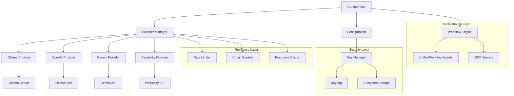

# LocalAgent Technical Implementation Guide

## Architecture Overview



---

## 🔧 Core Component Implementation

### 1. Provider Architecture Enhancement

#### Base Provider Improvements
```python
# app/llm_providers/base_provider.py

from abc import ABC, abstractmethod
from typing import Dict, Any, AsyncIterator, Optional, List, Union
from dataclasses import dataclass, field
import asyncio
from datetime import datetime
from enum import Enum

class ProviderCapability(Enum):
    """Provider capabilities enumeration"""
    CHAT = "chat"
    COMPLETION = "completion"
    FUNCTION_CALLING = "function_calling"
    VISION = "vision"
    STREAMING = "streaming"
    EMBEDDINGS = "embeddings"
    FINE_TUNING = "fine_tuning"
    SEARCH_GROUNDED = "search_grounded"

@dataclass
class ProviderConfig:
    """Provider configuration with validation"""
    name: str
    api_key: Optional[str] = None
    base_url: Optional[str] = None
    timeout: float = 30.0
    max_retries: int = 3
    rate_limit: Optional[int] = None  # requests per minute
    circuit_breaker_threshold: int = 5
    circuit_breaker_timeout: float = 60.0
    cache_ttl: int = 3600  # seconds
    custom_headers: Dict[str, str] = field(default_factory=dict)
    
    def validate(self) -> bool:
        """Validate configuration"""
        if self.name in ["openai", "gemini", "perplexity"] and not self.api_key:
            raise ValueError(f"{self.name} requires an API key")
        if self.timeout <= 0:
            raise ValueError("Timeout must be positive")
        return True

@dataclass
class TokenUsage:
    """Detailed token usage tracking"""
    prompt_tokens: int
    completion_tokens: int
    total_tokens: int
    cached_tokens: int = 0
    
    @property
    def billable_tokens(self) -> int:
        return self.total_tokens - self.cached_tokens

class BaseProvider(ABC):
    """Enhanced base provider with production features"""
    
    def __init__(self, config: ProviderConfig):
        config.validate()
        self.config = config
        self.name = config.name
        self._client = None
        self._health_status = {"healthy": False, "last_check": None}
        self._metrics = {
            "total_requests": 0,
            "failed_requests": 0,
            "total_tokens": 0,
            "total_cost": 0.0,
            "average_latency": 0.0
        }
        
    @abstractmethod
    async def initialize(self) -> bool:
        """Initialize provider with health check"""
        pass
    
    @abstractmethod
    async def complete(
        self,
        request: CompletionRequest,
        timeout: Optional[float] = None
    ) -> CompletionResponse:
        """Generate completion with timeout support"""
        pass
    
    async def complete_with_retry(
        self,
        request: CompletionRequest,
        retry_policy: Optional[RetryPolicy] = None
    ) -> CompletionResponse:
        """Complete with automatic retry on failure"""
        if not retry_policy:
            retry_policy = RetryPolicy()
            
        last_exception = None
        for attempt in range(retry_policy.max_attempts):
            try:
                return await self.complete(request)
            except Exception as e:
                last_exception = e
                if attempt < retry_policy.max_attempts - 1:
                    delay = retry_policy.calculate_delay(attempt)
                    await asyncio.sleep(delay)
                    
        raise last_exception
    
    def get_metrics(self) -> Dict[str, Any]:
        """Get provider metrics"""
        return self._metrics.copy()
    
    def reset_metrics(self):
        """Reset provider metrics"""
        self._metrics = {
            "total_requests": 0,
            "failed_requests": 0,
            "total_tokens": 0,
            "total_cost": 0.0,
            "average_latency": 0.0
        }
```

#### Connection Pool Implementation
```python
# app/llm_providers/connection_pool.py

import aiohttp
from typing import Optional, Dict, Any
import asyncio
from contextlib import asynccontextmanager

class ConnectionPool:
    """HTTP connection pool for providers"""
    
    def __init__(
        self,
        base_url: str,
        max_connections: int = 10,
        timeout: float = 30.0,
        headers: Optional[Dict[str, str]] = None
    ):
        self.base_url = base_url
        self.max_connections = max_connections
        self.timeout = aiohttp.ClientTimeout(total=timeout)
        self.headers = headers or {}
        self._session: Optional[aiohttp.ClientSession] = None
        self._semaphore = asyncio.Semaphore(max_connections)
        
    async def initialize(self):
        """Initialize connection pool"""
        if not self._session:
            connector = aiohttp.TCPConnector(
                limit=self.max_connections,
                limit_per_host=self.max_connections,
                ttl_dns_cache=300
            )
            self._session = aiohttp.ClientSession(
                connector=connector,
                timeout=self.timeout,
                headers=self.headers
            )
    
    async def close(self):
        """Close connection pool"""
        if self._session:
            await self._session.close()
            self._session = None
    
    @asynccontextmanager
    async def request(
        self,
        method: str,
        endpoint: str,
        **kwargs
    ):
        """Make HTTP request with connection pooling"""
        async with self._semaphore:
            if not self._session:
                await self.initialize()
                
            url = f"{self.base_url}{endpoint}"
            async with self._session.request(method, url, **kwargs) as response:
                yield response
```

---

### 2. Security Implementation

#### Secure Key Manager
```python
# app/security/key_manager.py

import keyring
import os
from cryptography.fernet import Fernet
from cryptography.hazmat.primitives import hashes
from cryptography.hazmat.primitives.kdf.pbkdf2 import PBKDF2
from typing import Optional, Dict
import json
import base64
from pathlib import Path
import logging

logger = logging.getLogger(__name__)

class SecureKeyManager:
    """Secure API key management with encryption"""
    
    SERVICE_NAME = "LocalAgent"
    
    def __init__(self, config_dir: Optional[Path] = None):
        self.config_dir = config_dir or Path.home() / ".localagent"
        self.config_dir.mkdir(exist_ok=True)
        self.encrypted_file = self.config_dir / ".keys.enc"
        self._master_key: Optional[bytes] = None
        
    def store_key(self, provider: str, api_key: str) -> bool:
        """Store API key securely"""
        try:
            # Try keyring first
            keyring.set_password(self.SERVICE_NAME, provider, api_key)
            logger.info(f"Stored key for {provider} in system keyring")
            return True
        except Exception as e:
            logger.warning(f"Keyring storage failed: {e}, falling back to encrypted file")
            return self._store_encrypted(provider, api_key)
    
    def retrieve_key(self, provider: str) -> Optional[str]:
        """Retrieve API key"""
        # Check environment variable first
        env_var = f"{provider.upper()}_API_KEY"
        if env_key := os.getenv(env_var):
            logger.debug(f"Using key from environment variable {env_var}")
            return env_key
        
        # Try keyring
        try:
            if key := keyring.get_password(self.SERVICE_NAME, provider):
                logger.debug(f"Retrieved key for {provider} from keyring")
                return key
        except Exception as e:
            logger.warning(f"Keyring retrieval failed: {e}")
        
        # Fall back to encrypted file
        return self._retrieve_encrypted(provider)
    
    def rotate_key(self, provider: str, new_key: str) -> bool:
        """Rotate API key"""
        old_key = self.retrieve_key(provider)
        if old_key:
            self._audit_log("key_rotation", provider, "success")
        return self.store_key(provider, new_key)
    
    def delete_key(self, provider: str) -> bool:
        """Delete API key with secure wiping"""
        try:
            keyring.delete_password(self.SERVICE_NAME, provider)
        except:
            pass
        
        return self._delete_encrypted(provider)
    
    def _store_encrypted(self, provider: str, api_key: str) -> bool:
        """Store in encrypted file"""
        if not self._master_key:
            self._master_key = self._get_or_create_master_key()
        
        fernet = Fernet(self._master_key)
        
        # Load existing keys
        keys = self._load_encrypted_keys()
        keys[provider] = fernet.encrypt(api_key.encode()).decode()
        
        # Save encrypted
        encrypted_data = fernet.encrypt(json.dumps(keys).encode())
        self.encrypted_file.write_bytes(encrypted_data)
        
        # Secure file permissions (Unix-like systems)
        if hasattr(os, 'chmod'):
            os.chmod(self.encrypted_file, 0o600)
        
        return True
    
    def _retrieve_encrypted(self, provider: str) -> Optional[str]:
        """Retrieve from encrypted file"""
        if not self._master_key:
            self._master_key = self._get_or_create_master_key()
        
        keys = self._load_encrypted_keys()
        if provider in keys:
            fernet = Fernet(self._master_key)
            return fernet.decrypt(keys[provider].encode()).decode()
        
        return None
    
    def _load_encrypted_keys(self) -> Dict[str, str]:
        """Load encrypted keys from file"""
        if not self.encrypted_file.exists():
            return {}
        
        if not self._master_key:
            self._master_key = self._get_or_create_master_key()
        
        fernet = Fernet(self._master_key)
        encrypted_data = self.encrypted_file.read_bytes()
        
        try:
            decrypted = fernet.decrypt(encrypted_data)
            return json.loads(decrypted)
        except:
            return {}
    
    def _get_or_create_master_key(self) -> bytes:
        """Get or create master encryption key"""
        key_file = self.config_dir / ".master.key"
        
        if key_file.exists():
            return key_file.read_bytes()
        
        # Generate new master key
        key = Fernet.generate_key()
        key_file.write_bytes(key)
        
        # Secure file permissions
        if hasattr(os, 'chmod'):
            os.chmod(key_file, 0o600)
        
        return key
    
    def _audit_log(self, action: str, provider: str, status: str):
        """Audit log for key operations"""
        audit_file = self.config_dir / "audit.log"
        timestamp = datetime.now().isoformat()
        entry = f"{timestamp} | {action} | {provider} | {status}\n"
        
        with audit_file.open("a") as f:
            f.write(entry)
```

---

### 3. Resilience Patterns

#### Rate Limiter Implementation
```python
# app/resilience/rate_limiter.py

import asyncio
import time
from typing import Dict, Optional
from dataclasses import dataclass

@dataclass
class RateLimitConfig:
    """Rate limit configuration"""
    requests_per_minute: int
    requests_per_hour: Optional[int] = None
    tokens_per_minute: Optional[int] = None
    tokens_per_day: Optional[int] = None

class TokenBucket:
    """Token bucket rate limiter"""
    
    def __init__(self, capacity: int, refill_rate: float):
        self.capacity = capacity
        self.refill_rate = refill_rate  # tokens per second
        self.tokens = capacity
        self.last_refill = time.time()
        self._lock = asyncio.Lock()
    
    async def acquire(self, tokens: int = 1) -> bool:
        """Acquire tokens from bucket"""
        async with self._lock:
            now = time.time()
            self._refill(now)
            
            if self.tokens >= tokens:
                self.tokens -= tokens
                return True
            
            return False
    
    async def wait_and_acquire(self, tokens: int = 1):
        """Wait until tokens are available"""
        while not await self.acquire(tokens):
            wait_time = tokens / self.refill_rate
            await asyncio.sleep(wait_time)
    
    def _refill(self, now: float):
        """Refill tokens based on elapsed time"""
        elapsed = now - self.last_refill
        new_tokens = elapsed * self.refill_rate
        self.tokens = min(self.capacity, self.tokens + new_tokens)
        self.last_refill = now

class RateLimiter:
    """Multi-level rate limiter for providers"""
    
    def __init__(self):
        self.limiters: Dict[str, Dict[str, TokenBucket]] = {}
    
    def configure_provider(self, provider: str, config: RateLimitConfig):
        """Configure rate limits for provider"""
        self.limiters[provider] = {}
        
        if config.requests_per_minute:
            self.limiters[provider]["rpm"] = TokenBucket(
                capacity=config.requests_per_minute,
                refill_rate=config.requests_per_minute / 60
            )
        
        if config.requests_per_hour:
            self.limiters[provider]["rph"] = TokenBucket(
                capacity=config.requests_per_hour,
                refill_rate=config.requests_per_hour / 3600
            )
        
        if config.tokens_per_minute:
            self.limiters[provider]["tpm"] = TokenBucket(
                capacity=config.tokens_per_minute,
                refill_rate=config.tokens_per_minute / 60
            )
    
    async def acquire(self, provider: str, tokens: Optional[int] = None):
        """Acquire permission to make request"""
        if provider not in self.limiters:
            return  # No rate limit configured
        
        # Check all rate limits
        for limiter in self.limiters[provider].values():
            if tokens and "tpm" in self.limiters[provider]:
                await self.limiters[provider]["tpm"].wait_and_acquire(tokens)
            else:
                await limiter.wait_and_acquire(1)
```

#### Circuit Breaker Implementation
```python
# app/resilience/circuit_breaker.py

from enum import Enum
from datetime import datetime, timedelta
from typing import Optional, Callable, Any
import asyncio
import logging

logger = logging.getLogger(__name__)

class CircuitState(Enum):
    """Circuit breaker states"""
    CLOSED = "closed"  # Normal operation
    OPEN = "open"      # Failing, reject requests
    HALF_OPEN = "half_open"  # Testing recovery

class CircuitBreaker:
    """Circuit breaker for fault tolerance"""
    
    def __init__(
        self,
        failure_threshold: int = 5,
        recovery_timeout: float = 60.0,
        success_threshold: int = 2,
        name: Optional[str] = None
    ):
        self.failure_threshold = failure_threshold
        self.recovery_timeout = recovery_timeout
        self.success_threshold = success_threshold
        self.name = name or "CircuitBreaker"
        
        self.state = CircuitState.CLOSED
        self.failure_count = 0
        self.success_count = 0
        self.last_failure_time: Optional[datetime] = None
        self._lock = asyncio.Lock()
    
    async def call(self, func: Callable, *args, **kwargs) -> Any:
        """Execute function with circuit breaker protection"""
        async with self._lock:
            if self.state == CircuitState.OPEN:
                if self._should_attempt_reset():
                    self.state = CircuitState.HALF_OPEN
                    logger.info(f"{self.name}: Attempting reset (HALF_OPEN)")
                else:
                    raise Exception(f"{self.name}: Circuit breaker is OPEN")
        
        try:
            result = await func(*args, **kwargs)
            await self._on_success()
            return result
        except Exception as e:
            await self._on_failure()
            raise
    
    async def _on_success(self):
        """Handle successful call"""
        async with self._lock:
            if self.state == CircuitState.HALF_OPEN:
                self.success_count += 1
                if self.success_count >= self.success_threshold:
                    self.state = CircuitState.CLOSED
                    self.failure_count = 0
                    self.success_count = 0
                    logger.info(f"{self.name}: Circuit breaker CLOSED")
            else:
                self.failure_count = 0
    
    async def _on_failure(self):
        """Handle failed call"""
        async with self._lock:
            self.failure_count += 1
            self.last_failure_time = datetime.now()
            
            if self.state == CircuitState.HALF_OPEN:
                self.state = CircuitState.OPEN
                logger.warning(f"{self.name}: Circuit breaker OPEN (half-open test failed)")
            elif self.failure_count >= self.failure_threshold:
                self.state = CircuitState.OPEN
                logger.warning(f"{self.name}: Circuit breaker OPEN (threshold reached)")
            
            self.success_count = 0
    
    def _should_attempt_reset(self) -> bool:
        """Check if we should attempt to reset circuit"""
        if not self.last_failure_time:
            return False
        
        elapsed = datetime.now() - self.last_failure_time
        return elapsed.total_seconds() >= self.recovery_timeout
    
    def get_state(self) -> Dict[str, Any]:
        """Get circuit breaker state"""
        return {
            "name": self.name,
            "state": self.state.value,
            "failure_count": self.failure_count,
            "success_count": self.success_count,
            "last_failure": self.last_failure_time.isoformat() if self.last_failure_time else None
        }
```

---

### 4. Testing Infrastructure

#### Mock Provider Framework
```python
# tests/mocks/mock_provider.py

from typing import Dict, List, Any, AsyncIterator
import asyncio
import random
from app.llm_providers.base_provider import BaseProvider, ModelInfo, CompletionRequest, CompletionResponse

class MockProvider(BaseProvider):
    """Mock provider for testing"""
    
    def __init__(self, config: Dict[str, Any]):
        super().__init__(config)
        self.responses = []
        self.latency_range = (0.1, 0.5)  # seconds
        self.failure_rate = 0.0
        self.is_healthy = True
        
    async def initialize(self) -> bool:
        """Initialize mock provider"""
        await asyncio.sleep(0.1)  # Simulate network delay
        return self.is_healthy
    
    async def list_models(self) -> List[ModelInfo]:
        """Return mock models"""
        return [
            ModelInfo(
                name="mock-model-1",
                provider="mock",
                context_length=4096,
                capabilities=["chat", "completion"]
            ),
            ModelInfo(
                name="mock-model-2",
                provider="mock",
                context_length=8192,
                capabilities=["chat", "completion", "streaming"]
            )
        ]
    
    async def complete(self, request: CompletionRequest) -> CompletionResponse:
        """Generate mock completion"""
        # Simulate latency
        latency = random.uniform(*self.latency_range)
        await asyncio.sleep(latency)
        
        # Simulate failures
        if random.random() < self.failure_rate:
            raise Exception("Mock provider failure")
        
        # Return mock response
        if self.responses:
            content = self.responses.pop(0)
        else:
            content = f"Mock response to: {request.messages[-1]['content']}"
        
        return CompletionResponse(
            content=content,
            model=request.model,
            provider="mock",
            usage={"total_tokens": len(content.split()) * 2}
        )
    
    async def stream_complete(self, request: CompletionRequest) -> AsyncIterator[str]:
        """Stream mock completion"""
        response = await self.complete(request)
        words = response.content.split()
        
        for word in words:
            await asyncio.sleep(0.01)  # Simulate streaming delay
            yield word + " "
    
    async def health_check(self) -> Dict[str, Any]:
        """Mock health check"""
        return {
            "healthy": self.is_healthy,
            "provider": "mock",
            "models_available": 2 if self.is_healthy else 0
        }
    
    def set_responses(self, responses: List[str]):
        """Set mock responses for testing"""
        self.responses = responses
    
    def set_failure_rate(self, rate: float):
        """Set failure rate for chaos testing"""
        self.failure_rate = min(1.0, max(0.0, rate))
    
    def set_latency(self, min_latency: float, max_latency: float):
        """Set latency range for performance testing"""
        self.latency_range = (min_latency, max_latency)
```

#### Integration Test Suite
```python
# tests/integration/test_provider_integration.py

import pytest
import asyncio
from unittest.mock import patch, MagicMock
from app.llm_providers.provider_manager import ProviderManager
from app.llm_providers.base_provider import CompletionRequest
from tests.mocks.mock_provider import MockProvider

@pytest.fixture
async def provider_manager():
    """Create provider manager with mock providers"""
    config = {
        "mock1": {"type": "mock"},
        "mock2": {"type": "mock"},
        "mock3": {"type": "mock"}
    }
    
    manager = ProviderManager(config)
    
    # Replace providers with mocks
    for name in config:
        manager.providers[name] = MockProvider(config[name])
    
    await manager.initialize_providers()
    return manager

@pytest.mark.asyncio
async def test_provider_fallback(provider_manager):
    """Test automatic fallback between providers"""
    # Set first provider to fail
    provider_manager.providers["mock1"].set_failure_rate(1.0)
    
    # Set second provider response
    provider_manager.providers["mock2"].set_responses(["Fallback response"])
    
    request = CompletionRequest(
        messages=[{"role": "user", "content": "Test"}],
        model="mock-model-1"
    )
    
    response = await provider_manager.complete_with_fallback(
        request,
        preferred_provider="mock1"
    )
    
    assert response.content == "Fallback response"
    assert response.provider == "mock2"

@pytest.mark.asyncio
async def test_concurrent_requests(provider_manager):
    """Test handling concurrent requests"""
    requests = [
        CompletionRequest(
            messages=[{"role": "user", "content": f"Test {i}"}],
            model="mock-model-1"
        )
        for i in range(10)
    ]
    
    # Execute concurrently
    tasks = [
        provider_manager.complete_with_fallback(req)
        for req in requests
    ]
    
    responses = await asyncio.gather(*tasks)
    
    assert len(responses) == 10
    assert all(r.content for r in responses)

@pytest.mark.asyncio
async def test_circuit_breaker_activation(provider_manager):
    """Test circuit breaker opens after failures"""
    # Configure provider to fail
    provider = provider_manager.providers["mock1"]
    provider.set_failure_rate(1.0)
    
    request = CompletionRequest(
        messages=[{"role": "user", "content": "Test"}],
        model="mock-model-1"
    )
    
    # Trigger failures to open circuit
    for _ in range(5):
        try:
            await provider.complete(request)
        except:
            pass
    
    # Circuit should be open now
    with pytest.raises(Exception, match="Circuit breaker is OPEN"):
        await provider.complete(request)

@pytest.mark.asyncio 
async def test_rate_limiting(provider_manager):
    """Test rate limiting enforcement"""
    # Configure strict rate limit
    provider_manager.configure_rate_limit("mock1", requests_per_minute=2)
    
    request = CompletionRequest(
        messages=[{"role": "user", "content": "Test"}],
        model="mock-model-1"
    )
    
    # First two requests should be immediate
    start = asyncio.get_event_loop().time()
    await provider_manager.providers["mock1"].complete(request)
    await provider_manager.providers["mock1"].complete(request)
    elapsed1 = asyncio.get_event_loop().time() - start
    
    # Third request should be delayed
    start = asyncio.get_event_loop().time()
    await provider_manager.providers["mock1"].complete(request)
    elapsed2 = asyncio.get_event_loop().time() - start
    
    assert elapsed1 < 1.0  # First two are fast
    assert elapsed2 > 25.0  # Third is rate limited
```

---

### 5. UnifiedWorkflow Integration

#### Agent Adapter Implementation
```python
# app/orchestration/agent_adapter.py

from typing import Dict, Any, List, Optional
from dataclasses import dataclass
import yaml
from pathlib import Path
from app.llm_providers.provider_manager import ProviderManager
from app.llm_providers.base_provider import CompletionRequest

@dataclass
class AgentContext:
    """Context package for agent execution"""
    agent_name: str
    phase: int
    task: str
    context: Dict[str, Any]
    max_tokens: int = 4000
    evidence_required: List[str] = None

class AgentAdapter:
    """Bridge between UnifiedWorkflow agents and LocalAgent providers"""
    
    def __init__(self, provider_manager: ProviderManager):
        self.provider_manager = provider_manager
        self.agents_dir = Path("agents")
        self.agents = self._load_agents()
        
    def _load_agents(self) -> Dict[str, Dict]:
        """Load agent definitions from YAML files"""
        agents = {}
        
        for yaml_file in self.agents_dir.rglob("*.yaml"):
            with open(yaml_file) as f:
                agent_def = yaml.safe_load(f)
                if agent_def:
                    agent_name = agent_def.get("name", yaml_file.stem)
                    agents[agent_name] = agent_def
        
        return agents
    
    async def execute_agent(
        self,
        agent_context: AgentContext,
        provider: Optional[str] = None
    ) -> Dict[str, Any]:
        """Execute agent task with specified provider"""
        
        # Get agent definition
        agent_def = self.agents.get(agent_context.agent_name)
        if not agent_def:
            raise ValueError(f"Agent {agent_context.agent_name} not found")
        
        # Prepare prompt
        prompt = self._prepare_prompt(agent_context, agent_def)
        
        # Create completion request
        request = CompletionRequest(
            messages=[
                {"role": "system", "content": agent_def.get("system_prompt", "")},
                {"role": "user", "content": prompt}
            ],
            model=self._select_model(provider),
            max_tokens=agent_context.max_tokens
        )
        
        # Execute with provider
        response = await self.provider_manager.complete_with_fallback(
            request,
            preferred_provider=provider
        )
        
        # Parse and validate response
        result = self._parse_response(response.content, agent_context)
        
        # Collect evidence if required
        if agent_context.evidence_required:
            result["evidence"] = await self._collect_evidence(
                result,
                agent_context.evidence_required
            )
        
        return result
    
    def _prepare_prompt(
        self,
        context: AgentContext,
        agent_def: Dict
    ) -> str:
        """Prepare prompt for agent execution"""
        template = agent_def.get("prompt_template", "{task}")
        
        return template.format(
            task=context.task,
            phase=context.phase,
            context=yaml.dump(context.context),
            **context.context
        )
    
    def _select_model(self, provider: Optional[str]) -> str:
        """Select appropriate model for provider"""
        model_map = {
            "ollama": "llama3.2",
            "openai": "gpt-4o-mini",
            "gemini": "gemini-1.5-flash",
            "perplexity": "sonar"
        }
        
        return model_map.get(provider, "llama3.2")
    
    def _parse_response(self, content: str, context: AgentContext) -> Dict:
        """Parse agent response"""
        # Basic parsing - can be enhanced with structured output
        return {
            "agent": context.agent_name,
            "phase": context.phase,
            "task": context.task,
            "response": content,
            "success": True
        }
    
    async def _collect_evidence(
        self,
        result: Dict,
        required_evidence: List[str]
    ) -> Dict[str, Any]:
        """Collect evidence for validation"""
        evidence = {}
        
        for item in required_evidence:
            if item == "screenshot":
                evidence["screenshot"] = await self._capture_screenshot()
            elif item == "logs":
                evidence["logs"] = await self._collect_logs()
            elif item == "metrics":
                evidence["metrics"] = await self._collect_metrics()
        
        return evidence
```

---

## 🚀 Deployment Strategy

### Container Deployment
```dockerfile
# Dockerfile
FROM python:3.10-slim

WORKDIR /app

# Install system dependencies
RUN apt-get update && apt-get install -y \
    gcc \
    git \
    && rm -rf /var/lib/apt/lists/*

# Copy requirements
COPY requirements.txt .
RUN pip install --no-cache-dir -r requirements.txt

# Copy application
COPY . .

# Create non-root user
RUN useradd -m -u 1000 localagent && \
    chown -R localagent:localagent /app

USER localagent

# Set environment variables
ENV PYTHONUNBUFFERED=1
ENV LOCALAGENT_CONFIG=/app/config

ENTRYPOINT ["python", "scripts/localagent"]
```

### Docker Compose Setup
```yaml
# docker-compose.yml
version: '3.8'

services:
  localagent:
    build: .
    image: localagent:latest
    container_name: localagent
    environment:
      - OLLAMA_HOST=ollama:11434
      - REDIS_URL=redis://redis:6379
    volumes:
      - ./config:/app/config
      - ~/.localagent:/home/localagent/.localagent
    depends_on:
      - ollama
      - redis
    networks:
      - localagent-net

  ollama:
    image: ollama/ollama:latest
    container_name: ollama
    ports:
      - "11434:11434"
    volumes:
      - ollama-data:/root/.ollama
    networks:
      - localagent-net

  redis:
    image: redis:alpine
    container_name: redis
    ports:
      - "6379:6379"
    volumes:
      - redis-data:/data
    networks:
      - localagent-net

volumes:
  ollama-data:
  redis-data:

networks:
  localagent-net:
    driver: bridge
```

---

## 📊 Monitoring & Observability

### Metrics Collection
```python
# app/monitoring/metrics.py

from prometheus_client import Counter, Histogram, Gauge, generate_latest
import time
from functools import wraps

# Define metrics
request_count = Counter(
    'localagent_requests_total',
    'Total number of requests',
    ['provider', 'model', 'status']
)

request_duration = Histogram(
    'localagent_request_duration_seconds',
    'Request duration in seconds',
    ['provider', 'model']
)

active_requests = Gauge(
    'localagent_active_requests',
    'Number of active requests',
    ['provider']
)

token_usage = Counter(
    'localagent_tokens_total',
    'Total tokens used',
    ['provider', 'model', 'type']
)

provider_health = Gauge(
    'localagent_provider_health',
    'Provider health status',
    ['provider']
)

def track_request(provider: str, model: str):
    """Decorator to track request metrics"""
    def decorator(func):
        @wraps(func)
        async def wrapper(*args, **kwargs):
            active_requests.labels(provider=provider).inc()
            start_time = time.time()
            
            try:
                result = await func(*args, **kwargs)
                request_count.labels(
                    provider=provider,
                    model=model,
                    status='success'
                ).inc()
                return result
            except Exception as e:
                request_count.labels(
                    provider=provider,
                    model=model,
                    status='error'
                ).inc()
                raise
            finally:
                duration = time.time() - start_time
                request_duration.labels(
                    provider=provider,
                    model=model
                ).observe(duration)
                active_requests.labels(provider=provider).dec()
        
        return wrapper
    return decorator
```

---

## 🔐 Security Checklist

### Pre-Production Security Audit

- [ ] **API Key Security**
  - [ ] All keys encrypted at rest
  - [ ] Keyring integration tested
  - [ ] Environment variable override working
  - [ ] No keys in logs or error messages
  - [ ] Audit logging enabled

- [ ] **Network Security**
  - [ ] TLS verification enabled
  - [ ] Certificate pinning for critical providers
  - [ ] Request signing implemented
  - [ ] Rate limiting configured

- [ ] **Input Validation**
  - [ ] Prompt sanitization
  - [ ] Configuration validation
  - [ ] Command injection prevention
  - [ ] Path traversal protection

- [ ] **Access Control**
  - [ ] File permissions (600 for sensitive files)
  - [ ] User authentication (if multi-user)
  - [ ] API endpoint protection
  - [ ] Resource quotas enforced

- [ ] **Dependency Security**
  - [ ] All dependencies scanned
  - [ ] No known vulnerabilities
  - [ ] License compliance verified
  - [ ] Supply chain integrity

---

## 📝 Conclusion

This technical implementation guide provides a comprehensive blueprint for building LocalAgent into a production-ready system. The architecture emphasizes:

1. **Security First**: Encrypted storage, secure key management
2. **Reliability**: Circuit breakers, rate limiting, retries
3. **Performance**: Connection pooling, caching, async operations
4. **Testability**: Mock frameworks, integration tests
5. **Observability**: Metrics, logging, monitoring
6. **Extensibility**: Plugin architecture, clean interfaces

Following this guide and the Agile SDLC roadmap will result in a robust, scalable, and maintainable LocalAgent implementation.